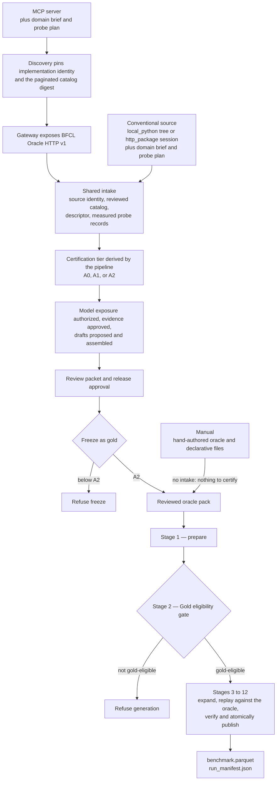

<!--
  SPDX-FileCopyrightText: Copyright (c) 2026 NVIDIA CORPORATION & AFFILIATES. All rights reserved.
  SPDX-License-Identifier: Apache-2.0
-->

# Authoring Flows

There are three implemented ways to arrive at a reviewed oracle pack.
They differ only in how the pack is produced; all three then converge on the same generation stages, the same gold gate, and the same publication contract described in {doc}`pipeline-overview`.
That convergence is the design: a pack drafted with model assistance receives exactly the same executable scrutiny as one typed by hand, so the authoring route never becomes a way to earn a weaker guarantee.

| Flow | Input | Where the oracle comes from |
| --- | --- | --- |
| Manual | A domain source plus a local backend or an HTTPS endpoint | Hand-authored by the operator. |
| Assisted from a conventional source | A source declaration, a *domain brief* (the human-reviewed description of what the source is for), and a *probe plan* (the human-reviewed list of calls intake may execute against the source) | A `local_python` package's own files, or a pinned `http_package` endpoint. |
| Assisted from an MCP server | An MCP server, a domain brief, and a probe plan | The certified MCP server, reached through a gateway that exposes BFCL Oracle HTTP v1. |

Read the diagram left of `Reviewed oracle pack` as the part that differs per flow, and everything right of it as the part that does not.
The manual flow reaches the pack directly because there is no source to certify; the two assisted flows share one source-intake stage, one certification ladder, and one review-and-freeze boundary, and the MCP flow joins that intake stage behind a gateway.



The diagram has two refusal points for a reason. A lower-tier source may be drafted and reviewed, so the tier is checked where it matters — at freeze — rather than being used to block exploration. The gold gate then re-derives eligibility from the frozen pack itself, which is why a pack that arrived through model assistance cannot enter generation on the strength of its authoring history alone.

The `Stages 3 to 12` node is collapsed here because it is identical for all three flows. {doc}`pipeline-overview` draws the same run with every stage named, including which two are optional and how a disabled stage is bypassed.
In practical terms, `Reviewed oracle pack` is the input to Stage 1: users stop editing
authoring-workspace drafts at that boundary and generation reads only the reviewed pack
and its generation configuration. {doc}`pipeline-worked-example` shows how one template
inside that pack changes as it passes through Stages 1–12.

## Manual Authoring

In the manual flow the operator supplies the executable oracle and every declarative file beside it.
There is no intake phase, because there is nothing to certify about a source the operator wrote: validation runs directly over the pack, and the gold gate is the first and only certification boundary.
This is the shortest path when the domain already has a deterministic implementation, or when the pack's conversation shapes need judgment that no automated intake could supply.
Refer to {doc}`../how-to/author-a-pack` and, for the complete lifecycle including endpoint identity pins, [`src/nemotron/steps/byob/references/bfcl-manual-oracle-pack-flow.md`](https://github.com/NVIDIA-NeMo/Nemotron/blob/main/src/nemotron/steps/byob/references/bfcl-manual-oracle-pack-flow.md).

## Assisted Authoring From a Conventional Source

The assisted flows start from a source that is *not* a pack and cannot carry certification, approval, or publication fields.
A `local_python` source is a tree: a `backend.py` import-closure root, a reviewed `tools.json` catalog, a canonical dependency lock, and optional fixtures. Its Python is parsed rather than imported, so identity is established without executing anything.
An `http_package` source is a session: a secret-free Oracle HTTP v1 declaration, a companion `tools.json`, and a mandatory conformance attestation digest.

Intake then collects a source identity, the reviewed catalog, a descriptor, and probe records that the pipeline itself measures.
The probe plan is one document for every transport, because the questions on the ladder do not change when a source is reached over a socket: it names a case per published tool, at least one structured error where the source has error codes, and a case the tool cannot finish inside its deadline.
A session-based plan must carry fixtures, since a session is handed its world when it opens rather than reading a reviewed file.

Certification is derived by the pipeline, never by the transport code that gathered the observations:

| Tier | What it establishes |
| --- | --- |
| `A0` | Identity and catalog integrity only. Result shapes, error codes, confirmation behavior, and reset isolation remain explicit unresolved gaps. |
| `A1` | Adds bounded read-only observation. Reset and confirmation behavior remain unresolved. |
| `A2` | Adds deterministic reset, isolation, confirmation safety, mutation truthfulness, timeout cleanup, and result coverage. |

Without a probe plan a source certifies `A0`, whatever transport it uses, because nothing else can supply observed outcomes.
Lower tiers may be drafted and reviewed, but freezing a pack as gold requires `A2`.

## Assisted Authoring From an MCP Server

The MCP flow reaches the same intake through a gateway.
Discovery reads the server's implementation identity and complete paginated tool catalog and pins a catalog digest; the gateway then exposes BFCL Oracle HTTP v1 so that generation stays entirely unaware that MCP was involved.
Mode A is the mode whose reset, state, and episode-end operations are control tools, which is why it is the only mode whose reset can be probed and the only executable gateway mode implemented.
Mode B and Mode C declarations are inert discovery records; their execution is not implemented.

A cooperative server has to return a stable identity and catalog, JSON-object structured content for its selected tools, deterministic describe/reset/state/end controls, isolated episodes, stable structured error codes, and unchanged state when a confirmation-gated mutation is not confirmed.
Control tools must not appear in the selected business catalog.
Refer to {doc}`../how-to/mcp-server` and [`src/nemotron/steps/byob/references/bfcl-mcp-user-guide.md`](https://github.com/NVIDIA-NeMo/Nemotron/blob/main/src/nemotron/steps/byob/references/bfcl-mcp-user-guide.md).

## The Guided Command Sequence

Both assisted flows run through one stateful guided command that prints the next safe command whenever a gate refuses progress:

1. `author` — resolve the source declaration and produce transport-neutral evidence and certification.
2. `answer` — apply any digest-bound open questions the evidence raised.
3. `authorize` — grant model exposure for that exact evidence subject.
4. `approve --boundary evidence` — separately approve the evidence for drafting.
5. `draft` — run bounded, cached, structured model calls.
6. `assemble` — bind those drafts into a loadable *candidate pack*, a pack assembled from drafts that has not yet been reviewed, approved, or frozen.
7. `review` — assemble the *review packet*: independently verified certification, fresh validation, answered questions, and the complete candidate pack.
8. `approve --boundary release` — approve that exact review packet.
9. `freeze` — seal the pack and every reviewed sidecar.
10. `publish` — rerun fresh gold validation and `stage=all`.

Two decisions are demanded at the first command rather than deferred.
A held-out decision must be stated before any evidence exists, because evidence that has already been collected cannot be retroactively declared clean.
A source that is meant to reach `A1` or `A2` needs its probe plan at that point too, since those tiers are earned from observed outcomes and nothing later can supply them.

## Two Trust Boundaries, Not Two Reviewers

The most important structural point in the assisted flows is that letting a model
*read* evidence and letting a pack be *released* are two separate trust decisions,
taken at different times against different digest-bound subjects. These are boundaries
in the workflow, not a requirement for two different reviewers.

The pre-model side uses two records: exposure authorization, supplied by a named human
or organizational policy digest, and evidence approval. The release side uses a third
record approving a specific review packet with fresh validation evidence.
Pre-model authorization cannot be replaced by final release approval, and approving a release does not retroactively legitimize a model request that was never authorized.
Editing any upstream artifact invalidates the downstream packet and its approval, so an approval always refers to bytes that still exist unchanged.

The implementation does not compare the identities on these records. One person may
act at multiple gates, while an organization that requires separation of duties may
assign a source owner, evidence reviewer, and release reviewer according to its own
policy. The examples use different role names to make the decisions visible, not to
impose a head-count requirement.

## What Assisted Authoring May and May Not Do

An authoring model may propose a tool coverage plan, validation cases, task-template plans, and declarative assertion specifications.
It may not change the backend, the endpoint's behavior, the tool schemas, or the fixtures. It cannot certify its own output, invent fixture bindings or hidden business truth, approve model exposure or release, bypass executable gold validation, or use target-model answers to select or repair benchmark rows.

Assembly enforces that boundary mechanically rather than by convention.
Everything derivable from trusted evidence is derived: pack identity and the manifest from the verified bundle, `tools.json` from the certified catalog, and `assertions.py` from drafts that compiled without a blocker.
A `local_python` source contributes its backend and fixtures byte for byte from the fingerprinted tree; a session-based source contributes no files at all, so the pack names the certified endpoint and takes its fixtures from the reviewed probe plan those sessions were opened with.
What remains — slot bindings to fixture columns, turn policies, per-language user turns, and the validation cases that decide the tier — arrives in one reviewed supplement, and every tool and assertion it names is checked back against the evidence, so a supplement cannot introduce a tool the source never published or an assertion nobody compiled.

:::{important}
Assisted authoring may propose semantics. It can never certify a tier, approve exposure, or bypass executable replay.
:::

## Current Limitations

Live source intake is disabled by default for every built-in adapter. Enablement comes from a reviewed rollout policy block or from strict environment overrides, and the effective decision is recorded in the resolved authoring configuration:

```shell
export BFCL_ENABLE_LOCAL_PYTHON=1
export BFCL_ENABLE_MCP_MODE_A=1
```

Malformed values and unknown adapter kinds fail closed, and the gate applies only to operations that inspect or execute a source. Offline artifact verification, review, approval, and freeze do not require it.

`local_python` and MCP Mode A have publication adapters. An `http_package` source shares intake, review, and freeze, but publication is deliberately refused until an independently verified publication adapter exists.
MCP Mode B and Mode C are not implemented.

## Related Information

- {doc}`../how-to/start-from-domain-data` for the two developer paths from an executable
  domain to that reviewed pack.
- {doc}`../how-to/assisted-authoring` for the guided command walkthrough.
- {doc}`../how-to/mcp-server` for onboarding an MCP server.
- {doc}`../how-to/publish-a-release` for freezing and publishing.
- {doc}`oracle-pack` for the contract every flow must satisfy.
- [`src/nemotron/steps/byob/references/bfcl-authoring-user-guide.md`](https://github.com/NVIDIA-NeMo/Nemotron/blob/main/src/nemotron/steps/byob/references/bfcl-authoring-user-guide.md), `bfcl-transport-neutral-intake.md`, and `bfcl-assisted-authoring-runbook.md` for the normative authoring contracts.
