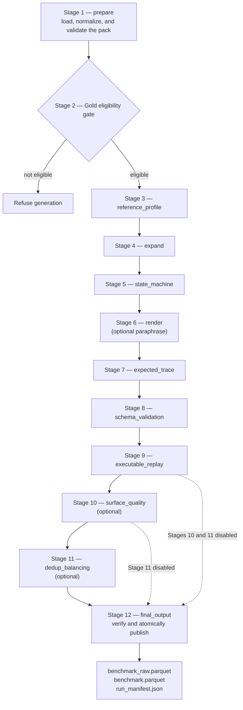

<!--
  SPDX-FileCopyrightText: Copyright (c) 2026 NVIDIA CORPORATION & AFFILIATES. All rights reserved.
  SPDX-License-Identifier: Apache-2.0
-->

# Pipeline Overview

The `bfcl` benchmark family builds function-calling benchmark artifacts from an executable oracle pack.
Unlike the multiple-choice-question family, it does not ask a model to invent questions: the pack's templates define the conversation, and the pack's oracle and assertions establish what the correct tool behavior is.
Generation is therefore closer to deterministic assembly than to synthesis, which is what makes a published row traceable back to the exact pack bytes it came from.

## From Source Assets To A Published Benchmark

Manual authoring produces the reviewed Oracle Pack that generation consumes.
Generation turns that pack into a verified benchmark.

The operator does not hand-edit the output of each internal stage. The normal
interaction is:

1. Author or obtain a reviewed pack and choose a generation configuration.
2. Run `stage=prepare` and correct the pack until the validation report is Gold-eligible.
3. Run `stage=generate` or `stage=all`.
4. If a stage refuses or drops tasks, inspect its artifact and correct the upstream
   pack or configuration rather than editing the cache.
5. Treat the output as published only after `run_manifest.json` exists.

{doc}`../how-to/author-a-pack` explains how to create the reviewed pack at the
left of this diagram. {doc}`pipeline-worked-example` follows one concrete task
through every generation stage.

`nemotron steps run byob/bfcl` supports three generation values for `stage`:

| `stage` | What the run does |
| --- | --- |
| `prepare` | Normalize and validate the oracle pack, then write `oracle_validation_report.json`. No benchmark rows are produced. |
| `generate` | Require a gold-eligible pack, generate tasks, replay them against the oracle, and publish artifacts. |
| `all` | Run `prepare` followed by `generate`. |

## The Twelve Stages

A full generation run is twelve stages. The first is pack preparation, the second is the gold-eligibility gate that decides whether generation is allowed to proceed at all, and the remaining ten are the canonical generation stages that turn templates into published rows.

| Stage | Name | What it establishes |
| --- | --- | --- |
| 1 | `prepare` | Loads the pack, normalizes its files into the stage cache, and runs every validation check. |
| 2 | Gold gate | Derives gold eligibility from the individual checks. `generate` refuses a pack that is not gold-eligible. |
| 3 | `reference_profile` | Normalizes content-addressed style samples into a cached profile when the optional `profile` role is enabled. |
| 4 | `expand` | Binds slot values into locked task instances under the category budget and any held-out reservations. |
| 5 | `state_machine` | Orders each template's milestones into turns and batches the calls that share a call group. |
| 6 | `render` | Renders every turn verbatim from the pack and re-checks the surface guards. Optional model paraphrasing runs here. |
| 7 | `expected_trace` | Derives `expected_tool_calls`, resolving any dependent-call arguments from earlier results. |
| 8 | `schema_validation` | Checks every derived call against its tool's declared parameter schema. |
| 9 | `executable_replay` | Resets the oracle and replays each task twice, then runs the pack's success assertions. |
| 10 | `surface_quality` | Optional. Maps the render guards onto a six-check contract and can drop rows before publication. |
| 11 | `dedup_balancing` | Optional. Deduplicates masked surfaces and balances the publication set across declared dimensions. |
| 12 | `final_output` | Assembles the rows, verifies them, and atomically publishes both Parquet tables and `run_manifest.json`. |

Stages 10 and 11 are bypassed when disabled rather than run as no-ops, so a disabled stage leaves no artifact a later reader could mistake for a verdict it never reached.

## What Enters And Leaves Each Stage

Each item below separates pipeline work from operator work. The files under
`stage_cache/` are how a run is diagnosed, but they are also what later stages read
and what the manifest hashes, so correct a problem in the pack or the configuration
rather than by editing the cache.

### Stages 1–2: establish whether generation may start

**Stage 1 — `prepare`**

- **Input:** the oracle pack and resolved generation configuration.
- **Transformation:** load and normalize the manifest, tool schemas, fixtures,
  templates, validation cases, held-out policy, and oracle declaration; run all pack
  validation checks. The checks judge each declaration on its own — known turn policy,
  exposed and declared tools, importable and executable-compatible assertions — while
  the conversation shape a policy implies is enforced later, in Stage 5.
- **Output:** normalized pack files under `stage_cache/` and
  `oracle_validation_report.json`. No benchmark task exists yet.
- **Operator responsibility:** supply the pack and configuration, run
  `stage=prepare`, and fix the named source file when a check fails.

**Stage 2 — Gold eligibility gate**

- **Input:** the Stage 1 validation verdict and the pack's derived certification tier.
- **Transformation:** combine the individual checks into the `gold_eligible` decision.
- **Output:** permission to enter generation or a refusal with ineligibility reasons.
- **Operator responsibility:** do not bypass the gate. Resolve the reported validation,
  certification, held-out, or lineage problem and run preparation again.

### Stages 3–7: turn templates into executable expectations

**Stage 3 — `reference_profile`**

- **Input:** optional, content-addressed reference samples and the configured profile
  model.
- **Transformation:** normalize the samples and, when the role is enabled, derive style
  guidance. The stage runs either way; only the model role is optional.
- **Output:** `reference_samples.parquet` and `reference_profile.json`, which records
  `status: "disabled"` when the role is off so no reader has to infer it.
- **Operator responsibility:** enable this role only when style references are needed
  and the model exposure is allowed. The profile may influence wording, never calls,
  arguments, or assertions.

**Stage 4 — `expand`**

- **Input:** normalized task templates, slot sources, fixtures, category budgets,
  deterministic seeds, and held-out reservations.
- **Transformation:** bind concrete values to every slot and create locked task
  instances without rendering conversation text.
- **Output:** `task_instances.parquet`, plus `held_out_bindings.json` when held-out
  data is configured.
- **Operator responsibility:** provide enough eligible fixture rows and literal values
  for the requested budget. A shortfall normally means the template sources, filters,
  budget, or held-out reservation must change.

**Stage 5 — `state_machine`**

- **Input:** task instances, `turn_policy`, `assistant_milestones`,
  `user_simulator_turns`, call groups, and call-order policy.
- **Transformation:** order user, assistant-text, and assistant-call steps; batch calls
  in the same group; insert deterministic user replies after clarification or
  confirmation; verify that the resulting shape obeys the declared turn policy.
- **Output:** `conversation_plans.parquet`, including user-turn and tool-call counts.
- **Operator responsibility:** make milestones, hidden slots, simulator replies, and
  the declared policy agree. This is the stage to inspect when a conversation asks,
  confirms, or calls in the wrong order.

**Stage 6 — `render`**

- **Input:** locked bindings, conversation plans, per-language turn templates, and the
  optional reference profile and paraphraser.
- **Transformation:** substitute bound values into every turn, preserve hidden-slot and
  tool-name boundaries, and apply surface guards. Optional paraphrases may change only
  the wording.
- **Output:** `rendered_conversations.parquet`; when paraphrasing is enabled, its
  append-only I/O cache and `paraphrase_rejections.json`.
- **Operator responsibility:** provide complete language variants and review rejected
  surfaces. Fix the source template instead of the rendered row.

**Stage 7 — `expected_trace`**

- **Input:** rendered conversations, tool-call milestones, bound slots, fixtures, and
  any references to results from earlier calls.
- **Transformation:** derive the ordered `expected_tool_calls` and resolve each
  argument from a slot, fixture value, literal, or previous tool result.
- **Output:** `expected_traces.parquet`, including a reason for any binding that could
  not produce a trace.
- **Operator responsibility:** ensure every argument source is unambiguous and every
  dependent call refers to a result that exists earlier in the plan.

### Stages 8–9: prove that the expected behavior is valid

**Stage 8 — `schema_validation`**

- **Input:** expected traces and the normalized model-facing tool catalog.
- **Transformation:** validate every function name and argument object against the
  declared JSON schema.
- **Output:** `schema_validated_traces.parquet`.
- **Operator responsibility:** reconcile templates with `tools.json` when a function,
  required argument, type, or constraint disagrees. Passing this stage proves schema
  conformance, not backend correctness.

**Stage 9 — `executable_replay`**

- **Input:** schema-valid traces, the backend or certified endpoint, fixtures, frozen
  clock, and pack assertions.
- **Transformation:** reset the oracle, execute each task twice in isolated sessions,
  compare deterministic outcomes, and run every declared success assertion.
- **Output:** `replay_validated_tasks.parquet`, with replay or assertion failures
  attributed to the task.
- **Operator responsibility:** investigate the backend, fixture, expected trace, or
  assertion named by a failure. A row cannot be published merely because its call is
  schema-valid; the oracle must reproduce the claimed behavior.

### Stages 10–12: select and publish without rewriting truth

**Stage 10 — `surface_quality` (optional)**

- **Input:** replay-valid tasks, rendered surfaces, deterministic guards, and the
  optional surface judge.
- **Transformation:** map each surface onto the six-check quality contract and apply
  the configured advisory or drop policy.
- **Output:** `surface_validated_tasks.parquet`,
  `surface_quality_rejections.json`, and judge cache-usage evidence when applicable.
- **Operator responsibility:** decide whether the gate is enabled and whether the
  judge has drop authority; review rejection reasons and improve source templates.

**Stage 11 — `dedup_balancing` (optional)**

- **Input:** eligible tasks and publication targets for categories, policies,
  languages, difficulty, turn classes, and diversity limits.
- **Transformation:** deduplicate masked surfaces and choose a coverage-safe,
  deterministic publication subset.
- **Output:** `balanced_tasks.parquet` and `dedup_balancing_report.json`.
- **Operator responsibility:** choose targets that the expanded pack can satisfy. Use
  the report to distinguish insufficient source diversity from an over-constrained
  publication configuration.

**Stage 12 — `final_output`**

- **Input:** all replay-valid rows for the raw table and the selected rows for the
  publication table, plus the complete lineage and stage evidence.
- **Transformation:** rescan held-out bindings, assemble and read back both Parquet
  tables, verify that selection never rewrote a row, publish payloads atomically, and
  write the manifest last.
- **Output:** `benchmark_raw.parquet`, `benchmark.parquet`,
  `run_manifest.json`, optional compatibility exports, and
  `stage_cache/held_out_scan.json`.
- **Operator responsibility:** verify row counts, hashes, pack identity, and enabled
  exports in the manifest. Parquet files without the adjacent manifest are not a
  published benchmark.

## Finding The Stage To Fix

Every canonical table is keyed by `task_id`. Compare adjacent artifacts to locate the
first transformation that rejected or changed a task:

- Missing from `task_instances.parquet`: inspect slot sources, fixture filters,
  budgets, and held-out reservations.
- Invalid in `conversation_plans.parquet`: inspect turn policy, milestones, call
  groups, and simulator replies.
- Dropped while deriving `expected_traces.parquet`: inspect argument bindings and
  dependent-call references.
- Missing from `schema_validated_traces.parquet`: compare the expected call with
  `tools_normalized.json`.
- Missing from `replay_validated_tasks.parquet`: inspect the oracle replay and success
  assertion failure.
- Rejected by Stage 10: inspect `surface_quality_rejections.json`.
- Not selected by Stage 11: inspect `dedup_balancing_report.json`.
- Parquet exists but `run_manifest.json` does not: publication did not commit.

The exact paths and sidecar reports are indexed in
{doc}`../reference/output-files`.

## Generation Calls No Model By Default

Every assistant and user turn is rendered from the pack's own templates, so a default run contacts no model at all.
That is not a cost optimization; it is what keeps oracle truth and model output on opposite sides of the pipeline.
A template's rendered wording and its expected calls come from the same bound slot values, so a call and the turn describing it can never disagree.

Three model roles are optional and disabled in the shipped configuration template: a reference profile that shapes style, a paraphraser that proposes alternative wording for a binding, and a surface judge that scores surface quality only.
When all three are disabled the run records `generation_mode: template_only`, and that does not affect gold eligibility.
Even when they are enabled, none of them may touch a task's calls, arguments, or assertions.

## Stages Are Checkpointed And Resumable

Each generation stage writes one artifact under `stage_cache/`, keyed by `task_id` with one row per task, and a checkpoint holding a canonical state snapshot plus immutable copies of the stage's mutable artifacts.
Because every table carries the same `task_id` set, joining them shows exactly which stage dropped a task instead of leaving a shortfall unexplained.

`skip_until=<stage>` resumes by running the named stage and every later enabled stage.
It recursively verifies the named stage's immediate enabled predecessor: the versioned manifest and canonical state, artifact snapshots, schemas, hashes, counts, task order, the generation-config hash, and the pack and endpoint identities.
Unknown stages, disabled optional stages, missing parents, and any drift fail closed.
Restoration removes only the stage outputs that will run again and keeps the append-only model input/output caches, so a re-run stage replays the responses it already recorded rather than paying for new ones that would render different surfaces.

:::{note}
A run started without `skip_until` clears the old checkpoints, and resuming revalidates the pack and endpoint before restoring anything.
`stage=all` therefore does not run `prepare` first when `skip_until` is set.
:::

## Configuration Is Fail-Closed

Generation refuses a configuration it cannot honor instead of ignoring the parts it does not read.
An unknown export name, a balancing target whose owning stage is disabled, an evaluation or translation block, a leftover key from another benchmark family, or an unrecognized `surface_generation` key all stop the run and are named in the error.
The reason is that a silently dropped setting produces a benchmark whose manifest claims a guarantee no stage applied, and there is no way for a later reader to tell that apart from a benchmark where the guarantee held.
A key no stage reads is also, in practice, usually a typo for one that matters.

The same principle governs publication. `run_manifest.json` is written last as the commit marker, so a Parquet file without an adjacent manifest is unpublished bytes whatever its name says.
Troubleshooting for individual refusals is collected in {doc}`../reference/troubleshooting`.

## Related Information

- {doc}`oracle-pack` for the pack contract the whole pipeline reads from.
- {doc}`../reference/generate-config` for every generation YAML key.
- {doc}`../reference/output-files` for artifact names and locations.
