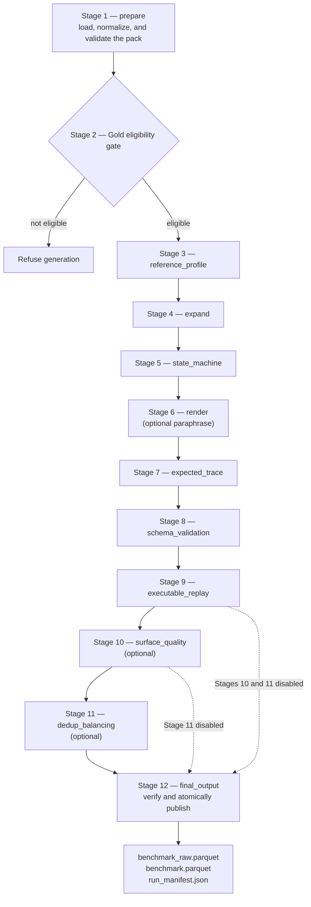

<!--
  SPDX-FileCopyrightText: Copyright (c) 2026 NVIDIA CORPORATION & AFFILIATES. All rights reserved.
  SPDX-License-Identifier: Apache-2.0
-->

# Pipeline Overview

The `bfcl` benchmark family builds function-calling benchmark artifacts from an executable oracle pack.
Unlike the multiple-choice-question family, it does not ask a model to invent questions: the pack's templates define the conversation, and the pack's oracle and assertions establish what the correct tool behavior is.
Generation is therefore closer to deterministic assembly than to synthesis, which is what makes a published row traceable back to the exact pack bytes it came from.

`nemotron steps run byob/bfcl` accepts five values for `stage`:

| `stage` | What the run does |
| --- | --- |
| `prepare` | Normalize and validate the oracle pack, then write `oracle_validation_report.json`. No benchmark rows are produced. |
| `generate` | Require a gold-eligible pack, generate tasks, replay them against the oracle, and publish artifacts. |
| `translate` | Localize an already published benchmark without changing oracle truth. |
| `eval` | Score candidate models using a separate evaluation configuration. |
| `all` | Run `prepare` followed by `generate`. It does not implicitly translate or evaluate. |

## The Twelve Stages

A full generation run is twelve stages. The first is pack preparation, the second is the gold-eligibility gate that decides whether generation is allowed to proceed at all, and the remaining ten are the canonical generation stages that turn templates into published rows.

| Stage | Name | What it establishes |
| --- | --- | --- |
| 1 | `prepare` | Loads the pack, normalizes its files into the stage cache, and runs every validation check. |
| 2 | Gold gate | Derives gold eligibility from the individual checks. `generate` refuses a pack that is not gold-eligible. |
| 3 | `reference_profile` | Normalizes content-addressed style samples into a cached profile when the optional `profile` role is enabled. |
| 4 | `expand` | Binds slot values into locked task instances under the category budget and any held-out reservations. |
| 5 | `state_machine` | Orders each template's milestones into turns and batches the calls that share a call group. |
| 6 | `render` | Renders every turn verbatim from the pack and re-checks the surface guards. Optional model paraphrasing runs here. |
| 7 | `expected_trace` | Derives `expected_tool_calls`, resolving any dependent-call arguments from earlier results. |
| 8 | `schema_validation` | Checks every derived call against its tool's declared parameter schema. |
| 9 | `executable_replay` | Resets the oracle and replays each task twice, then runs the pack's success assertions. |
| 10 | `surface_quality` | Optional. Maps the render guards onto a six-check contract and can drop rows before publication. |
| 11 | `dedup_balancing` | Optional. Deduplicates masked surfaces and balances the publication set across declared dimensions. |
| 12 | `final_output` | Assembles the rows, verifies them, and atomically publishes both Parquet tables and `run_manifest.json`. |

Stages 10 and 11 are bypassed when disabled rather than run as no-ops, so a disabled stage leaves no artifact a later reader could mistake for a verdict it never reached.

## Generation Calls No Model By Default

Every assistant and user turn is rendered from the pack's own templates, so a default run contacts no model at all.
That is not a cost optimization; it is what keeps oracle truth and model output on opposite sides of the pipeline.
A template's rendered wording and its expected calls come from the same bound slot values, so a call and the turn describing it can never disagree.

Three model roles are optional and disabled in the shipped configuration template: a reference profile that shapes style, a paraphraser that proposes alternative wording for a binding, and a surface judge that scores surface quality only.
When all three are disabled the run records `generation_mode: template_only`, and that does not affect gold eligibility.
Even when they are enabled, none of them may touch a task's calls, arguments, or assertions.

## Stages Are Checkpointed And Resumable

Each generation stage writes one artifact under `stage_cache/`, keyed by `task_id` with one row per task, and a checkpoint holding a canonical state snapshot plus immutable copies of the stage's mutable artifacts.
Because every table carries the same `task_id` set, joining them shows exactly which stage dropped a task instead of leaving a shortfall unexplained.

`skip_until=<stage>` resumes by running the named stage and every later enabled stage.
It recursively verifies the named stage's immediate enabled predecessor: the versioned manifest and canonical state, artifact snapshots, schemas, hashes, counts, task order, the generation-config hash, and the pack and endpoint identities.
Unknown stages, disabled optional stages, missing parents, and any drift fail closed.
Restoration removes only the stage outputs that will run again and keeps the append-only model input/output caches, so a re-run stage replays the responses it already recorded rather than paying for new ones that would render different surfaces.

:::{note}
A run started without `skip_until` clears the old checkpoints, and resuming revalidates the pack and endpoint before restoring anything.
`stage=all` therefore does not run `prepare` first when `skip_until` is set.
:::

## Configuration Is Fail-Closed

Generation refuses a configuration it cannot honor instead of ignoring the parts it does not read.
An unknown export name, a balancing target whose owning stage is disabled, an evaluation or translation block, a leftover key from another benchmark family, or an unrecognized `surface_generation` key all stop the run and are named in the error.
The reason is that a silently dropped setting produces a benchmark whose manifest claims a guarantee no stage applied, and there is no way for a later reader to tell that apart from a benchmark where the guarantee held.
A key no stage reads is also, in practice, usually a typo for one that matters.

The same principle governs publication. `run_manifest.json` is written last as the commit marker, so a Parquet file without an adjacent manifest is unpublished bytes whatever its name says.
Troubleshooting for individual refusals is collected in {doc}`../reference/troubleshooting`.

## Translation And Evaluation Are Separate Runs

`translate` and `eval` are runs over a benchmark that was already published, not stages of generation.
Translation starts from the source release's `run_manifest.json`, verifies the published table hashes and schema, and localizes only approved model-facing text while leaving tool names, parameter schemas, slot values, expected calls, assertions, ordering, held-out state, and lineage unchanged.
Protection is mechanical rather than editorial: the translator addresses text through stable field paths, and each protected occurrence is swapped for one placeholder before the request and restored afterwards, so a protected value cannot be localized even when it reads like ordinary prose.
Function descriptions may be localized when that is enabled, but function names and parameter schemas stay exact, because those are the fields a score compares.

Forward translation, backtranslation, and quality evidence are written beside a content-addressed `translation_manifest.json` that records the translator's identity and its contamination scope, which is what lets the contamination gate treat a translator like any other model that read published rows.
Deterministic normalization, configurable response guards, a no-op translation gate that refuses output identical to its input, and Unicode-script checks — inferred from the target language or configured explicitly — all run before publication, and an evaluation recomputes those claims and every metric verdict from the evidence rather than trusting the manifest.
Two consequences are worth planning for: translation never filters rows, so a localized release has exactly the task set of its source, and it does not support `skip_until`, so a failed translation is rerun from the start.

Evaluation reads its own configuration, described in {doc}`evaluation`, and is deliberately excluded from the generation lineage hashes: scoring a new candidate must not change the identity of the benchmark it was scored on.

## Related Information

- {doc}`oracle-pack` for the pack contract the whole pipeline reads from.
- {doc}`authoring-flows` for the three ways to obtain a pack before Stage 1.
- {doc}`evaluation` for what happens after a benchmark is published.
- {doc}`../reference/generate-config` for every generation YAML key.
- {doc}`../reference/output-files` for the exact artifact names and locations.
