<!--
  SPDX-FileCopyrightText: Copyright (c) 2026 NVIDIA CORPORATION & AFFILIATES. All rights reserved.
  SPDX-License-Identifier: Apache-2.0
-->

# Follow One Task Through the Pipeline

This example follows one real template from the bundled localized
`banking_vn_oracle_pack`, from an abstract conversation to a published benchmark row.
It was selected because its missing-slot flow makes the stage boundaries visible, not
because banking, Vietnamese, currency, or its tool names are framework defaults. The
same transformations apply to any pack contract. The snippets abbreviate the actual
Parquet rows; they are not replacement schemas for the artifacts in
{doc}`../reference/output-files`.

The source template is
`src/nemotron/steps/byob/data/banking_vn_oracle_pack/task_templates.yaml` with
`template_id: bn_transfer_fee_withheld_destination`. The user asks for a transfer-fee
quote but does not initially provide the destination account number, so the assistant
must ask for that slot before calling `get_transfer_fee`.

## Before Generation: What the Author Supplies

The pack already contains four kinds of truth that this task needs:

- `tools.json` declares the `get_transfer_fee` interface. Its required arguments are
  `from_account_id`, `to_account_number`, `amount_vnd`, and `rail`;
  `to_bank_code` is optional.
- `fixtures.json` supplies eligible source accounts such as `ACC-001`.
- `task_templates.yaml` declares the slot sources, the Vietnamese surface, the
  `missing_slot` policy, and the ordered assistant milestones.
- `assertions.py` supplies `assert_transfer_fee_reported`, which checks the replayed
  outcome instead of trusting a generated answer.

The template below omits `category`, `difficulty`, `call_order`, and `paraphrase` so
that the fields this example follows stay visible. Read the pack file for the complete
declaration.

```yaml
template_id: bn_transfer_fee_withheld_destination
intent: quote_transfer_fee
turn_policy: missing_slot
required_tools: [get_transfer_fee]
slots:
  from_account_id:
    source: "fixture:accounts.account_id"
    visible_in_first_turn: true
  to_account_number:
    source: "literal:['9876543210', '9988776655']"
    visible_in_first_turn: false
    label: {vi: "số tài khoản nhận"}
  amount_vnd:
    source: "literal:[200000, 500000]"
    visible_in_first_turn: true
  rail:
    source: "literal:['napas']"
    visible_in_first_turn: true
  to_bank_code:
    source: "literal:['970436']"
    visible_in_first_turn: true
success_assertions: [assert_transfer_fee_reported]
user_turn_templates:
  vi: "Tính phí chuyển {amount_vnd}đ từ {from_account_id} tới ngân hàng {to_bank_code} qua {rail}."
assistant_milestones:
  - {type: ask_for_slot, slot: to_account_number}
  - {type: tool_call, tool: get_transfer_fee, args: {to_bank_code: "{to_bank_code}"}}
  - {type: final_answer}
user_simulator_turns:
  - after: ask_for_slot
    content_template: {vi: "Số tài khoản nhận là {to_account_number}."}
```

The template declares no `assistant_turn_templates`, so its assistant text comes from
the pack manifest, which is where the Banking VN pack declares one wording per
milestone type:

```yaml
assistant_turn_templates:
  ask_for_slot:
    vi: "Bạn vui lòng cung cấp {slot_name} ạ."
  final_answer:
    vi: "Đã xong."
```

For readers who do not speak Vietnamese, the English meanings are:

- `số tài khoản nhận`: "destination account number";
- the first user template: "Calculate the fee for transferring
  `{amount_vnd}` VND from `{from_account_id}` to bank `{to_bank_code}` via
  `{rail}`.";
- the simulator reply: "The destination account number is
  `{to_account_number}`.";
- `ask_for_slot`: "Please provide `{slot_name}`.";
- `final_answer`: "Done."

These translations explain the source text; they are not additional language variants
in the pack and are not rendered by the pipeline.

The author reviews these semantics before generation. The pipeline will bind, render,
and verify them, but it will not decide that asking for the destination is the right
domain policy.

## Stages 1–2: Normalize and Admit the Pack

### Stage 1 — `prepare`

Preparation reads the complete pack, normalizes it under `stage_cache/`, and runs the
validation cases. For this example it establishes that:

- `missing_slot` is a known turn policy and every slot declares
  `visible_in_first_turn`;
- `get_transfer_fee` is exposed to the template and declared in `tools.json`;
- the fixture collection `accounts` and its primary keys are valid;
- `assert_transfer_fee_reported` imports, has a valid signature, and is
  executable-compatible.

The main verdict lands in `stage_cache/oracle_validation_report.json`. There is still
no task instance or conversation row at this point.

Preparation checks that the declarations are individually well formed. It does not
check that the milestones produce a conversation the `missing_slot` policy allows;
Stage 5 does that once the turns are ordered.

**Operator action:** run `stage=prepare`; if it fails, correct the named pack file and
rerun it.

### Stage 2 — Gold eligibility gate

The gate derives one decision from the validation report and certification evidence.
A Gold-eligible verdict lets this pack enter generation. A failed verdict stops before
any rows are generated.

**Operator action:** resolve every ineligibility reason. The stage has no override.

## Stage 3: Optionally Establish a Surface Style

`reference_profile` can derive style guidance from reviewed samples. The stage itself
always runs; it is the `profile` model role that is optional. In a template-only run it
writes `reference_profile.json` with `status: "disabled"`, which is how a later reader
can tell that no profile influenced the surfaces. Whether the role is enabled or not,
it cannot change the hidden slot, selected tool, arguments, or success assertion in
this example.

**Operator action:** normally none. Enable the role only when reviewed style samples
and model-exposure authorization exist.

## Stage 4: Expand an Abstract Template

`expand` binds one value for each slot under the configured budget and deterministic
seed. One illustrative instance is:

```yaml
template_id: bn_transfer_fee_withheld_destination
slots:
  from_account_id: ACC-001
  to_account_number: "9876543210"
  amount_vnd: 500000
  rail: napas
  to_bank_code: "970436"
turn_policy: missing_slot
required_tools: [get_transfer_fee]
success_assertions: [assert_transfer_fee_reported]
```

The result is written to `stage_cache/task_instances.parquet`. The destination value
is locked into the task but remains hidden from the first user turn.

**Data change:** reusable slot expressions become concrete, reproducible values.

**Operator action:** if no eligible instance can be made, adjust the fixture data,
slot filters, literals, requested budget, or held-out reservation. Do not edit the
Parquet row.

## Stage 5: Build the Conversation State Machine

`state_machine` orders the milestones and inserts the deterministic simulator reply
after the clarification:

```text
user(first_turn)
assistant(ask_for_slot: to_account_number)
user(simulator reply after ask_for_slot)
assistant(tool_call: get_transfer_fee)
tool(result)
assistant(final_answer)
```

The plan records two user turns and one tool call, so this instance is multi-turn even
though the source template is one task. The output is
`stage_cache/conversation_plans.parquet`.

**Data change:** a concrete task becomes an ordered protocol, but its text and expected
arguments have not yet been rendered.

**Operator action:** if the plan shape is invalid, correct `turn_policy`,
`assistant_milestones`, `user_simulator_turns`, or call groups in the template.

## Stage 6: Render the Visible Conversation

`render` substitutes the locked values into the Vietnamese templates while respecting
`visible_in_first_turn`. The conversation now contains model-facing text:

```text
User:      Tính phí chuyển 500000đ từ ACC-001 tới ngân hàng 970436 qua napas.
Assistant: Bạn vui lòng cung cấp số tài khoản nhận ạ.
User:      Số tài khoản nhận là 9876543210.
Assistant: (calls get_transfer_fee)
Assistant: Đã xong.
```

English meaning:

```text
User:      Calculate the fee for transferring VND 500,000 from ACC-001
           to bank 970436 via NAPAS.
Assistant: Please provide the destination account number.
User:      The destination account number is 9876543210.
Assistant: (calls get_transfer_fee)
Assistant: Done.
```

The English block is a reader aid only. The Vietnamese block above is the actual
surface rendered from this pack.

Two substitutions are worth following, because they answer where a value in a
published row came from. Slot placeholders such as `{amount_vnd}` are replaced by the
value Stage 4 locked, formatted as plain text, which is why the first turn reads
`500000đ` rather than a localized amount. The `{slot_name}` placeholder in the
manifest's `ask_for_slot` wording is replaced by the asked slot's per-language
`label`, so the question reads `số tài khoản nhận` instead of the identifier
`to_account_number`.

The first request cannot leak `9876543210`; the withheld-slot guard applies to the
first turn only, so the value is released in the simulator's later reply. The rendered
row lands in `stage_cache/rendered_conversations.parquet`.

If optional paraphrasing is enabled, it may rewrite the wording but must preserve the
same values, visibility boundary, turn shape, and tool boundary.

**Data change:** the structured plan gains the exact conversation surfaces shown to a
candidate model.

**Operator action:** add or repair language templates when a surface cannot render or
fails a guard. Review `paraphrase_rejections.json` when paraphrasing is enabled.

## Stage 7: Derive the Expected Tool Trace

`expected_trace` turns the tool-call milestone into a machine-checkable call:

```json
{
  "function_name": "get_transfer_fee",
  "arguments": {
    "from_account_id": "ACC-001",
    "to_account_number": "9876543210",
    "amount_vnd": 500000,
    "rail": "napas",
    "to_bank_code": "970436"
  }
}
```

The milestone explicitly supplies `to_bank_code`. The stage also binds required tool
parameters from same-named task slots, which supplies the other four arguments. This
rule does not inject optional parameters merely because an unrelated same-named slot
exists, so omitting one preserves the backend's declared default.

The two routes differ in one way that matters later. A milestone argument written as
`"{to_bank_code}"` is substituted into text and therefore arrives as the string
`"970436"`, while `amount_vnd` keeps the integer type of the literal it was bound from.
Evaluation compares arguments as canonical JSON, where `500000` and `"500000"` are
different answers, so a template that quotes a numeric argument pins a string as the
gold value.

The result lands in `stage_cache/expected_traces.parquet`.

**Data change:** the rendered conversation gains the exact ordered tool behavior that
evaluation will compare.

**Operator action:** repair unresolved argument sources or references to earlier call
results in the source milestones.

## Stage 8: Validate the Call Against the Tool Contract

`schema_validation` checks the expected call against `tools_normalized.json`:

- the function name exists;
- all four required arguments are present;
- strings and the integer use the declared JSON types;
- `rail` is one of the declared enum values;
- there are no undeclared properties.

A passing row is written to `stage_cache/schema_validated_traces.parquet`.

**Data change:** no semantic value is added; the trace receives evidence that it
conforms to the public tool interface.

**Operator action:** reconcile the template with `tools.json` if the function or
arguments disagree.

## Stage 9: Prove the Backend Reproduces the Claim

`executable_replay` replays the task twice after independent resets and runs
`assert_transfer_fee_reported`, which requires a `get_transfer_fee` result carrying
`fee_vnd` and no error. The two replays must agree on their results, final state, and
assertion outcomes; a divergence is recorded as a nondeterministic replay rather than
published.

A successful task lands in `stage_cache/replay_validated_tasks.parquet`. A failure
means that a schema-valid call still disagrees with the backend or the declared
success condition.

**Data change:** the trace gains executable evidence. This is the point where an
expected answer becomes oracle-verified rather than merely well-formed.

**Operator action:** use the recorded failure to determine whether the backend,
fixture, expected trace, or assertion is wrong.

## Stages 10–11: Decide Whether the Verified Row Is Published

When enabled, `surface_quality` checks that the Vietnamese surface is usable without
changing its verified call. A rejected surface is recorded in
`surface_quality_rejections.json`.

When enabled, `dedup_balancing` compares this row with the other replay-valid rows and
may select it to satisfy the requested category, policy, difficulty, language, and
turn mix. The decision is recorded in `dedup_balancing_report.json`.

**Data change:** these stages can remove a row from the publication set; they never
rewrite its conversation, expected call, or oracle evidence.

**Operator action:** improve source surfaces for quality failures. For balancing
shortfalls, add source diversity or relax an infeasible publication target.

## Stage 12: Publish the Verified Selection

`final_output` places every schema-valid, replay-valid row in
`benchmark_raw.parquet`. If this example survives the optional selection stages, the
byte-identical row also appears in `benchmark.parquet`.

The stage then verifies both tables, rescans held-out bindings, publishes optional
exports, and writes `run_manifest.json` last. The manifest binds the benchmark to the
exact pack, configuration, seeds, stage counts, model roles, and artifact hashes.

**Data change:** verified internal rows become an immutable publication. Selection may
change membership and order, but not row content.

**Operator action:** confirm the publication counts, pack identity, hashes, and export
status in the manifest. If the Parquet files exist without `run_manifest.json`, this
run did not publish.

## Transformation Summary

```mermaid
flowchart LR
  T["Abstract template<br/>slot expressions"]
  I["Locked instance<br/>concrete values"]
  P["Conversation plan<br/>ordered milestones"]
  R["Rendered conversation<br/>visible text"]
  E["Expected trace<br/>exact tool call"]
  V["Schema-valid trace"]
  X["Replay-valid task<br/>assertions passed"]
  S["Selected row"]
  O["Published benchmark<br/>manifest-bound"]

  T -->|"expand"| I
  I -->|"state_machine"| P
  P -->|"render"| R
  R -->|"expected_trace"| E
  E -->|"schema_validation"| V
  V -->|"executable_replay"| X
  X -->|"quality and balancing"| S
  S -->|"final_output"| O
```



For the complete stage contracts, refer to {doc}`pipeline-overview`. For every artifact
path, refer to {doc}`../reference/output-files`.
