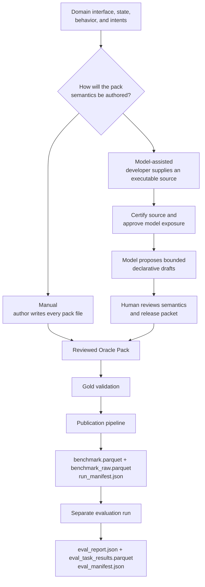

<!--
  SPDX-FileCopyrightText: Copyright (c) 2026 NVIDIA CORPORATION & AFFILIATES. All rights reserved.
  SPDX-License-Identifier: Apache-2.0
-->

# From Domain Assets To An Oracle Pack

Use this guide when you have some combination of a tool interface, representative
records, an existing implementation, or documented business behavior but do not yet
have an Oracle Pack. It shows the two conventional authoring paths from those starting
assets to one reviewed pack:

- **Manual authoring:** write and review every pack file yourself.
- **Model-assisted authoring:** expose a reviewed, executable source to an authoring
  model, let it propose only the permitted declarative artifacts, and review those
  proposals before release.

Both paths finish with the same reviewed Oracle Pack and the same Gold gate. Generation,
publication, and evaluation are later runs over that pack, not extra authoring stages.
After the pack is Gold-eligible, continue with {doc}`publish-a-release`, optionally
{doc}`translate`, and {doc}`run-evaluation`. Model assistance never earns a weaker
validation standard.

## Understand The End-To-End Process

Use the three guides as separate phases with explicit handoffs:

1. **Author and validate the domain:** follow this guide until you have a reviewed,
   Gold-eligible Oracle Pack.
2. **Generate and publish the benchmark:** follow {doc}`publish-a-release` until one
   unchanged directory contains `benchmark.parquet`, `benchmark_raw.parquet`, and
   the `run_manifest.json` commit marker. Enable the NeMo Evaluator bundle during
   this phase if the Launcher backend will be used.
3. **Import and evaluate:** follow {doc}`run-evaluation`. Point `eval.yaml` at
   `run_manifest.json`, run either the direct or NeMo Evaluator Launcher backend,
   then read and export the evaluation artifacts.

Do not combine the phase outputs manually. In particular, do not edit generated
Parquet files, synthesize a manifest, or add files to the NeMo Evaluator bundle.

## Identify The Required Domain Inputs

Documents, schemas, and records can help author a pack, but they are not collectively
treated as a special "domain data" format. Interface documentation alone cannot
establish executable correctness. Before generation, the workflow needs a deterministic
Python backend, a pinned HTTP oracle, or a supported MCP gateway that reproduces what
each function does. Identify these four inputs before choosing an authoring path:

1. **Tool interface:** function names, descriptions, parameter schemas, and whether
   each function mutates state or requires confirmation.
2. **Domain state:** deterministic example records from which every episode can reset.
3. **Business behavior:** successful results, state transitions, structured errors,
   confirmation behavior, and timeout behavior.
4. **Conversation intent:** the questions and workflows the benchmark should exercise,
   including missing information, confirmations, corrections, and negative paths.

The compact walkthrough below uses the bundled English `tiny_oracle_pack` only to keep
the snippets short. Language, geography, industry, and library behavior are not
framework defaults. Warehouse command paths in {doc}`assisted-authoring`,
{doc}`publish-a-release`, {doc}`translate`, and {doc}`run-evaluation` are a second
worked example. The Vietnamese `banking_vn_oracle_pack` and
{doc}`../explanation/pipeline-worked-example` demonstrate a larger localized pack.
Do not mix fixture ids or tool names across those examples.

```text
Tool interface:
  get_book_status(book_id)
  checkout_book(book_id, patron_id, confirm=false)

Domain state:
  BK-100 is available
  BK-ABSENT-1 is not held
  P-1 is a known patron

Business behavior:
  An unknown id returns a structured not-found error
  Checkout changes loan state only after confirmation

Conversation intent:
  Look up a known book
  Confirm and complete a checkout
  Decline an out-of-scope request
```

Those names, ids, and files live in
`src/nemotron/steps/byob/data/tiny_oracle_pack/`. Later snippets in this guide use the
same catalog rather than a second invented library.

## Choose A Path



Choose manual authoring when you want direct control over every conversation or no
source may be exposed to a model. Choose model-assisted authoring when a deterministic
source already expresses the domain and you want help drafting benchmark coverage
around it.

This page walks the conventional local-Python path because it supports the complete
intake-to-publication lifecycle. If the oracle is an existing HTTP service, read
{doc}`assisted-authoring` before starting: `http_package` supports intake, drafting,
review, and freeze, but publication is currently refused. If the oracle is an MCP
server, use {doc}`mcp-server`; it joins the same assisted-authoring spine through the
gateway.

## Before You Start

Run commands from the repository root:

```bash
uv sync --extra byob
```

If this is your first BFCL run, execute the finished English reference before editing
anything:

```bash
uv run nemotron steps run byob/bfcl \
  -c src/nemotron/steps/byob/bfcl/config/tiny.yaml \
  stage=all \
  family=bfcl
```

That run shows the destination both paths are trying to produce. The reference pack
contains `manifest.yaml`, `tools.json`, `backend.py`, `fixtures.json`,
`task_templates.yaml`, `assertions.py`, and `validation_cases.yaml`.

To inspect the assisted path once without preparing your own source, run the
credential-free walkthrough from the repository root:

```bash
uv run python scripts/bfcl_assisted_authoring_demo.py \
  --workdir /tmp/bfcl-demo
```

The walkthrough creates its own library source, `tools.json`, domain brief, and probe
plan, then uses a scripted authoring model, real intake probes, independent validation,
human-gate simulations, publication, and evaluation. It demonstrates the boundaries; it
does not prepare or validate your domain inputs. Use `--author-model live` only after
the scripted path works and a configured model endpoint is available.

## Path A: Author The Pack Manually

In this path, the files you review are the files generation reads. No authoring model
participates.

### 1. Scaffold A Runnable Pack

Choose a new target directory; the scaffolder never overwrites one:

```bash
uv run python -m nemotron.steps.byob.scripts.scaffold_oracle_pack \
  --domain library_catalog \
  --target /srv/bfcl/packs/library_catalog \
  --transport python \
  --language en \
  --version 0.1.0
```

The starter implements one generic `get_record` tool and writes a `validate.yaml`.
Run that starter once before replacing it, so an environment problem is not mistaken
for a domain-modeling problem.

If the oracle already runs as an HTTPS service, scaffold with `--transport endpoint`
instead and follow {doc}`../reference/endpoint-config`.

### 2. Map Domain Truth Into Pack Files

Work in dependency order. {doc}`../reference/oracle-pack-inputs` explains the file
inventory and links to one standardized reference per artifact:
{doc}`../reference/manifest`, {doc}`../reference/tools-and-fixtures`,
{doc}`../reference/python-backend`, {doc}`../reference/task-templates`,
{doc}`../reference/assertions`, {doc}`../reference/validation-cases`,
{doc}`../reference/endpoint-config`, and {doc}`../reference/held-out-policy`.

| Your domain input | Pack destination | What to preserve |
| --- | --- | --- |
| Tool interface | `tools.json` | OpenAI function-tool shape, JSON parameter types, `x-mutates`, and `x-requires-confirmation`. |
| Executable behavior | `backend.py` | `list_tools`, `reset`, `call_tool`, and `get_state`; deterministic state and structured `{"error": {"code": ...}}` rejections. |
| Example records | `fixtures.json` | Stable collection names and primary keys; enough rows for template filters and publication budgets. |
| Conversation intents | `task_templates.yaml` | Slots, visibility, turn policy, milestones, tool exposure, and success assertions. |
| Meaning of success | `assertions.py` | Assertions named by templates, plus capability declarations for trace and executable use. |
| Known outcomes | `validation_cases.yaml` | At least one success and one negative probe per tool. |
| Pack identity and shared text | `manifest.yaml` | Version, language, frozen clock, paths, primary keys, and assistant turn templates. |

`tools.json` is the source of truth for the public interface, but it is not enough to
derive business behavior, state transitions, conversation policies, or assertions.
Those remain explicit because they are what make a row executable and reviewable.

Use the matching files in `tiny_oracle_pack` as an English example. Replace its library
semantics with your domain; do not copy its fixture values or publication budgets as
defaults.

### 3. Validate While Authoring

Run the standalone validator after each meaningful edit:

```bash
uv run python -m nemotron.steps.byob.scripts.validate_oracle_pack \
  --config /srv/bfcl/packs/library_catalog/validate.yaml \
  --output-dir /tmp/bfcl-library-validation
```

Exit code `0` means Gold-eligible, `2` means validation reached a non-Gold verdict,
and `1` means no verdict could be produced. Read the failed checks rather than editing
the generated report. The same report is what `stage=prepare` writes if you prefer to
stay on the pipeline CLI. See {doc}`author-a-pack` for how to read the named checks.

### 4. Generate A Smoke Benchmark

Once preparation is Gold-eligible, copy the smoke configuration rather than using the
scaffolded `validate.yaml` as a generation run. Relative paths in a BFCL configuration
resolve from `src/nemotron/steps/byob/`, not from the shell working directory; use
absolute paths for an external pack and keep `output_dir` outside the pack root.

```bash
mkdir -p /srv/bfcl/runs && \
  cp src/nemotron/steps/byob/bfcl/config/smoke.example.yaml \
    /srv/bfcl/runs/library-smoke.yaml
```

Point the copy at the pack, keep `lineage.policy: smoke_no_publication`, and set
`tasks_per_category` to at least the template count of the widest category:

```yaml
expt_name: bfcl_library_smoke
output_dir: /srv/bfcl/runs/library-smoke-output
oracle_pack:
  manifest_path: /srv/bfcl/packs/library_catalog/manifest.yaml
oracle_runtime:
  allowed_roots:
    - /srv/bfcl/packs/library_catalog
task_generation:
  tasks_per_category: 10
```

```bash
uv run nemotron steps run byob/bfcl \
  -c /srv/bfcl/runs/library-smoke.yaml \
  stage=all \
  family=bfcl
```

Verify `benchmark_raw.parquet`, `benchmark.parquet`, `run_manifest.json`, and the
adjacent `stage_cache/` tables. A smoke run still writes those files, but records
`gold_eligible: false` in the manifest even when the pack itself is Gold. That proves
plumbing; it is not a publication-eligible evaluation source. Follow
{doc}`publish-a-release` to choose a reviewed publication budget, then
{doc}`run-evaluation` to score a candidate.

For every manual pack field and validation rule, continue with
{doc}`author-a-pack`.

## Path B: Author From An Executable Source With Model Assistance

This path starts one step before an Oracle Pack. You supply a conventional source
package whose behavior can be fingerprinted and probed; the authoring pipeline
certifies that source before a model sees sanitized evidence from it.

The authoring control plane is the stateful `bfcl_author` CLI; there is no equivalent
generic REST endpoint for driving this guided workflow. This does not restrict oracle
transport: source behavior may still come from local Python, a reviewed HTTP package,
or an MCP gateway, subject to the support limitations above.

:::{important}
This is model-assisted authoring, not model-generated oracle truth. A model may propose
coverage, task plans, validation cases, and declarative assertion specifications. After
a source is certified, it may not change that source's backend, tool schemas, or
fixtures, and it may not certify, approve, or bypass Gold validation. An optional
pre-intake scaffold lane can suggest fixture data, but those suggestions become source
bytes a human must review before certification.
:::

The credential-free walkthrough above creates its own source and authoring inputs.
The steps below prepare yours.

### Required Inputs

Prepare these operator-owned inputs before starting intake:

| Input | Purpose |
| --- | --- |
| Reviewed `tools.json` | Defines the exact public functions and JSON parameter schemas a candidate may see. |
| Executable source | For `local_python`: `backend.py`, `dependency-lock.json`, and optional `fixtures.json`. For HTTP: `endpoint_config.yaml`. Prefer an existing domain-owned implementation over scaffolding. |
| Domain brief | Describes the domain, supported reads and mutations, confirmation and refusal behavior, identifier shapes, and language. It supplies drafting context, not oracle truth. See {doc}`../reference/domain-brief`. |
| Probe plan | Names the calls intake may execute to measure coverage, errors, reset, isolation, confirmation safety, and timeout cleanup. A Gold release requires A2, including a timeout case. |
| Held-out decision | Supplies either a reviewed held-out policy or a reason held-out data does not apply. |
| Certification key | An Ed25519 private key that signs the measured source evidence under a chosen key id. |

The domain brief is required independently of `tools.json`: the catalog defines the
call interface, while the brief explains which capabilities and business behaviors
matter together. Command-level intake, drafting, and freeze details are in
{doc}`assisted-authoring`.

Create a certification key before intake:

```bash
mkdir -p /srv/bfcl/keys
openssl genpkey -algorithm Ed25519 \
  -out /srv/bfcl/keys/certification-private.pem
openssl pkey -in /srv/bfcl/keys/certification-private.pem \
  -pubout -out /srv/bfcl/keys/certification-public.pem
```

`--certification-key-id` is the identifier you pass with that private key, such as
`library-authoring`. Keep the private key outside the source tree.

### 1. Prepare A Reviewed Tool Catalog

Start from the public interface you want a candidate model to see. Each entry in
`tools.json` needs a stable name, description, and JSON parameter schema. Mark
mutating and confirmation-gated tools with the pack-local annotations shown in
`tiny_oracle_pack/tools.json`.

Put that reviewed catalog *inside* the source directory before scaffolding or checking.
Neither `scaffold_source_package` nor intake copies `tools.json` for you; both read it
as a file that already belongs to the source. When following this library example:

```bash
mkdir -p /srv/sources/library
cp src/nemotron/steps/byob/data/tiny_oracle_pack/tools.json \
  /srv/sources/library/tools.json
```

For your own domain, write `tools.json` from the real interface instead of copying the
library catalog. The catalog cannot decide what a call returns or how state changes.
You supply that truth in the next step.

### 2. Provide Or Scaffold The Source Package

If a reviewed `backend.py`, `fixtures.json`, and `dependency-lock.json` already exist,
place the catalog beside them and continue at the static check. Do not scaffold over a
domain-owned implementation; the scaffolder never overwrites `backend.py` or
`fixtures.json`, but it also will not replace their semantics.

If no independently implemented source exists, generate the mechanical backend and
fixture skeleton from the reviewed catalog:

```bash
uv run python -m nemotron.steps.byob.scripts.scaffold_source_package \
  --tools /srv/sources/library/tools.json \
  --output /srv/sources/library \
  --collection books \
  --dependency-lock
```

The command writes `backend.py`, `fixtures.json`, and `dependency-lock.json`. It does
not write `tools.json`. After a successful scaffold the source looks like:

```text
library/
├── backend.py
├── tools.json
├── fixtures.json
└── dependency-lock.json
```

The generated handlers and fixture rows still carry `BFCL-TODO` at every decision the
catalog cannot make. Implement and review every marker. Intake deliberately refuses a
source while one remains.

An optional `--draft-with-model` lane can suggest fixture data and declarative
behaviors when supplied with `--domain-brief` and the required model identity flags.
It still compiles those declarations into Python rather than allowing the model to
write the oracle directly. Review the result exactly as you would review a manually
written backend.

Do not prefer this optional lane over an existing domain-owned implementation or a
backend authored from independently reviewed specifications. Model suggestions can
carry the authoring model's assumptions into fixture distributions, error behavior,
vocabulary, and state transitions, which can bias task coverage or favor familiar
conventions. Gold validation catches inconsistency and nondeterminism, not semantic
representativeness. Use independent records and tests to review every suggestion, and
avoid using the same model as the sole author of both oracle behavior and benchmark
tasks. See {doc}`../reference/python-backend` for the full recommendation.

### 3. Check The Source Before Intake

```bash
uv run python -m nemotron.steps.byob.scripts.check_source_package \
  --source /srv/sources/library
```

Proceed only when the command exits `0`. A passing static check means the source agrees
with its catalog and contains no review marker; it does not certify that the behavior
is correct.

### 4. Supply The Human-Owned Authoring Inputs

Copy and complete the domain brief:

```bash
cp src/nemotron/steps/byob/references/bfcl-domain-brief.skeleton.txt \
  /srv/sources/library-domain-brief.txt
```

Remove every bracketed `BFCL-SKELETON` block. State what the assistant reads and
changes, confirmation behavior, well-formed requests that are refused, identifier
shape, and language. The brief is context for drafting, not behavioral proof. See
{doc}`../reference/domain-brief` for the complete content, safety, and validation
contract.

Prepare a probe plan covering every published tool, at least one structured error if
the source has error codes, confirmation safety for mutations, reset isolation, and a
case the tool cannot finish inside its deadline. Without that timeout case,
certification cannot reach A2. Copy the structure from
`src/nemotron/steps/byob/references/bfcl-probe-plan.example.json`, then replace its
banking tools, fixture ids, and cases. See {doc}`../reference/probe-plan` for the A2
coverage contract, including the timeout case. Check the plan without executing probes:

```bash
uv run python -m nemotron.steps.byob.scripts.check_probe_plan \
  --source /srv/sources/library \
  --probe-plan /srv/sources/library-probe-plan.json
```

The check reports static coverage gaps that would block A2. Intake remains
authoritative because only it executes the probes. An optional model-drafted plan is
documented in {doc}`assisted-authoring`; review that draft the same way you would
review a handwritten plan.

### 5. Start Intake And Certification

Enable live inspection of a local Python source:

```bash
export BFCL_ENABLE_LOCAL_PYTHON=1
```

Then trigger the guided flow:

```bash
uv run python -m nemotron.steps.byob.scripts.bfcl_author \
  --ci author \
  --workspace /srv/bfcl/authoring/library \
  --source /srv/sources/library \
  --brief /srv/sources/library-domain-brief.txt \
  --adapter local_python \
  --pack-id library_catalog \
  --pack-version 0.1.0 \
  --required-tier A2 \
  --held-out-not-applicable-reason "The library fixtures are public synthetic data." \
  --held-out-reviewed-by reviewer@example.test \
  --certification-private-key /srv/bfcl/keys/certification-private.pem \
  --certification-key-id library-authoring \
  --probe-plan /srv/sources/library-probe-plan.json
```

Intake writes fingerprinted, transport-neutral evidence and derives A0, A1, or A2
from observations. A Gold release needs A2. Neither a reviewer nor a model can promote
an under-certified source.

### 6. Cross The Two Human Boundaries

Continue with the commands that `bfcl_author` reports for the current session:

```text
answer open questions, when present
→ authorize the exact sanitized evidence for model exposure
→ approve that evidence
→ draft bounded proposals
→ assemble them with a reviewed semantic supplement
→ build and inspect the release review packet
→ approve that exact release
→ freeze
→ publish
```

These are two trust boundaries implemented by three human or policy records:

- **Pre-model:** exposure authorization and evidence approval happen before drafting
  and decide whether a model may read one exact evidence subject.
- **Release approval** happens after fresh candidate validation and decides whether
  one exact reviewed pack may be frozen and published.

The boundaries require distinct decisions and digest-bound artifacts, not two distinct
people. The same named person may act at multiple gates unless organizational policy
requires separation of duties; exposure may also be authorized by an organizational
policy digest. Editing an upstream artifact invalidates downstream approvals.

### 7. Review The Semantic Supplement And Assemble

The authoring model cannot infer fixture-column bindings, final turn policies,
per-language user turns, or certification validation cases merely from a tool
catalog. Put those human-reviewed semantics in a
`bfcl-candidate-pack-supplement-v1` YAML document.
The supplement's `task_templates` entries use the same field contract documented in
{doc}`../reference/task-templates`.

The supplement is a real YAML document, not a sketch: `task_templates` and
`validation_cases` must each contain at least one complete entry, and every tool or
assertion they name must already exist in the certified catalog and compiled drafts.
The shape is:

```yaml
schema_version: bfcl-candidate-pack-supplement-v1
languages: [en]
clock: "2026-03-02T02:00:00Z"
absent_ids:
  books: [BK-ABSENT-1]
primary_keys:
  books: book_id
assistant_turn_templates:
  ask_for_slot:
    en: "Could you tell me the {slot_name}?"
  ask_confirm:
    en: "Please confirm you want me to go ahead with the details above."
  decline:
    en: "Sorry, none of the tools I have can do that."
  final_answer:
    en: "Done."
task_templates:
  - template_id: lib_status_single
    # Remaining keys are the same contract as task_templates.yaml.
validation_cases:
  - id: success_get_book_status
    # Remaining keys are the same contract as validation_cases.yaml.
```

Do not paste the comments above into a file you assemble. Adapt the completed
templates and cases from `tiny_oracle_pack`, then review every slot binding and turn
policy against the certified source. The demo's `write_supplement()` adds a
demo-specific timeout tool and assertions to exercise A2 certification; it is useful
to inspect but is not a drop-in supplement template for another domain.

After drafting has produced the session-owned evidence and draft artifacts, assemble
the candidate with the two operator-owned paths that guided mode does not infer:

```bash
uv run python -m nemotron.steps.byob.scripts.bfcl_author \
  --ci assemble \
  --workspace /srv/bfcl/authoring/library \
  --supplement /srv/bfcl/authoring/library/reviewed-supplement.yaml \
  --output /srv/bfcl/authoring/library/candidate-pack
```

The CLI binds the session's evidence, drafts, and source automatically. Assembly
refuses any supplement tool or assertion that cannot be traced back to certified
evidence and compiled drafts.

### 8. Review, Freeze, And Publish

The remaining guided commands build a deterministic review packet from independently
verified certification, fresh validation, answered questions, and the complete
candidate pack. A reviewer approves the packet digest, then `freeze` seals the exact
pack and sidecars. `publish` reruns fresh Gold validation and the ordinary
`stage=all` generation pipeline rather than trusting an earlier verdict.

Follow {doc}`assisted-authoring` for the remaining command-level sequence and
`src/nemotron/steps/byob/references/bfcl-authoring-user-guide.md` for every required
argument and refusal code. Those pages are the sources of truth for authorize, draft,
review, freeze, and publish. The `_demo.py` walkthrough above is not a production
launcher.

## Where Both Paths Meet

Both paths must produce the same pack contract:

```text
reviewed-oracle-pack/
├── manifest.yaml
├── tools.json
├── backend.py                 # or endpoint_config.yaml
├── fixtures.json
├── task_templates.yaml
├── assertions.py
├── validation_cases.yaml
└── held_out.yaml              # optional
```

From that boundary onward, authoring history does not change the standard:

```text
reviewed Oracle Pack
  → prepare and Gold eligibility
  → expand locked task instances
  → construct conversation state machines
  → render surfaces and derive expected calls
  → validate schemas and replay against the oracle
  → optionally check quality, deduplicate, and balance
  → atomically publish benchmark.parquet and run_manifest.json
```

{doc}`../explanation/pipeline-worked-example` follows one task through those
transformations. {doc}`../explanation/pipeline-overview` lists each stage's input,
output, operator responsibility, and failure meaning.

## Verify Success

Check pack validation and publication separately. They answer different questions.

- `stage_cache/oracle_validation_report.json` reports the pack's own `tier` and
  `gold_eligible`. A Gold pack is required before you spend a publication budget.
- A smoke configuration with `lineage.policy: smoke_no_publication` still writes
  `run_manifest.json`, but records `gold_eligible: false` even when the pack itself
  is Gold. That is the point of a smoke run: it proves plumbing without claiming a
  releasable lineage.
- Every row that reaches the raw table passed deterministic executable replay and its
  declared assertions.
- `benchmark_raw.parquet` contains all replay-valid rows.
- `benchmark.parquet` contains the selected publication rows without rewriting them.
- `run_manifest.json` exists beside both tables and pins the pack, configuration,
  seeds, stage counts, model roles, and artifact hashes.

A publication run after freeze, or {doc}`publish-a-release`, is what can record
`gold_eligible: true` in the manifest.

If a run fails, use {doc}`../reference/output-files` to find the first adjacent stage
artifact that lost the task, then use {doc}`../reference/troubleshooting` to map the
reported refusal to its source fix.

## Follow-Up: Evaluation And Next Steps

Evaluation is a separate run over a **published** benchmark, with its own configuration
and output directory. A smoke run with `lineage.policy: smoke_no_publication` can write
`run_manifest.json`, `benchmark.parquet`, and `benchmark_raw.parquet` while still
recording `gold_eligible: false`. That output is not a publication-eligible evaluation
source.

Before scoring a candidate:

1. Produce a publication run with {doc}`publish-a-release`, or Path B `publish` after
   freeze, so the manifest can record `gold_eligible: true`.
2. Confirm the publication tree still contains `run_manifest.json`,
   `benchmark.parquet`, and `benchmark_raw.parquet`.
3. For executable mode, keep the exact Oracle Pack whose fingerprint the publication
   recorded.

Connect the publication to the evaluator through its manifest, not by importing the
Parquet file directly:

```yaml
source_run_manifest: /srv/bfcl/runs/library-gold/run_manifest.json
```

The manifest locates and authenticates the adjacent `benchmark.parquet` and
`benchmark_raw.parquet`. Direct evaluation needs no compatibility export. If you will
submit through the NeMo Evaluator Launcher, enable
`exports.nemo_evaluator_bundle: true` in the publication configuration first.

Then follow {doc}`run-evaluation` for candidate endpoint configuration, preflight,
execution, and result inspection. Use {doc}`../reference/eval-config` for every
configuration field and {doc}`../explanation/evaluation` for scoring modes, gates,
artifacts, and metric semantics.

To localize a completed, verified generation run without changing oracle truth, follow
{doc}`translate`. Translation is a separate run and writes its own
`translation_manifest.json`.
