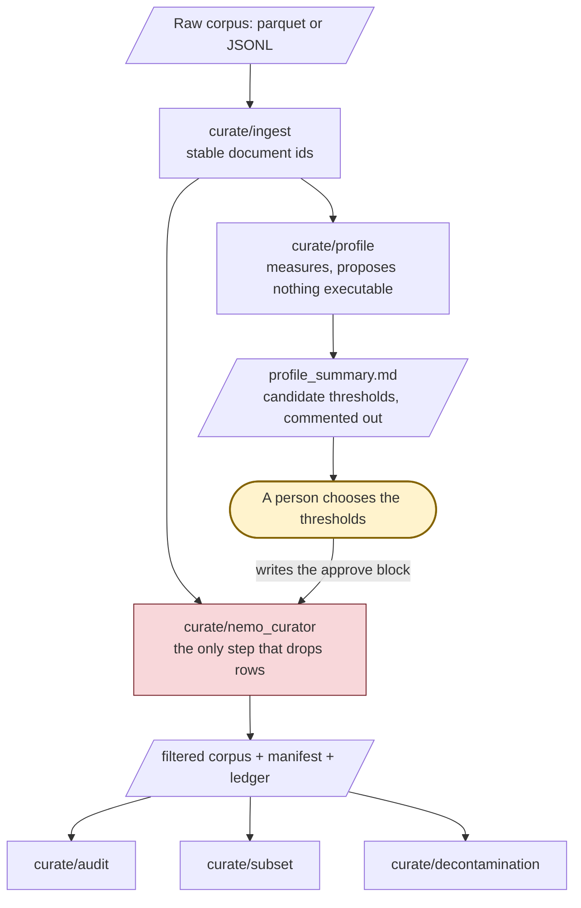
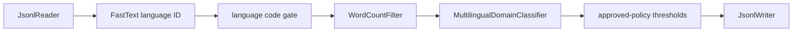

(curate-index)=
# About Data Curation With NeMo Curator

The `curate/*` steps turn a raw corpus into a filtered one you can account for. `curate/nemo_curator` is the filter itself; six further steps prepare the corpus, measure it before you gate it, and check what came out. `curate/flow` runs them from a single config.

| Step | Use it to |
|---|---|
| `curate/ingest` | Read raw parquet or JSONL, mint a stable document id, write curatable JSONL. |
| `curate/profile` | Measure the corpus and report what a candidate threshold would do to it. |
| `curate/nemo_curator` | Apply language, word-count, domain and approved-policy filters. |
| `curate/audit` | Check the output against what the producing step declared. |
| `curate/subset` | Draw nested subsets at fixed token budgets, for ablations. |
| `curate/decontamination` | Remove training documents that overlap a held-out split. |
| `curate/flow` | Run the above from one config, with the gates enforced. |

Start with **[the curate/flow README](https://github.com/NVIDIA-NeMo/Nemotron/blob/main/src/nemotron/steps/curate/flow/README.md)**, which carries the run guide: the shipped example configs, the two-run threshold workflow, and the output layout. Note that `-c tiny` is an ingest-only smoke test, not a working curation config.

Language packs are supplied by you. Nemotron ships one opt-in English reference pack; every other language needs a reviewed pack under `corpus.langpack_dir`.

## When to Use

Use `curate/nemo_curator` on its own when you need:

- A local JSONL reader and writer path using NeMo Curator.
- Optional FastText language identification and language filtering.
- Optional word-count filtering.
- Optional multilingual domain classification and filtering.
- Optional Hugging Face dataset snapshot download before the Curator reader runs.

```{note}
`curate/nemo_curator` is intentionally lightweight: it does not crawl web pages or extract Common Crawl WARC files. Use a dedicated Curator recipe for those jobs before this step.

Near-duplicate removal against a held-out split does live in this category, in `curate/decontamination`, behind the `nemotron[curate-gpu]` extra.
```

## Pipeline Summary

The category, and where the human decision sits. A plain fence is used so this
renders both on the documentation site and on GitHub.



The two runs are deliberate: the candidate thresholds do not exist until the
profile has read your corpus, so there is nothing to approve on the first run.
The profile writes them out ready to paste, commented, with the retention each
one buys — the copying is automated, the choice is not.

### Inside curate/nemo_curator



Every gate is conditional on configuration. A key left out means the stage is not
built, not that it is built with a default.

## Documentation Series

::::{grid} 1 2 2 2
:gutter: 1 1 1 2

:::{grid-item-card} {octicon}`book;1.5em;sd-mr-1` Tutorial
:link: getting-started
:link-type: doc
Install the Nemotron CLI, run a local tiny JSONL initial curation validation, and inspect output shards.
+++
{bdg-secondary}`hands-on`
:::

:::{grid-item-card} {octicon}`tools;1.5em;sd-mr-1` How-To Guides
:link: how-to/index
:link-type: doc
Run local JSONL curation, download a Hugging Face snapshot, and enable optional filters.
+++
{bdg-secondary}`task-based`
:::

:::{grid-item-card} {octicon}`list-unordered;1.5em;sd-mr-1` Reference
:link: reference/index
:link-type: doc
YAML parameters, CLI syntax, input/output format, and troubleshooting.
+++
{bdg-secondary}`lookup`
:::

::::

## All Documentation

````{tab-set}

```{tab-item} Tutorial

| Guide | What you do |
| --- | --- |
| {doc}`getting-started` | Run `curate/nemo_curator` on the packaged tiny JSONL fixture |

```

```{tab-item} How-To Guides

| Guide | Focus |
| --- | --- |
| {doc}`how-to/run-local-jsonl` | Local JSONL reader/writer path |
| {doc}`how-to/use-huggingface-snapshot` | `dataset` block and Hugging Face snapshot download |
| {doc}`how-to/enable-filters` | Language, word-count, and domain filters |

```

```{tab-item} Reference

| Guide | Content |
| --- | --- |
| {doc}`reference/curate-config` | YAML field reference |
| {doc}`reference/cli-curate` | `nemotron steps run curate/nemo_curator` syntax |
| {doc}`reference/io-format` | Input and output shapes |
| {doc}`reference/troubleshooting` | Common failures and fixes |

```

````

## What You Need

- JSONL input with one text field, usually named `text`.
- Optional model assets when filters are enabled, such as a FastText language identification model for `language_codes`.
- A writable output directory for JSONL shards.

## Quick Paths

1. First local run: {doc}`getting-started`
2. Local corpus setup: {doc}`how-to/run-local-jsonl`
3. Hugging Face snapshot setup: {doc}`how-to/use-huggingface-snapshot`
4. Filter setup: {doc}`how-to/enable-filters`
5. Lookup flags: {doc}`reference/cli-curate`
