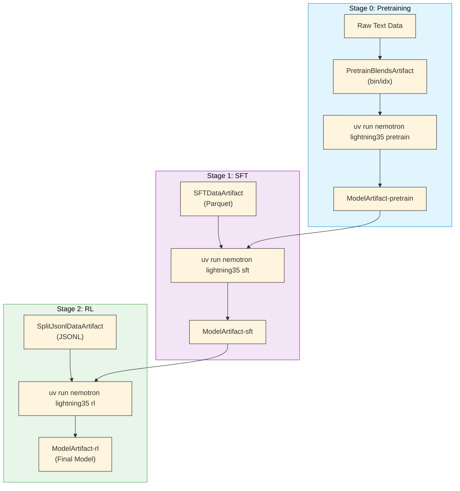

# Nemotron 3.5 Lightning Training Recipe

Reproducible training pipeline for [Nemotron 3.5 Lightning](https://developer.nvidia.com/blog/nvidia-nemotron-3-5-lightning-delivers-fast-accurate-specialized-task-execution-for-long-running-agents/), an open 30B-A3B Mixture-of-Experts hybrid Mamba-Transformer model with Multi-Token Prediction, built for fast, accurate specialized task execution in long-running agents. Weights, data, and recipes are released under OpenMDW-1.1.

## Quick Start

### Prerequisites

- **GPU cluster** (H100 recommended) reachable through one of the supported
  executors: **Slurm**, **DGX Cloud (run:ai)**, or **DGX Cloud Lepton** —
  plus `local`/`docker` for development. The executor is selected per profile
  via `executor = "..."` in `env.toml`; see
  [Execution through NeMo-Run](../../nemo_runspec/nemo-run.md).

  > **Note**: Until the public 26.08 launch container ships, the pretrain and
  > SFT stages mount Megatron-Bridge main via `${auto_mount:...}`, which is
  > cloned over an SSH tunnel and therefore **requires the Slurm executor**.
  > The RL and eval stages have no mounts and run on any executor. Once the
  > launch container (with the Lightning recipes built in) is available, the
  > mounts disappear and all stages become executor-agnostic.

- **[Weights & Biases](../wandb.md) account** for experiment tracking and
  [artifact lineage](../artifacts.md) — optional; the file-based
  [manifest registry](../artifacts.md) (`[artifacts.manifest]` in `env.toml`)
  works without W&B
- **Container images**:
  - Training (pretrain/SFT): `nvcr.io/nvidian/nemo:26.08.rc2` (internal rc) until the
    public `nvcr.io/nvidia/nemo:26.08` tag ships at launch. The rc container's bundled
    Megatron-Bridge predates the Lightning recipes, so the configs mount Megatron-Bridge
    main (`@0c565c9a0`) plus its pinned Megatron-LM into the container (see the note above)
  - RL and eval: `nvcr.io/nvidia/nemo-rl:v0.4.0.nemotron_3_5_lightning` (bundles vLLM and
    NeMo Gym with the Lightning reference eval scripts)

### Installation

```bash
git clone https://github.com/NVIDIA/nemotron
cd nemotron
uv sync
```

### Configuration

Create an `env.toml` file (see [Execution through NeMo-Run](../../nemo_runspec/nemo-run.md) for details):

```toml
[wandb]
project = "nemotron"
entity = "YOUR-TEAM"

[YOUR-CLUSTER]
executor = "slurm"
account = "YOUR-ACCOUNT"
partition = "batch"
nodes = 2
ntasks_per_node = 8
gpus_per_node = 8
mounts = ["/lustre:/lustre"]
```

### Run the Pipeline

<div class="termy">

```console
// Stage 0: Pretraining
$ uv run nemotron lightning35 data prep pretrain --run YOUR-CLUSTER
$ uv run nemotron lightning35 pretrain --run YOUR-CLUSTER

// Stage 1: Supervised Fine-Tuning
$ uv run nemotron lightning35 data prep sft --run YOUR-CLUSTER
$ uv run nemotron lightning35 sft --run YOUR-CLUSTER

// Stage 2: Reinforcement Learning
$ uv run nemotron lightning35 data prep rl --run YOUR-CLUSTER
$ uv run nemotron lightning35 rl --run YOUR-CLUSTER

// Compose pretrain + SFT as a single nemo-run Experiment
$ uv run nemotron lightning35 pipe --run YOUR-CLUSTER
```

</div>

> **Note**: The `pipe` command composes pretrain → SFT into a single nemo-run Experiment for coordinated remote execution. RL uses Ray and must be run separately.

## Resources

- **Release Blog:** [NVIDIA Nemotron 3.5 Lightning Delivers Fast, Accurate Specialized Task Execution for Long-Running Agents](https://developer.nvidia.com/blog/nvidia-nemotron-3-5-lightning-delivers-fast-accurate-specialized-task-execution-for-long-running-agents/)

  > There is no separate technical report — the release blog, the
  > [model cards](https://huggingface.co/collections/nvidia/nvidia-nemotron-v3),
  > and the recipe configs in this repository are the authoritative references
  > for methodology.

- **Model Weights:**
  - [NVIDIA-Nemotron-3.5-Lightning-30B-A3B-Base-BF16](https://huggingface.co/nvidia/NVIDIA-Nemotron-3.5-Lightning-30B-A3B-Base-BF16) (Base model)
  - [NVIDIA-Nemotron-3.5-Lightning-30B-A3B-BF16](https://huggingface.co/nvidia/NVIDIA-Nemotron-3.5-Lightning-30B-A3B-BF16) (Instruct model)
  - [NVIDIA-Nemotron-3.5-Lightning-30B-A3B-NVFP4](https://huggingface.co/nvidia/NVIDIA-Nemotron-3.5-Lightning-30B-A3B-NVFP4) (NVFP4 quantized)
  - DSpark and DFlash draft models for speculative decoding ship alongside the
    checkpoints — see the release blog for serving guidance (MTP-based
    speculation suits medium/high concurrency; DSpark suits DGX Spark and
    low-concurrency serving)
- **Model Collection:** [NVIDIA Nemotron v3 Collection](https://huggingface.co/collections/nvidia/nvidia-nemotron-v3)
- **Training Datasets:**
  - [Pre-training Datasets](https://huggingface.co/collections/nvidia/nemotron-pre-training-datasets) (Open pre-training data)
  - [Post-training Datasets](https://huggingface.co/collections/nvidia/nemotron-post-training-v3) (SFT and RL data)

<!-- TODO - move whatever customization docs for Lightning 3.5 to this section of the docs.
```{seealso}
For model cards and recipe summaries, see {doc}`/customize/models/lightning35/index`.
```
-->

## Training Pipeline

| Stage | Name | Purpose | Guide |
|-------|------|---------|-------|
| 0 | [Pretraining](./pretrain.md) | Base model on the released pretraining recipe.md](./pretrain.md) |
| 1 | [SFT](./sft.md) | Multi-domain instruction tuning with 12+ data sources | [sft.md](./sft.md) |
| 2 | [RL](./rl.md) | GRPO alignment with multi-environment rewards | [rl.md](./rl.md) |
| 3 | [Evaluation](./evaluate.md) | Benchmark evaluation with NeMo Gym | [evaluate.md](./evaluate.md) |
| 4 | [Quantization](./quantization.md) | NVFP4 PTQ + Quantization-Aware Distillation via Model Optimizer | [quantization.md](./quantization.md) |

## Model Specifications

| Specification | Value |
|---------------|-------|
| **Total Parameters** | 30B |
| **Active Parameters** | 3B (per forward pass) |
| **Architecture** | Hybrid Mamba-Transformer with sparse MoE + Multi-Token Prediction |
| **Layers / Hidden** | 52 / 2688 |
| **Experts** | 128 routed (top-6) + 1 shared |

> For architecture details, see the [model card](https://huggingface.co/nvidia/NVIDIA-Nemotron-3.5-Lightning-30B-A3B-Base-BF16). There is no separate technical report for Nemotron 3.5 Lightning; the HF model cards and the recipe configs in this repository are the authoritative references.

## Stage Summaries

### Stage 0: Pretraining

Two-phase curriculum on the pretraining mixture from the released recipe configs.5T) focuses on diversity across web, code, math, and multilingual data; Phase 2 (1.5T) emphasizes high-quality sources. Includes long-context extension to 1M tokens.

→ [Pretraining Guide](./pretrain.md)

### Stage 1: Supervised Fine-Tuning

Multi-domain instruction tuning covering 12+ data domains including competition math/code, InfinityByte cross-domain synthesis, STEM reasoning, conversational tool use, and multilingual support.

→ [SFT Guide](./sft.md)

### Stage 2: Reinforcement Learning

Multi-environment RLVR training across 7 reward environments using GRPO, plus GenRM-based RLHF and DPO for reducing tool hallucination.

→ [RL Guide](./rl.md)

### Quantization (PTQ + QAD)

NVFP4 post-training quantization with four-over-six calibration, followed by
Quantization-Aware Distillation to recover accuracy — producing the released
NVFP4 checkpoint (22 GB from 66 GB BF16, up to 4x faster throughput). Runs
from [NVIDIA Model Optimizer](https://github.com/NVIDIA/Model-Optimizer)'s
Megatron-Bridge examples.

→ [Quantization Guide](./quantization.md)

## Execution Options

All commands support [NeMo-Run](../../nemo_runspec/nemo-run.md) execution modes:

| Option | Behavior | Use Case |
|--------|----------|----------|
| `--run <profile>` | Attached—submits job and streams logs | Interactive development |
| `--batch <profile>` | Detached—submits and exits immediately | Long-running jobs |
| `--dry-run` | Preview execution plan | Validation |

See [Execution through NeMo-Run](../../nemo_runspec/nemo-run.md) for profile configuration and advanced options.

## Artifact Lineage

The pipeline tracks lineage via [W&B Artifacts](../artifacts.md), so you can trace any model back to the data it was trained on.



→ [Artifact Lineage & W&B Integration](../artifacts.md)

## Open-Source Data

> **Note**: These recipes train exclusively on the open-sourced subset of training data. Results will differ from the published model-card benchmarks, which used additional proprietary data. Use these recipes as reference implementations to apply the methodology with your own data.

## Coming Soon

Native integrations with NVIDIA's NeMo ecosystem:

| Tool | Description | Status |
|------|-------------|--------|
| [NeMo Curator](https://github.com/NVIDIA-NeMo/Curator) | Data curation: deduplication, quality filtering, PII removal | Planned |
| [NeMo Data Designer](https://github.com/NVIDIA-NeMo/DataDesigner) | Synthetic data generation for instruction tuning and alignment | Planned |
| [NeMo Export-Deploy](https://github.com/NVIDIA-NeMo/Export-Deploy) | Model export to TensorRT-LLM and deployment | Planned |
| [NeMo Gym](https://github.com/NVIDIA-NeMo/Evaluator) | Model evaluation and benchmarking | Planned |

These integrations will connect data curation directly to model evaluation.

## CLI Reference

<div class="termy">

```console
// Show available commands
$ uv run nemotron lightning35 --help
Usage: nemotron lightning35 [OPTIONS] COMMAND [ARGS]...

 Lightning35 training recipe

╭─ Commands ───────────────────────────────────────────────────────────────╮
│ data       Data curation and preparation commands                        │
│ model      Model evaluation and import commands                          │
╰──────────────────────────────────────────────────────────────────────────╯
╭─ Training Stages ────────────────────────────────────────────────────────╮
│ pretrain   Run pretraining with Megatron-Bridge (stage0).                │
│ sft        Run supervised fine-tuning with Megatron-Bridge (stage1).     │
│ rl         Run reinforcement learning with NeMo-RL GRPO (stage2).        │
╰──────────────────────────────────────────────────────────────────────────╯
╭─ Evaluation ─────────────────────────────────────────────────────────────╮
│ eval       Run model evaluation with NeMo Gym.                     │
╰──────────────────────────────────────────────────────────────────────────╯
╭─ Pipeline ───────────────────────────────────────────────────────────────╮
│ pipe       Compose pretrain → SFT into a single nemo-run Experiment.     │
╰──────────────────────────────────────────────────────────────────────────╯

// View training command help (SFT example with artifact overrides)
$ uv run nemotron lightning35 sft --help
Usage: nemotron lightning35 sft [OPTIONS]

 Run supervised fine-tuning with Megatron-Bridge (stage1).

╭─ Options ────────────────────────────────────────────────────────────────╮
│ --help  -h        Show this message and exit.                            │
╰──────────────────────────────────────────────────────────────────────────╯
╭─ Global Options ─────────────────────────────────────────────────────────╮
│  -c, --config NAME       Config name or path                             │
│  -r, --run PROFILE       Submit to cluster (attached)                    │
│  -b, --batch PROFILE     Submit to cluster (detached)                    │
│  -d, --dry-run           Preview config without execution                │
│  --stage                 Stage files for interactive debugging           │
╰──────────────────────────────────────────────────────────────────────────╯
╭─ Configs (-c/--config) ──────────────────────────────────────────────────╮
│ Built-in: default, tiny                                                  │
│ Custom: -c /path/to/your/config.yaml                                     │
╰──────────────────────────────────────────────────────────────────────────╯
╭─ Artifact Overrides (W&B artifact references) ───────────────────────────╮
│  run.model     Base model checkpoint artifact                            │
│  run.data      SFT data artifact (Packed Parquet)                        │
╰──────────────────────────────────────────────────────────────────────────╯
╭─ Run Overrides (override env.toml settings) ─────────────────────────────╮
│  run.env.nodes               Number of nodes                             │
│  run.env.nproc_per_node      GPUs per node                               │
│  run.env.partition           Slurm partition                             │
│  run.env.account             Slurm account                               │
│  run.env.time                Job time limit (e.g., 04:00:00)             │
│  run.env.container_image     Override container image                    │
╰──────────────────────────────────────────────────────────────────────────╯
╭─ env.toml Profiles ──────────────────────────────────────────────────────╮
│ Available profiles: YOUR-CLUSTER, YOUR-CLUSTER-large                     │
│ Usage: --run PROFILE or --batch PROFILE                                  │
╰──────────────────────────────────────────────────────────────────────────╯
╭─ Examples ───────────────────────────────────────────────────────────────╮
│ $ ... sft -c tiny                    Local execution                     │
│ $ ... sft -c tiny --dry-run          Preview config                      │
│ $ ... sft -c tiny --run my-cluster   Submit to cluster                   │
│ $ ... sft -c tiny -r cluster run.env.nodes=4                             │
╰──────────────────────────────────────────────────────────────────────────╯
```

</div>

## Troubleshooting

**W&B authentication**: See [W&B Integration](../wandb.md) for setup.
```bash
wandb login
```

**Container not found**: Verify image path in config files.

**Job submission fails**: Check Slurm account and partition in `env.toml`. See [Execution through NeMo-Run](../../nemo_runspec/nemo-run.md).

## Further Reading

- [Stage 0: Pretraining](./pretrain.md)
- [Stage 1: SFT](./sft.md)
- [Stage 2: RL](./rl.md)
- [Stage 3: Evaluation](./evaluate.md)
- [Quantization (PTQ + QAD)](./quantization.md)
- [Importing Models & Data](./import.md)
- [Artifact Lineage](../artifacts.md)
- [Execution through NeMo-Run](../../nemo_runspec/nemo-run.md)
- [W&B Integration](../wandb.md)
- [NVIDIA AI Stack](../nvidia-stack.md)
- [CLI Framework](../cli.md)
- [Data Preparation Module](../data-prep.md)

```{toctree}
:hidden:

pretrain.md
sft.md
rl.md
evaluate.md
quantization.md
import.md
```
