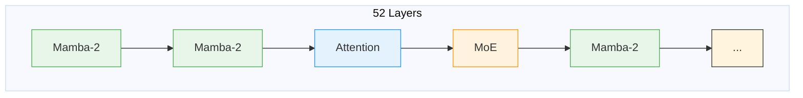
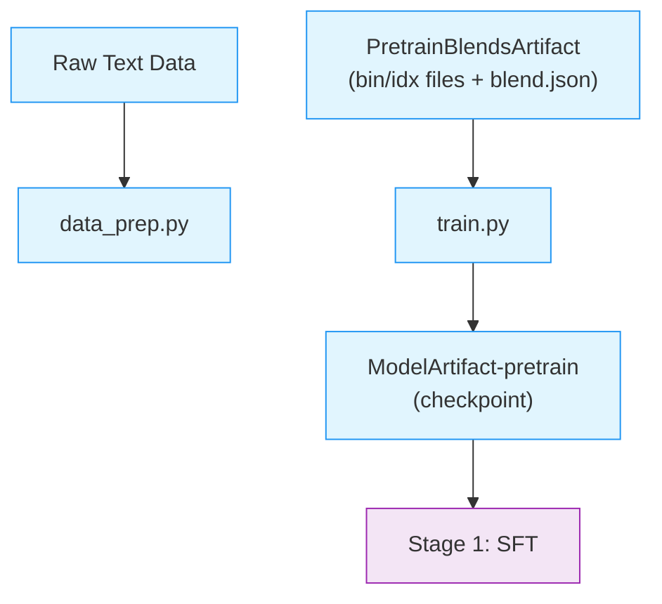

# Stage 0: Pretraining

This stage trains the base Nemotron 3.5 Lightning model from scratch using [Megatron-Bridge](../nvidia-stack.md#megatron-bridge)'s released `nemotron_3_5_lightning_pretrain_config` recipe.

Nemotron 3.5 Lightning is a **hybrid Mamba-Transformer-MoE** model with 52 layers, combining state-space models for efficiency, attention for global context, and mixture-of-experts for capacity. Notable design choices include aux-loss-free MoE balancing and a two-phase data curriculum.

> **Open-Source Data Only**: This recipe uses exclusively open-sourced training data from the [Nemotron Pre-training Datasets](https://huggingface.co/collections/nvidia/nemotron-pre-training-datasets) collection, which is a subset of the full data used to train the released model. The recipe includes datasets from Nemotron-CC-Math-v1, Nemotron-CC-v2, Nemotron-CC-v2.1, and Nemotron-Pretraining-Specialized-v1. Results will differ from the published benchmarks on the [model card](https://huggingface.co/nvidia/NVIDIA-Nemotron-3.5-Lightning-30B-A3B-Base-BF16). Use this recipe as a reference implementation to apply the methodology with your own data.

---

## Training Methodology

> **Training Framework**: Pretraining is implemented using [Megatron-Bridge](https://docs.nvidia.com/nemo/megatron-bridge/latest/), which provides the training loop, distributed training primitives, and checkpoint management. See [Training Entry Points](https://docs.nvidia.com/nemo/megatron-bridge/latest/training/entry-points.html) for details on how `pretrain()` works.
>
> Nemotron 3.5 Lightning has no separate technical report. The [model cards](https://huggingface.co/collections/nvidia/nvidia-nemotron-v3) and the recipe configs in this repository are the authoritative references for methodology.

### Model Architecture

Nemotron 3.5 Lightning uses a **hybrid Mamba-Transformer-MoE** architecture with 52 layers:

| Layer Type | Count | Role |
|------------|-------|------|
| Mamba-2 | 23 | Efficient sequence modeling via state space |
| Attention | 6 | Global context at key positions |
| MoE | 23 | Sparse computation with 8 experts per layer |

The hybrid pattern interleaves these layer types to balance efficiency and capability:



**Design choices:**

- **Mamba-2 layers** provide linear-time sequence processing, making long-context inference practical
- **Attention layers** appear at regular intervals (every ~8 layers) for global information mixing
- **MoE layers** use 128 routed experts plus 1 shared expert, with 6 experts activated per token. This keeps active parameters at ~3B while total parameters reach ~30B

> For implementation details, see [Megatron-Bridge Nemotron 3.5 Lightning](https://docs.nvidia.com/nemo/megatron-bridge/latest/models/nemotron/nemotron3-nano.html).

### Pretraining Data

The pretraining corpus comprises four main dataset families:

| Dataset Family | Description |
|----------------|-------------|
| **Nemotron-CC-Code-v1** | High-quality code from Common Crawl |
| **Nemotron-Pretraining-Code-v2** | GitHub code with student-teacher generation |
| **Nemotron-CC-v2.1** | General English web crawl with synthetic rephrasing |
| **Nemotron-Pretrain-Specialized-v1** | Synthetic STEM, math textbooks, scientific coding |

Data spans 15 categories including web crawl (various quality tiers), code, math, academic, and multilingual content.

### Data Mixture

Training follows a two-phase curriculum that transitions from broad coverage to focused quality:

| Phase | Tokens | Focus | Strategy |
|-------|--------|-------|----------|
| Phase 1 | 23.5T | Diversity | Broad coverage across all data sources |
| Phase 2 | 1.5T | Quality | Increased weight on high-quality and STEM data |

**Phase 1: Foundation Building**

- Uses all dataset families with balanced weights
- Emphasizes diversity: web (multiple quality tiers), code, math, multilingual
- Builds broad knowledge base and language understanding

**Phase 2: Quality Refinement**

- Increases sampling from high-quality sources:
  - `High-Quality` and `High-Quality-Synthetic` subsets
  - Nemotron-Pretraining-Specialized-v1 (STEM, math textbooks, scientific coding)
- Reduces low-quality web content
- Sharpens model capabilities on curated data

### Hyperparameters

These values come from Megatron-Bridge main's released
`nemotron_3_5_lightning_pretrain_config` — the recipe function is the source
of truth for anything not listed here.

| Parameter | Value |
|-----------|-------|
| **Global Batch Size** | 512 sequences |
| **Sequence Length** | 8,192 tokens |
| **Context Parallelism** | CP=2 (P2P comms; halves each MTP head's vocab-loss workspace per rank) |
| **MTP** | Repeated-layer module, depth 2 (`mtp_hybrid_override_pattern: "*E"`), loss scaling 0.3 |
| **MoE Load Balancing** | seq_aux_loss, sigmoid router score, expert bias enabled |

> Token counts and the full learning-rate schedule for the released base model
> are documented on the [model card](https://huggingface.co/nvidia/NVIDIA-Nemotron-3.5-Lightning-30B-A3B-Base-BF16);
> the recipe here reproduces the methodology on the open data blend.

### MoE Load Balancing

Nemotron 3.5 Lightning uses the **aux-loss-free load balancing** strategy from DeepSeek, avoiding the auxiliary losses traditionally used to balance expert utilization.

**Why aux-loss-free?**

Traditional MoE training adds an auxiliary loss term to encourage balanced routing. However, this:
- Adds a hyperparameter (aux loss weight) that's hard to tune
- Can conflict with the main training objective
- May hurt model quality at scale

**How it works:**

Instead of auxiliary losses, the router uses **bias terms** that are adjusted dynamically:
- Track expert utilization over a sliding window
- Increase bias for underutilized experts (more tokens routed to them)
- Decrease bias for overloaded experts
- No gradient flows through the bias adjustment

This achieves balanced expert utilization without interfering with the main loss function.

> For details, see the [Auxiliary-Loss-Free Load Balancing paper](https://arxiv.org/abs/2408.15664).

## Recipe Execution

### Quick Start

<div class="termy">

```console
// 1. Prepare data (tokenize to bin/idx format)
$ uv run nemotron lightning35 data prep pretrain --run YOUR-CLUSTER

// 2. Run pretraining
$ uv run nemotron lightning35 pretrain --run YOUR-CLUSTER
```

</div>

> **Note**: The `--run YOUR-CLUSTER` flag submits jobs via [NeMo-Run](../../nemo_runspec/nemo-run.md). See [Execution through NeMo-Run](../../nemo_runspec/nemo-run.md) for setup.

#### Direct Script Execution (Megatron-Bridge)

For direct execution outside this CLI, use the scripts in the [Megatron-Bridge](https://github.com/NVIDIA-NeMo/Megatron-Bridge) repository:

```bash
# Clone Megatron-Bridge main (the Lightning recipes live on main)
git clone https://github.com/NVIDIA-NeMo/Megatron-Bridge.git
cd Megatron-Bridge

# Run pretraining via the recipe runner (inside a 26.08-generation container)
python scripts/training/setup_experiment.py \
    --recipe nemotron_3_5_lightning_pretrain_config \
    --account ACCOUNT --partition PARTITION --container-image IMAGE
```

See the [Nemotron 3.5 Lightning verification card](https://github.com/NVIDIA-NeMo/Megatron-Bridge/blob/main/examples/model_verification_cards/nemotron-3.5-lightning/card.yaml) for the exact
validated invocations (convergence, performance, and FSDP variants).

### Configuration

| File | Purpose |
|------|---------|
| `config/default.yaml` | Production configuration |
| `config/data_prep/default.yaml` | Data preparation settings |
| `config/data_prep/data_blend_raw.json` | Dataset blend definition |

**Blend Configuration**

Data blends are defined in `config/data_prep/data_blend_raw.json`. Each entry specifies:

```json
{
  "name": "dataset-name",
  "path": "hf://nvidia/...",
  "subset": "subset-name",
  "weight": 1.0
}
```

Weights control sampling probability during data preparation. Phase transitions are implemented by using different blend configurations.

### Data Preparation

The `data_prep.py` script tokenizes raw text datasets into Megatron's binary format. See [Data Preparation Module](../data-prep.md) for detailed documentation.

#### CLI Command

```bash
uv run nemotron lightning35 data prep pretrain [options]
```

| Option | Description |
|--------|-------------|
| `--run <profile>` | Execute on Slurm via [NeMo-Run](../../nemo_runspec/nemo-run.md) |
| `sample=N` | Limit rows per dataset (for testing) |
| `force=true` | Force re-run, ignoring cache |

#### Output

```
output/lightning35/stage0_pretrain/
├── blend.json                          # Per-split blend {"train": [...], "valid": [...], "test": [...]}
├── splits/
│   ├── train/
│   │   ├── shard_000000.bin/.idx
│   │   └── ...
│   ├── valid/
│   │   └── shard_000000.bin/.idx
│   └── test/
│       └── shard_000000.bin/.idx
└── runs/<run_hash>/                    # Raw shard outputs (splits/ symlinks here)
```

The output is registered as a [W&B Artifact](../artifacts.md) (`PretrainBlendsArtifact-<config_name>`) for lineage tracking.

### Training

#### CLI Command

```bash
uv run nemotron lightning35 pretrain [options] [overrides...]
```

| Option | Description |
|--------|-------------|
| `--run <profile>` | Attached—submits and waits, streaming logs ([NeMo-Run](../../nemo_runspec/nemo-run.md)) |
| `--batch <profile>` | Detached—submits and exits immediately ([NeMo-Run](../../nemo_runspec/nemo-run.md)) |
| `--dry-run` | Preview execution plan |
| `key=value` | Override config values ([CLI Framework](../cli.md#dotlist-overrides)) |

#### Override Examples

```bash
# More training iterations
uv run nemotron lightning35 pretrain train.train_iters=5000

# Larger batch size
uv run nemotron lightning35 pretrain train.global_batch_size=64

# Different checkpoint location
uv run nemotron lightning35 pretrain checkpoint.save=/path/to/checkpoints
```

### Running with NeMo-Run

Configure execution profiles in `env.toml`:

```toml
[wandb]
project = "nemotron"
entity = "YOUR-TEAM"

[YOUR-CLUSTER]
executor = "slurm"
account = "YOUR-ACCOUNT"
partition = "batch"
nodes = 2
ntasks_per_node = 8
gpus_per_node = 8
mounts = ["/lustre:/lustre"]
```

See [Execution through NeMo-Run](../../nemo_runspec/nemo-run.md) for complete configuration options.

### Checkpoint & Resume

Training automatically saves checkpoints at regular intervals. To resume from a checkpoint:

```bash
# Resume from a specific checkpoint
uv run nemotron lightning35 pretrain checkpoint.load=/path/to/checkpoint

# Resume from latest checkpoint in a directory
uv run nemotron lightning35 pretrain checkpoint.load=/path/to/checkpoints/
```

**Checkpoint Configuration:**

| Option | Description |
|--------|-------------|
| `checkpoint.save` | Directory for saving checkpoints |
| `checkpoint.load` | Path to checkpoint for resuming |
| `checkpoint.save_interval` | Steps between saves (default: 1000) |

Checkpoints use Megatron's distributed format, which handles model parallelism automatically. Each checkpoint contains model weights, optimizer state, and training progress.

> For checkpoint format and advanced options, see [Megatron-Bridge Checkpointing](https://docs.nvidia.com/nemo/megatron-bridge/latest/training/checkpointing.html).

### Artifact Lineage



---

## Infrastructure

This stage uses the following components from the [NVIDIA AI Stack](../nvidia-stack.md):

| Component | Role | Documentation |
|-----------|------|---------------|
| [Megatron-Core](../nvidia-stack.md#megatron-core) | Distributed training primitives (TP, PP, DP, EP, CP, SP) | [GitHub](https://github.com/NVIDIA/Megatron-LM) |
| [Megatron-Bridge](../nvidia-stack.md#megatron-bridge) | Model definitions, training loop, checkpoint management | [Docs](https://docs.nvidia.com/nemo/megatron-bridge/latest/) |

### Parallelism Configuration

Pretraining uses multiple parallelism strategies for efficient scaling. The specific values differ between main pretraining and long-context extension:

| Parallelism | Value | Config Key |
|-------------|-------|------------|
| Tensor (TP) | 1 | `model.tensor_model_parallel_size` |
| Pipeline (PP) | 1 | `model.pipeline_model_parallel_size` |
| Expert (EP) | 8 | `model.expert_model_parallel_size` |
| Context (CP) | 2 | `model.context_parallel_size` |
| Data (DP) | Auto | Computed from world size |

- **CP=2** splits the 8K sequence across two ranks so each MTP head
  materializes only half of its vocabulary-loss workspace on an 80-GiB H100
- **EP=8** distributes the 128 experts with HybridEP token dispatch
  (`moe_flex_dispatcher_backend: hybridep`; EP groups must align to the
  8-rank NVLink domain)

> For parallelism concepts, see [NVIDIA AI Stack: Parallelism](../nvidia-stack.md#parallelism-strategies).

### Container

```
nvcr.io/nvidian/nemo:26.08.rc2   # public nvcr.io/nvidia/nemo:26.08 at launch
```

The rc container's bundled Megatron-Bridge predates the Lightning recipes, so the
config mounts Megatron-Bridge main (`@0c565c9a0`) and its pinned Megatron-LM
(`@d12f6c8c9`) over the container's copies via `${auto_mount:...}` (Slurm executor
only). These mounts disappear once the launch container ships with the recipes built in.

---

## Next Steps

After pretraining completes, proceed to [Stage 1: SFT](./sft.md) for instruction tuning.

## Reference

- [Base model card](https://huggingface.co/nvidia/NVIDIA-Nemotron-3.5-Lightning-30B-A3B-Base-BF16) – architecture and pretraining reference
- [NVIDIA AI Stack](../nvidia-stack.md) – Megatron-Core, Megatron-Bridge
- [Artifact Lineage](../artifacts.md) – W&B artifact system
- **Recipe Source:** `src/nemotron/recipes/lightning35/stage0_pretrain/`
- [Back to Overview](./README.md)
