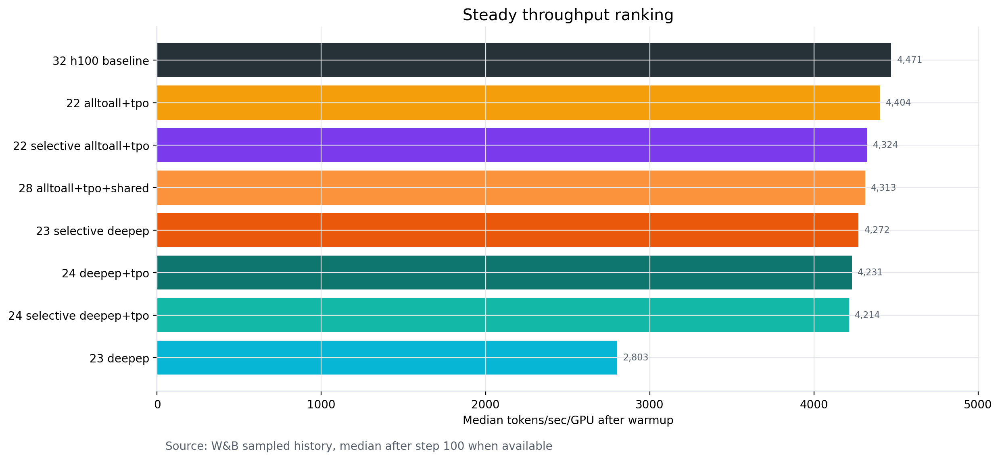
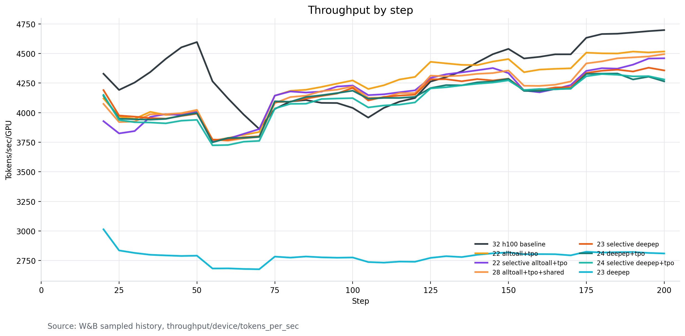
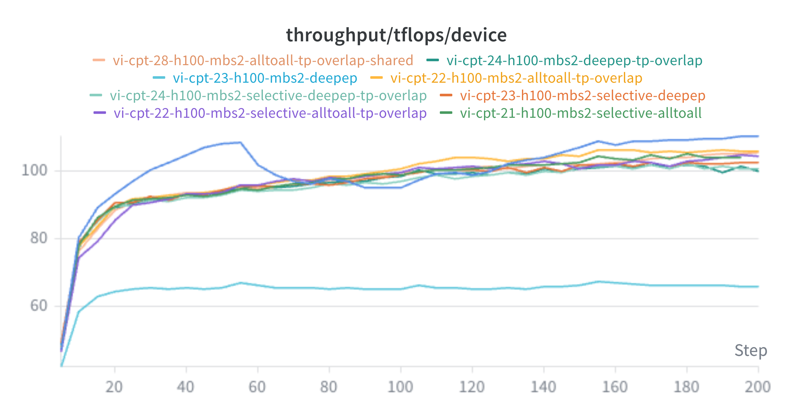
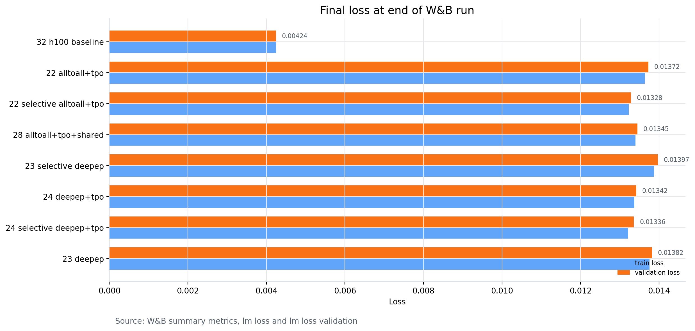
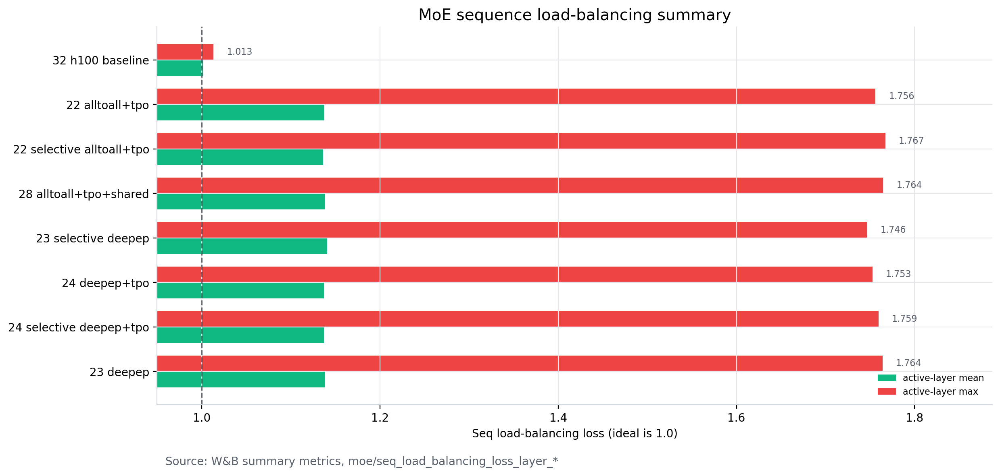

# Nemotron 3 Nano Vietnamese CPT Ablation Results

Wandb: <https://wandb.ai/nvidia/Nemotron-3-Nano-CPT-Ablation-Study>

Data source: W&B cloud metrics for project `nvidia/Nemotron-3-Nano-CPT-Ablation-Study`.
These numbers are from synced W&B run metrics, not from local run directories.

## Reading Method

The primary ranking metric is steady `throughput/device/tokens_per_sec`.
For 200-step runtime screens, steady throughput is the median sampled W&B
history value after warmup, using steps `>=100` when available.

Loss should be read primarily as a convergence signal. Use the `lm loss` curve
to check whether a candidate is still converging smoothly, then compare
`lm loss validation` at the same token count, data snapshot, tokenizer,
initialization checkpoint, and sequence length. A single 200-step final loss is
useful for screening, but it should not be treated as a final quality result.

Final loss, validation loss, and MoE balance values are W&B summary metrics at
the end of each run. MoE mean/max are derived from active
`moe/seq_load_balancing_loss_layer_*` summary metrics. When calculating MoE
health, filter out zero-valued inactive/non-MoE layers and report the active
layer count. In these Nano CPT runs, the comparable H100 summaries have
`23` active MoE layers. Values closer to `1.0` indicate better expert balance.

## Executive Summary

- Fastest raw H100 reference: `vi-cpt-32-h100-gcp-hardware-baseline`, with
  `4,471` steady tokens/sec/GPU and `143,088` total tokens/sec.
- Best comparable ablation candidate: `vi-cpt-22-h100-mbs2-alltoall-tp-overlap`,
  with `4,404` steady tokens/sec/GPU, `140,918` total tokens/sec, and
  `105.01` TFLOPS/GPU.
- Best validation loss among comparable high-throughput candidates:
  `vi-cpt-22-h100-mbs2-selective-alltoall-tp-overlap`, with validation loss
  `0.01328`, but it is about `1.8%` slower than the non-selective
  `vi-cpt-22-h100-mbs2-alltoall-tp-overlap`.
- Shared expert overlap in `vi-cpt-28` did not beat the simpler alltoall plus
  TP-overlap result.
- DeepEP variants underperformed this alltoall baseline in the observed runs,
  and the no-TP-overlap DeepEP run was much slower.
- The MBS4 DeepEP run crashed and produced no useful throughput summary.

## Runtime Requirements And Notes

- Prefer `nvcr.io/nvidia/nemo:26.02` for this Nano CPT ablation instead of
  `nvcr.io/nvidia/nemo:25.11.nemotron_3_nano`. The public NeMo changelog
  lists `nvcr.io/nvidia/nemo:26.02` as the 26.02 framework container, and the
  Megatron Bridge 26.02 software matrix shows a newer stack including
  Megatron-Bridge `0.3.0`, Transformer Engine `2.12`, and CUDA `13.0.2`.
- In this Lepton environment, the 26.02 container should be treated as the
  required runtime for the H100 ablation because it resolved the observed
  NCCL/container compatibility issue and restored reliable throughput and MoE
  metric logging. The public docs validate the container and component versions;
  the NCCL/logging fix is an empirical result from these runs.
- For TP communication overlap, keep `CUDA_DEVICE_MAX_CONNECTIONS=1`.
- For H100, prefer `UB_SKIPMC=0` when the job is stable. This keeps Transformer
  Engine userbuffers on the CUDA multicast path, which is the faster path in
  this H100 Lepton setup. Use `UB_SKIPMC=1` only as a compatibility fallback:
  public Transformer Engine discussion says it skips CUDA multicast and uses
  CUDA IPC handles instead, which can help avoid multicast-related failures but
  may be slower.

References:

- NVIDIA NeMo 26.02 changelog:
  <https://docs.nvidia.com/nemo-framework/user-guide/26.02/changelog.html>
- Megatron Bridge 26.02 software versions:
  <https://docs.nvidia.com/nemo/megatron-bridge/latest/releases/software-versions.html>
- Transformer Engine UB_SKIPMC discussion:
  <https://github.com/NVIDIA/TransformerEngine/issues/966>

## Visualizations

Steady throughput ranking by median post-warmup tokens/sec/GPU.

Throughput history from W&B sampled metrics.

W&B chart export for `throughput/tflops/device`.

Final training and validation loss from W&B summary metrics.

MoE sequence load-balancing mean and max across active MoE layers.

## Ranked Results

Primary ranking is steady tokens/sec/GPU.

| Rank | Run | Step | Final Loss | Val Loss | MoE Mean | MoE Max | Tok/s/GPU | Total Tok/s | TFLOPS/GPU | Iter Time |
| ---: | --- | ---: | ---: | ---: | ---: | ---: | ---: | ---: | ---: | ---: |
| 1 | `vi-cpt-32-h100-gcp-hardware-baseline` | 200 | 0.00425 | 0.00424 | 1.002 | 1.013 | 4,471 | 143,088 | 107.33 | 27.21s |
| 2 | `vi-cpt-22-h100-mbs2-alltoall-tp-overlap` | 200 | 0.01363 | 0.01372 | 1.138 | 1.756 | 4,404 | 140,918 | 105.01 | 27.81s |
| 3 | `vi-cpt-22-h100-mbs2-selective-alltoall-tp-overlap` | 200 | 0.01323 | 0.01328 | 1.136 | 1.767 | 4,324 | 138,376 | 102.66 | 28.44s |
| 4 | `vi-cpt-28-h100-mbs2-alltoall-tp-overlap-shared` | 200 | 0.01340 | 0.01345 | 1.139 | 1.764 | 4,313 | 138,004 | 102.38 | 28.52s |
| 5 | `vi-cpt-23-h100-mbs2-selective-deepep` | 200 | 0.01387 | 0.01397 | 1.141 | 1.746 | 4,272 | 136,698 | 101.69 | 28.71s |
| 6 | `vi-cpt-24-h100-mbs2-deepep-tp-overlap` | 200 | 0.01337 | 0.01342 | 1.137 | 1.753 | 4,231 | 135,389 | 100.67 | 29.01s |
| 7 | `vi-cpt-24-h100-mbs2-selective-deepep-tp-overlap` | 200 | 0.01321 | 0.01336 | 1.137 | 1.759 | 4,214 | 134,859 | 99.73 | 29.28s |
| 8 | `vi-cpt-23-h100-mbs2-deepep` | 200 | 0.01376 | 0.01382 | 1.139 | 1.764 | 2,803 | 89,695 | 65.83 | 44.36s |

## Loss Summary

The comparable 200-step H100 ablation runs are tightly grouped in final
validation loss, roughly `0.01328` to `0.01397`.

`vi-cpt-22-h100-mbs2-selective-alltoall-tp-overlap` has the best validation loss
among high-throughput candidates at `0.01328`, while
`vi-cpt-22-h100-mbs2-alltoall-tp-overlap` is the best runtime candidate with
validation loss `0.01372`.

For follow-up runs, judge loss by convergence behavior, not only the last point.
The expected pattern is a smooth post-warmup `lm loss` decline without spikes,
NaN/Inf, or sudden slope changes, plus validation loss that remains competitive
at matched tokens. Use longer common-budget runs before making a final quality
claim.

The hardware baseline has much lower loss (`0.00424`) and cleaner MoE balance,
so keep it as an important reference point, but avoid treating it as a direct
quality comparison unless its data snapshot, initialization, and runtime setup
are confirmed to match the ablation candidates.

## MoE Summary

The comparable H100 ablation runs show stable MoE balance at the summary level.
MoE mean is around `1.136` to `1.141`, and MoE max is around `1.746` to `1.767`.
There is no obvious expert-balance failure in the finished 200-step runs.

When summarizing MoE balance, calculate mean and max only over active MoE
layers. The W&B per-layer keys include zero-valued entries for inactive/non-MoE
layers; including those zeros would understate imbalance. For these runs, use
`23` active layers in the aggregate calculation and report both active-layer
mean and active-layer max.

The hardware baseline is much closer to ideal balance, with MoE mean `1.002`
and max `1.013`.

## Throughput Summary

`alltoall + TP overlap` is the strongest comparable system setting in these
results. It reaches `4,404` steady tokens/sec/GPU and `140,918` total tokens/sec.

The selective alltoall variant is slightly slower (`4,324` tokens/sec/GPU) but
has the best validation loss among comparable high-throughput candidates.

Shared expert overlap did not improve throughput in the observed `vi-cpt-28`
run. Its steady throughput is `4,313` tokens/sec/GPU, below the simpler
alltoall plus TP-overlap run.

DeepEP needs more caution. The selective DeepEP run without TP overlap reaches
`4,272` tokens/sec/GPU, and the TP-overlap variants are around
`4,214` to `4,231` tokens/sec/GPU. The non-selective DeepEP run is much slower
at `2,803` tokens/sec/GPU.

## Failed Or Excluded Runs

| Run | State | Notes |
| --- | --- | --- |
| `vi-cpt-25-h100-mbs4-selective-deepep-tp-overlap` | crashed | No useful throughput summary was logged. |
| `vi-cpt-21-h100-mbs2-selective-alltoall` | crashed | Reached step 199 and logged strong throughput, but should not be promoted because the run did not finish. |
| `vi-cpt-33-h100-nccl-diagnostic` | finished | Short 30-step diagnostic run. Useful for sanity checks, but excluded from 200-step ranking. |
| `vi-cpt-00-original` | finished | Included in W&B, but not directly comparable in the main H100 ranking because per-device throughput and TFLOPS logging differ. |

## Recommendation

Promote `vi-cpt-22-h100-mbs2-alltoall-tp-overlap` as the leading runtime
candidate for the next longer run.

Keep `vi-cpt-22-h100-mbs2-selective-alltoall-tp-overlap` as the quality/loss
challenger because it has the best validation loss among the high-throughput
finished candidates.

Do not continue MBS4 until the crash/OOM behavior is understood. Revisit DeepEP
only after validating the environment and overlap settings, because the current
W&B results do not beat alltoall plus TP overlap.
