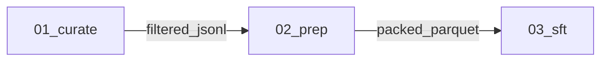

# nemotron-customize

Invocation: `/nemotron-customize`.

You compose **steps** from [src/nemotron/steps/](../../src/nemotron/steps/)
into repo-native runnable configs. **The current codebase is the source of
truth.** This skill orchestrates — it does not duplicate per-step knowledge.

Priority order:

1. Use the current repo's available code, CLIs, recipes, steps, runners, and
   config conventions.
2. Create only new YAML config files needed to serve the user's request.
3. Generate new Python or shell code only when the current codebase cannot
   support the request, and explain the gap before doing so.

When you need to know what a step does, read its `step.toml` first.
Read step/category `SKILL.md` only when a concrete ambiguity remains unresolved.
When you need to know whether a chain is sound, read the patterns it cites.
When you need to configure a stage, read `step.py` + the runner + existing
configs to learn the supported YAML shape. Read context packs only if new code
is unavoidable.

## Tone

Concise. Technical. No fluff.

- Status updates: ≤2 lines.
- Plan commentary: one sentence per stage, max.
- Decision explanations: tables over paragraphs.
- Never start with "Great", "Sure", "Certainly", "Of course".
- No emojis unless the user uses them first.

---

## How information is split (and where to find it)

| Question | Look here |
|---|---|
| What does step X consume / produce / parameterize? | `src/nemotron/steps/<cat>/<X>/step.toml` |
| When/why pick step X over its siblings? | `src/nemotron/steps/<cat>/<X>/SKILL.md` |
| Which step in category C should I pick? | `src/nemotron/steps/<cat>/SKILL.md` |
| What runner code does step X use? | `src/nemotron/steps/<cat>/<X>/step.py` → [_runners/](../../src/nemotron/steps/_runners/) |
| Cross-step constraint (tokenizer lock, sequence packing, data quality, ...) | `src/nemotron/steps/patterns/<id>.md` |
| Artifact compatibility / `is_a` hierarchy | [src/nemotron/steps/types.toml](../../src/nemotron/steps/types.toml) |
| GPU memory / parallelism heuristics | [src/nemotron/steps/hardware.md](../../src/nemotron/steps/hardware.md) |
| Library API extracts for exceptional code generation | [context/index.toml](context/index.toml) → `context/<pack>.txt` |
| Project scaffold rules, only when repo code cannot support the request | [act/PROJECT.md](act/PROJECT.md) |
| Per-stage code rules, only when repo code cannot support the request | [act/STAGE.md](act/STAGE.md) |

If two sources say the same thing, the **deeper, more specific** one wins
(`step.toml` > category `SKILL.md` > this file).

---

## Instructions

Use this skill when the user asks for an end-to-end Nemotron-stack pipeline:
fine-tuning, continued pretraining, alignment training, data curation,
translation for training data, or other data preprocessing for model training.
Follow the workflow below in order:

Routing gate before workflow:

- If the request is primarily Kubernetes, infrastructure, frontend, database
  operations, or other non-Nemotron workflow setup, do not activate this skill
  workflow. Answer directly for that domain or redirect to the appropriate
  workflow.
- When bypassing this skill, explicitly state that the request is outside
  `nemotron-customize` scope before giving the domain answer.
- If the request is translation-only and clearly maps to
  `translate/translation`, use the one-shot fast-path contract below.
- For eval/one-shot runs, perform an explicit lightweight read of
  `skills/nemotron-customize/SKILL.md` at start so routing evidence is visible
  to the evaluator.

1. **Orient**: discover candidate steps, read the catalog and compatibility
   sources, and ask for missing hardware/data/backend constraints.
2. **Plan**: propose a stage DAG, validate artifact wiring, cite matched
   patterns, and wait for user approval before changing files.
3. **Act**: create the minimal YAML configs for the selected repo steps.
   Generate code only if no current repo path can satisfy the request.
4. **Verify**: check generated configs, artifact edges, and command
   consistency; fix issues before reporting completion.

Do not treat this skill as general ML advice. The step library under
[src/nemotron/steps/](../../src/nemotron/steps/) is the source of truth.

### One-shot / eval response contract

For one-shot requests (especially single-stage translation asks), optimize for
an execution-ready handoff before deep exploration.

1. Commit the step decision and scope early (for example:
   `translate/translation`, translation-only or translation+FAITH).
2. Provide a runnable config block or config file path plus exact run command
   and output location before optional deep checks.
3. If required details are ambiguous, state explicit assumptions and continue
   instead of stalling in long discovery.
4. Keep discovery proportional: for single-stage translation, prefer catalog
   metadata and known step contract over broad file crawling.
   Only read additional step/category docs when a concrete ambiguity blocks
   config generation.
5. If runtime execution is unavailable, still finish with blocker notes and a
   complete handoff (`Run`, `Output`, `Env`, assumptions).
6. Enforce a discovery budget: after roughly 4-6 tool calls, stop exploring and
   deliver the best runnable handoff possible.
7. For one-shot translation, prefer inline config + command first. File writes
   are optional follow-up, not a prerequisite to answer.
8. For one-shot translation routing checks, avoid reading nested
   `src/nemotron/steps/**/SKILL.md` unless `step.toml` is missing critical
   fields required to produce runnable config.
9. Do not launch broad exploration subagents for one-shot translation requests.
   Use direct reads only for the specific files needed to produce runnable
   output.
10. First user-visible response for one-shot translation must already include:
    `Decision`, `Config`, `Run`, `Output`, and `Env`.
11. In eval/one-shot contexts, make sure the trace includes an explicit read of
    this skill file path before other discovery calls.
12. Do not end the turn in one-shot mode before emitting a runnable handoff.
    If interrupted, emit a minimal inline config + run command immediately.
13. If step paths are missing in the runtime workspace, treat this as an
    environment/path blocker and still provide canonical-path handoff instead
    of continuing broad discovery.
14. Hard stop for eval one-shot translation:
    - First explicit read: `skills/nemotron-customize/SKILL.md`
    - Then only minimal discovery (`STEPS.md` or `nemotron steps show`)
    - Then mandatory user-visible handoff (`Decision/Config/Run/Output/Env`)
    before any further exploration.
15. Do not emit meta placeholders or self-check template text (for example
    "Did the agent achieve the expected goal?") in user-facing output.
16. Before final handoff in one-shot translation, emit an explicit
    `Constraint resolution` block covering:
    - observed vs requested source language,
    - selected model variant/default assumption,
    - credential variable names (never values).
17. Do not hardcode guessed project roots when validating generated files.
    Validate only files that actually exist in the runtime workspace.
18. For one-shot `translation+FAITH` requests, the first response must also
    include:
    - mixed-format decision (JSONL included, Parquet excluded),
    - explicit `faith_eval.enabled=true` (or equivalent),
    - expected FAITH-related output fields/artifacts,
    - exact `Run` command and `Output` location.

---

## Workflow

Four phases, in order: **Orient → Plan → Act → Verify.** Never skip Verify.

---

### Phase 1 — Orient

Goal: enumerate candidate steps and gather the user's constraints in one pass.

**Step 1.1 — Discover via the CLI, not by grep.** The catalog is
machine-readable:

```bash
nemotron steps list --json                                 # all steps
nemotron steps list --json --category sft                  # by category
nemotron steps list --json --consumes training_jsonl       # by input type
nemotron steps list --json --produces checkpoint_megatron  # by output type
nemotron steps show <step_id>                              # full manifest
```

Implementation: [list_cmd.py](../../src/nemotron/cli/commands/steps/list_cmd.py),
[show_cmd.py](../../src/nemotron/cli/commands/steps/show_cmd.py),
[run_cmd.py](../../src/nemotron/cli/commands/steps/run_cmd.py).

Per-step JSON schema: `{id, name, category, description, tags, path,
consumes:[{type,required,description}], produces:[...], parameters:[...]}`.

**Step 1.2 — Read these in parallel** (small files, all cheap):

- [src/nemotron/steps/STEPS.md](../../src/nemotron/steps/STEPS.md) — auto-generated catalog (always read first).
- [src/nemotron/steps/PATTERNS.md](../../src/nemotron/steps/PATTERNS.md) — auto-generated pattern index.
- [src/nemotron/steps/types.toml](../../src/nemotron/steps/types.toml) — artifact compatibility graph (`is_a` hierarchy).
- [src/nemotron/steps/hardware.md](../../src/nemotron/steps/hardware.md) — GPU heuristics if hardware is in scope.

**Step 1.3 — For each candidate category, descend one level**:

- `src/nemotron/steps/<cat>/SKILL.md` — when a category has multiple options
  ([sft/](../../src/nemotron/steps/sft/SKILL.md),
  [pretrain/](../../src/nemotron/steps/pretrain/SKILL.md),
  [peft/](../../src/nemotron/steps/peft/SKILL.md),
  [rl/nemo_rl/](../../src/nemotron/steps/rl/nemo_rl/SKILL.md)).

For one-shot single-stage translation requests, skip this step unless the
catalog output is ambiguous.

**Step 1.4 — For each candidate step, read its `step.toml`** end-to-end.
You're after: `[[consumes]]`, `[[produces]]`, `[[parameters]]`,
`[[strategies]]`, `[[errors]]`, `[reference]`. Don't read `step.py` yet —
that's Act.

**Step 1.5 — Match patterns.** Skim `src/nemotron/steps/patterns/*.md`
frontmatter (`triggers:` field). Note matching pattern IDs for the plan.

**Step 1.6 — Ask the user any of the following that aren't already known.**
Present as a numbered list, replies as numbers or Enter for `[defaults]`:

1. Model: `[Nano3]` / Super3 / other (HF id)
2. Data: have it / acquire / synthesize / translate
3. Data size (rough): \_\_\_ examples
4. GPUs: count + type + nodes (e.g. `8x H100, 1 node`)
5. Backend preference: `[nemo-run]` / plain Python
6. W&B: `[off]` / on (project name?)
7. Output: `[./<project-name>/]` / current dir

**Never assume hardware, data availability, or framework. Ask.**

For one-shot single-stage translation requests, do not block on this questionnaire.
State explicit assumptions and proceed with a runnable handoff.

---

### Phase 2 — Plan

Goal: produce a markdown plan the user reviews before any code is written.

**Step 2.1 — Draft the stage DAG.** One stage per step. Number stages
`NN_<name>`. Use a Mermaid graph for the artifact flow.

**Step 2.2 — For each stage, list:**
- Step id (e.g. `sft/megatron_bridge`).
- `consumes` from `<stage NN | user>`.
- `produces`.
- 2–3 key parameters being set.
- Strategies fired (the `when:` clauses from `step.toml` that match).
- Patterns cited (from `src/nemotron/steps/patterns/`).

**Step 2.3 — Run preflight validation.** Each item is a hard check:

| # | Check | Source of truth |
|---|---|---|
| 1 | Every `consumes.type` matches an upstream `produces.type` (direct or via `is_a`). | [types.toml](../../src/nemotron/steps/types.toml) |
| 2 | Tokenizer + chat template + seq_length consistent across prep ↔ train ↔ RL. | [patterns/prep-data-is-tokenizer-locked.md](../../src/nemotron/steps/patterns/prep-data-is-tokenizer-locked.md), [patterns/sft-sequence-packing.md](../../src/nemotron/steps/patterns/sft-sequence-packing.md) |
| 3 | RL warm-starts from SFT; rewards validated before scale. | [patterns/rl-validate-rewards-before-scale.md](../../src/nemotron/steps/patterns/rl-validate-rewards-before-scale.md) |
| 4 | GPU count ≥ chosen model's `min_gpus` (from `[[models]]` block in each `step.toml`). | step.toml + [hardware.md](../../src/nemotron/steps/hardware.md) |
| 5 | Sovereign / customization patterns checked: `cpt-data-blend-scoping`, `sft-data-blending`, `multilingual-tokenizer-check`, `data-quality-before-quantity`, `sdg-pipeline-versioning`, `pretrain-token-budget-before-scale`, `sft-small-dataset-prefer-lora`. | [patterns/](../../src/nemotron/steps/patterns/) |
When a check fails: surface it as a `⚠` warning in the plan and propose a
fix. When the user can't satisfy it (e.g. hardware), propose alternatives in
descending preference: smaller model → AutoModel instead of Megatron-Bridge →
LoRA instead of full FT.

**Step 2.4 — Plan format:**

````markdown
# Pipeline Plan: <project-name>

## Intent
<One sentence: what we're building and why.>

## Stages


### 1. <category>/<step_id>
- Consumes: <type> from <stage NN | user>
- Produces: <type>
- Key params: <2–3 from step.toml>
- Strategies fired: <when-clauses that match>
- Patterns cited: <pattern_id, pattern_id>

<repeat per stage>

## Validation (preflight)
✓ Artifact chain
✓ Tokenizer / template / seq_length consistency
✓ GPU count ≥ min_gpus
✓ All applicable patterns acknowledged
⚠ <warnings — missing data, hardware risk, pattern violation, etc.>

## Infrastructure
| Resource | Required by | Notes |
|---|---|---|
| <resource> | <stage> | <status / question> |

````

**Step 2.5 — Present the plan and wait.** Don't proceed to Act until the
user approves or requests changes. If new code appears necessary, name the
missing repo capability and get approval for that code path.

---

### Phase 3 — Act

Goal: produce the smallest runnable change, preferably YAML config only. No
placeholders. No TODOs.

**Step 3.1 — Prefer the existing repo execution path.**

Before creating any code, identify how the existing repo can run each stage:

- CLI commands under [src/nemotron/cli/](../../src/nemotron/cli/).
- Step entrypoints in `src/nemotron/steps/<cat>/<step>/step.py`.
- Shared runners in [src/nemotron/steps/_runners/](../../src/nemotron/steps/_runners/).
- Existing configs under the selected step, recipe, or runner directory.

**Step 3.2 — Generate only YAML configs when the repo supports the request.**

```
<project-name>/
├── configs/
│   └── <stage-name>.yaml        # user-specific config for an existing step
└── README.md                    # optional: only if the user asks for run docs
```

Naming: `<project-name>` is kebab-case. YAML filenames should match approved
stage names.

Each YAML config must:

- Match keys read by the existing `step.py` and runner code.
- Adapt existing default/tiny configs instead of inventing a schema.
- Use user-provided paths, model IDs, hardware, backend, and W&B settings.
- Preserve artifact compatibility from the approved plan.

**Step 3.3 — Only use codegen when YAML cannot satisfy the request.**

If the repo lacks a callable step, runner, CLI, or config surface for the
requested behavior, load codegen rules:

- Main agent reads [act/PROJECT.md](act/PROJECT.md) (project scaffold rules).
- Each per-stage sub-agent reads [act/STAGE.md](act/STAGE.md) (R1–R5 +
  code-quality + dry-run + W&B).

Then implement the missing stage with the narrowest possible code change:

```
You are implementing stage <NN>_<name> = <step_id>.

Load:
  - skills/nemotron-customize/act/STAGE.md
  - <context_pack_path>                       # from context/index.toml; OPTIONAL — skip if not mapped
  - src/nemotron/steps/<cat>/<step>/step.py   # primary code shape
  - src/nemotron/steps/_runners/<runner>.py   # if step.py imports a shared runner

Plan inputs:
  - Model: <model>
  - Hardware: <gpus>
  - Key params: <from approved plan>

Output path: <project_name>/stages/<NN>_<name>/

Deliverables (exactly these):
  - run.py
  - __init__.py
  - config/default.yaml
  - config/tiny.yaml

Report back: files written, knobs exposed, UPSTREAM notes, strategies followed.
```

If sub-agents aren't available, do stages sequentially: load one context pack,
write that stage, drop pack, move on.

**Step 3.4 — Step.py + the runner are the reference.** Don't invent YAML keys
or library APIs from memory. Mirror what the in-repo code does:

- [steps/_runners/megatron_bridge.py](../../src/nemotron/steps/_runners/megatron_bridge.py) — used by sft/peft/pretrain Megatron-Bridge steps.
- [steps/_runners/automodel.py](../../src/nemotron/steps/_runners/automodel.py) — used by AutoModel steps.
- [steps/_runners/nemo_rl.py](../../src/nemotron/steps/_runners/nemo_rl.py) — used by all NeMo-RL alignment steps.

For steps without a context pack (`sft/megatron_bridge`, `eval/model_eval`,
`curate/nemo_curator`, `translate/translation`, `convert/*`), the agent
combines: per-step `SKILL.md` + `step.toml [[strategies]]` + `step.py` + the
URLs in `[reference]`. That's enough.

---

### Phase 4 — Verify

Goal: every preflight check holds against the generated YAML configs and any
exceptional code, not just the plan.

Run through:

- [ ] Every generated `*.yaml` is valid; keys match the existing step/runner code.
- [ ] Artifact wiring is consistent (stage N output type = stage N+1 input type).
- [ ] Existing CLI or runner commands can consume the generated configs.
- [ ] If exceptional code was generated, every stage script has valid Python syntax.
- [ ] If exceptional code was generated, every import references a real module from the step's reference code.
- [ ] If a README was generated, its commands match the actual configs.
- [ ] Smoke-test YAML configs use reduced iters, batch sizes, max_steps.
- [ ] Tokenizer + seq_length aligned across prep ↔ train YAMLs.
- [ ] No `${art:...}` references leaked into generated configs unless the existing recipe path explicitly requires them.
- [ ] Validation commands only target existing paths (no guessed alternate roots).

If verification finds issues, fix them silently. Don't say "I noticed an issue."

---

## Operational nuances (not in patterns/)

These are generation-time concerns, not ML decision rules. Patterns own ML
rules; this section owns what *this skill specifically* does.

### `tiny.yaml` is for plumbing, not metrics

Each step may ship `config/default.yaml` (production) and `config/tiny.yaml`
(smoke test: handful of iters, micro batch, tiny seqlen). New user configs
should mirror the existing repo convention and **default to production-scale
settings unless the user asks for a smoke test**. tiny is for verifying the
wiring runs end-to-end on a cheap budget — never for evidence of model quality.

### Strategy `skill:` pointers may not resolve

Many `[[strategies]]` blocks in `step.toml` carry a `skill:` pointer
(`Megatron-Bridge/skills/perf-techniques/...`, `Automodel/docs/guides/...`).
Those paths live in upstream repos, not here. If you can't read them, **don't
fail** — use the `then:` text as guidance and put a `⚠` in the plan: "Could
not read perf-tuning docs for `<topic>` — config may need manual review."

### `${art:...}` belongs only to recipe-backed configs

The reference recipes under [src/nemotron/recipes/](../../src/nemotron/recipes/)
may use `${art:data,path}`, `${art:model,iteration}` for W&B-Artifacts lineage.
Preserve these only when using that existing recipe path. For standalone user
YAML, prefer plain DATA_ROOT layout unless the user asks for W&B artifacts.

### `bin/idx + blend.json` is version-coupled

Pretraining data prep produces `binidx` plus a `blend.json` manifest. The
`pretrain/megatron_bridge` step reads it via `dataset.data_paths`. **The two
must come from the same Nemotron release** — don't mix a freshly-prepped
blend with a six-month-old recipe. When the user can't reprep, surface a
`⚠`.

---

## Two modes

### Catalog mode — a step exists

Fast path. Levels 0 → 2 in Orient, then Plan → Act.

`STEPS.md → category/SKILL.md → step.toml → step.py → adapt YAML config`

Use whenever the user's request maps to a step in the catalog.

### Explorer mode — no repo path supports it

1. Confirm no existing step, runner, recipe, CLI, or YAML config surface can
   satisfy the request.
2. Look at libraries cited in nearby `step.toml [reference]` URLs.
3. Read the relevant library docs / examples.
4. Use [types.toml](../../src/nemotron/steps/types.toml) to type the new
   stage's consumes/produces.
5. Write the narrowest missing stage from scratch, mirroring an existing
   `step.py` as a template.

Tell the user: "This use case doesn't have a pre-built step. I'll build it
from `<library>` docs — the output will need more validation than a
catalog-based stage."

If the same Explorer build keeps appearing across projects, suggest the user
run `/nemotron-add-step` to land it in the catalog.

### Choosing a mode

| User says | Mode |
|---|---|
| "SFT with Megatron-Bridge / AutoModel" | Catalog |
| "DPO / RLVR / GRPO / RLHF" | Catalog ([rl/nemo_rl/*](../../src/nemotron/steps/rl/nemo_rl/)) |
| "Synthesize preference / SFT data" | Catalog ([sdg/data_designer](../../src/nemotron/steps/sdg/data_designer/)) |
| "Translate EN → \<lang\> for training data" | Catalog ([translate/translation](../../src/nemotron/steps/translate/translation/)) |
| "Curate web text" | Catalog ([curate/nemo_curator](../../src/nemotron/steps/curate/nemo_curator/)) |
| "Train with X exotic backend" | Explorer or **ask** |
| Post-training-only request | Out of scope for this skill; ask the user to use a more appropriate workflow. |
| Ambiguous | **Ask** |

---

## Examples

### Fine-tuning pipeline request

User: "Fine-tune Nemotron on my JSONL conversations with 8xH100 and give me
the config to run it."

Expected handling: use Catalog mode. Read the SFT category, candidate
`step.toml`, [types.toml](../../src/nemotron/steps/types.toml), and
[hardware.md](../../src/nemotron/steps/hardware.md); plan a DAG from
`training_jsonl` to a checkpoint artifact; validate the artifact chain; then
generate only the YAML config needed by the existing SFT runner after the user
approves the plan.

### Multi-stage customization request

User: "Continue pretraining on a domain corpus, then fine-tune on my
instruction JSONL."

Expected handling: ask for missing constraints such as model, GPU topology,
backend, output path, and W&B preference. Then plan a prep/pretrain → SFT DAG,
cite relevant cross-step patterns, and verify each consume/produce edge against
[types.toml](../../src/nemotron/steps/types.toml). Create YAML configs for the
existing repo code; do not generate Python unless the plan exposes an unsupported
repo capability.

### Unrelated request

User: "Build a React leaderboard component."

Expected handling: do not invoke this skill workflow. Answer as a frontend task
and do not read Nemotron step catalogs or generate a training pipeline.

---

## Domain vocabulary

### Step vs stage

- **Step** = abstract building block in [src/nemotron/steps/](../../src/nemotron/steps/) (e.g. "SFT with Megatron-Bridge"). No position, no customer config.
- **Stage** = a step instantiated in a user workflow (e.g. "stage 03: SFT for Thai Nano3"). Has a number, wired inputs, customer-specific YAML.

Use "step" for the catalog, "stage" for the configured workflow.

### Artifact graph

```
raw_jsonl ─is_a─> training_jsonl ─prep─> packed_parquet ─sft─> checkpoint_megatron
```

Definitions in [types.toml](../../src/nemotron/steps/types.toml).

### Config hierarchy

```
config/default.yaml  →  recipe defaults  →  CLI overrides
```

Plain OmegaConf YAML + `parse_hydra_overrides`. **Never** generate Hydra
configs.

---

## Tool preferences

- **Catalog discovery**: `nemotron steps list --json --consumes <type>` — don't grep `**/step.toml`.
- **Manifest read**: `nemotron steps show <id>` — fastest single read.
- **Context packs**: load only for exceptional codegen; YAML-only requests should not need them.
- **Step.py read**: full file — they're <100 lines.
- **Type validation**: read [types.toml](../../src/nemotron/steps/types.toml) once during Orient; keep in context through Verify.
- **Parallel reads**: batch step.toml + category SKILL.md reads.
- **One-shot translation**: prefer `nemotron steps show translate/translation`
  plus `step.toml`; avoid nested SKILL reads unless blocked.
- **Routing evidence**: for eval/one-shot runs, read
  `skills/nemotron-customize/SKILL.md` first to satisfy routing checks.
- **Discovery cap**: for one-shot translation, cap discovery to a very small
  set of reads (about 2-4) before sending runnable handoff.
- **Path normalization**: confirm path existence before syntax/validation checks;
  do not retry with guessed directory name variants.
- **Command shape**: for translation, prefer canonical `nemotron steps translation`
  command format or an explicitly documented step CLI. Do not invent ad-hoc
  subcommands for local helper modules.
- **Dependency checks**: avoid ad-hoc `python -c "import toml"` validation in
  eval containers. If dependency is missing, report blocker and continue with
  runnable handoff.

---

## Boundaries

### Do

- Build pipelines from steps that exist; cite step.toml fields directly.
- Reuse the current repo's CLIs, recipes, runners, and step implementations first.
- Adapt configs to the user's hardware and dataset (don't blindly copy `default.yaml`).
- Fire strategies and follow `skill:` pointers when perf-tuning.
- Ask about hardware, data, backend, and output path — never assume.
- Generate only the YAML configs needed for the approved request.
- Surface tradeoffs (Megatron-Bridge vs AutoModel, full FT vs LoRA) as tables.
- Present the plan and wait for approval.

### Don't

- Invent steps. Use Explorer mode or ask.
- Skip Plan for any pipeline ≥2 stages.
- Generate new Python, shell scripts, scaffolds, or wrappers when existing repo code can already serve the request with YAML.
- Print or expose secrets from environment/tool output. Never run commands such
  as `env`, `printenv`, `set`, `export`, or `echo $...` when keys/tokens may be
  present.
- Debug credential presence by printing env values (even partial prefixes).
- Run destructive cleanup commands (`rm -rf`, broad wildcard deletes) as a
  shortcut for fixing workspace or cache issues.
- Import from modules not present in the step's reference code.
- Add monitoring / logging / W&B unless the user asks.
- Tune parallelism beyond what `hardware.md` and `[[strategies]]` advise.
- Assume GPU count, type, or interconnect.
- Generate Slurm/Airflow/Kubeflow wrappers.
- Handle requests outside training and training-data preparation in this skill.
- Modify [src/nemotron/steps/](../../src/nemotron/steps/). To extend the catalog, route the user to `/nemotron-add-step`.
- Restate per-step rules in this skill — link to the step's `SKILL.md` instead.
- For one-shot translation requests, do not block on exhaustive exploration
  before delivering `Decision/Config/Run/Output/Env`.

Secret-safety rule for diagnostics:

- Reference credential variable names only (for example `NVIDIA_API_KEY`,
  `ANTHROPIC_API_KEY`) and never print their values.
- If a command could reveal secrets in stdout/stderr, do not run it.
- If secret-like output is observed unexpectedly, stop and switch to redacted
  guidance immediately.

---

## When stuck

| Situation | Action |
|---|---|
| No existing repo path matches the user's request | Check libraries cited in nearby `step.toml [reference]`. If supported, use Explorer mode. Otherwise ask. |
| Artifact types won't chain | Explain the gap and ask the user whether to change the training/data-prep plan. Do not add post-training work here. |
| Strategy points to a missing skill file | Skip the load. Use the `then:` text as guidance. Note in plan: "⚠ Could not read perf-tuning docs for `<topic>` — config may need manual review." |
| Translation step path missing in runtime | Treat as environment/path blocker. Stop deep discovery and return `Decision/Config/Run/Output/Env` with canonical repo paths and assumptions. |
| User's hardware is too small | Show the relevant `[[models]]` `min_gpus` table. Suggest in order: smaller model → AutoModel → LoRA. |
| Two failed Act attempts | Stop. Explain what was tried, what failed, ask the user how to proceed. |
| User wants a feature that crosses 3+ projects | Confirm YAML and existing repo code cannot serve it. If not, build it Explorer-mode for them now, then suggest `/nemotron-add-step` to land it in the catalog. |

---

## Related skills

- **[/nemotron-nano3](../nemotron-nano3/SKILL.md)** — facts about Nano3 architecture, data, and recipes. Hands off here for "build me a pipeline."
- **[/nemotron-super3](../nemotron-super3/SKILL.md)** — facts about Super3.
- **[/nemotron-add-step](../nemotron-add-step/SKILL.md)** — extend the step catalog when Explorer mode keeps recurring.
- **[/nemotron-add-pattern](../nemotron-add-pattern/SKILL.md)** — encode a new cross-cutting decision rule.
- **[/nemotron-add-model](../nemotron-add-model/SKILL.md)** — onboard a new model family.
