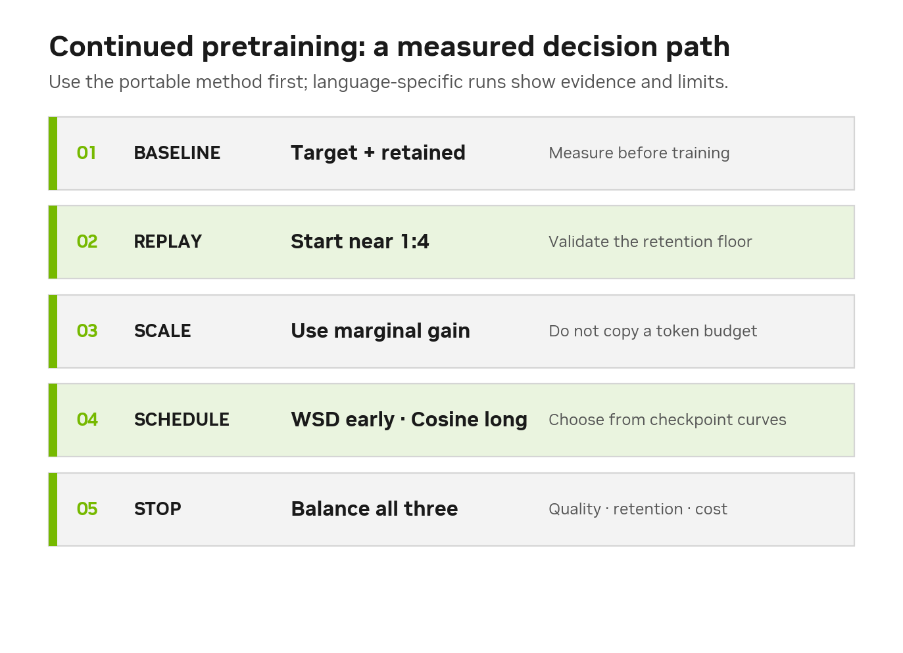
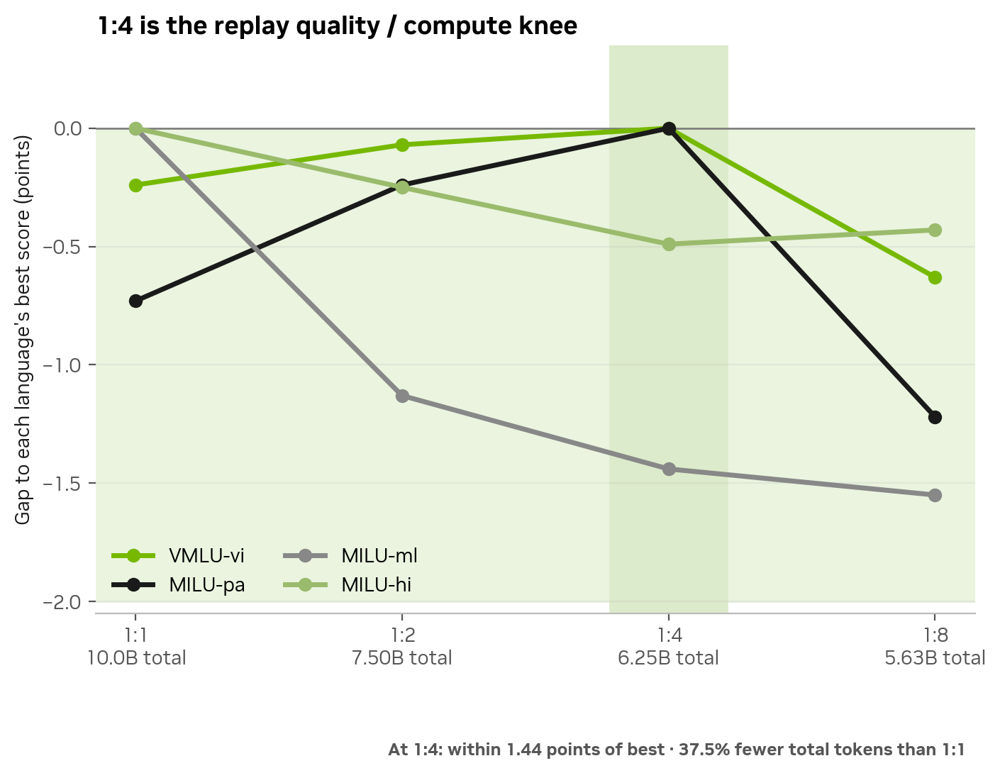
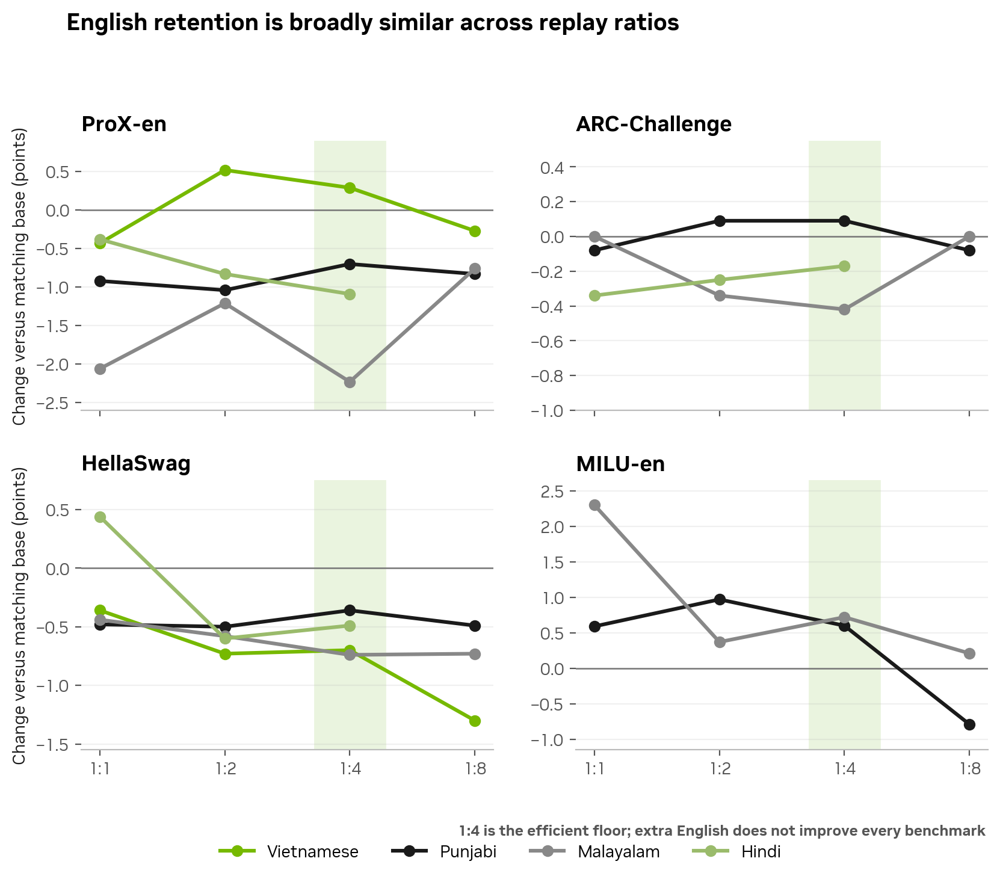
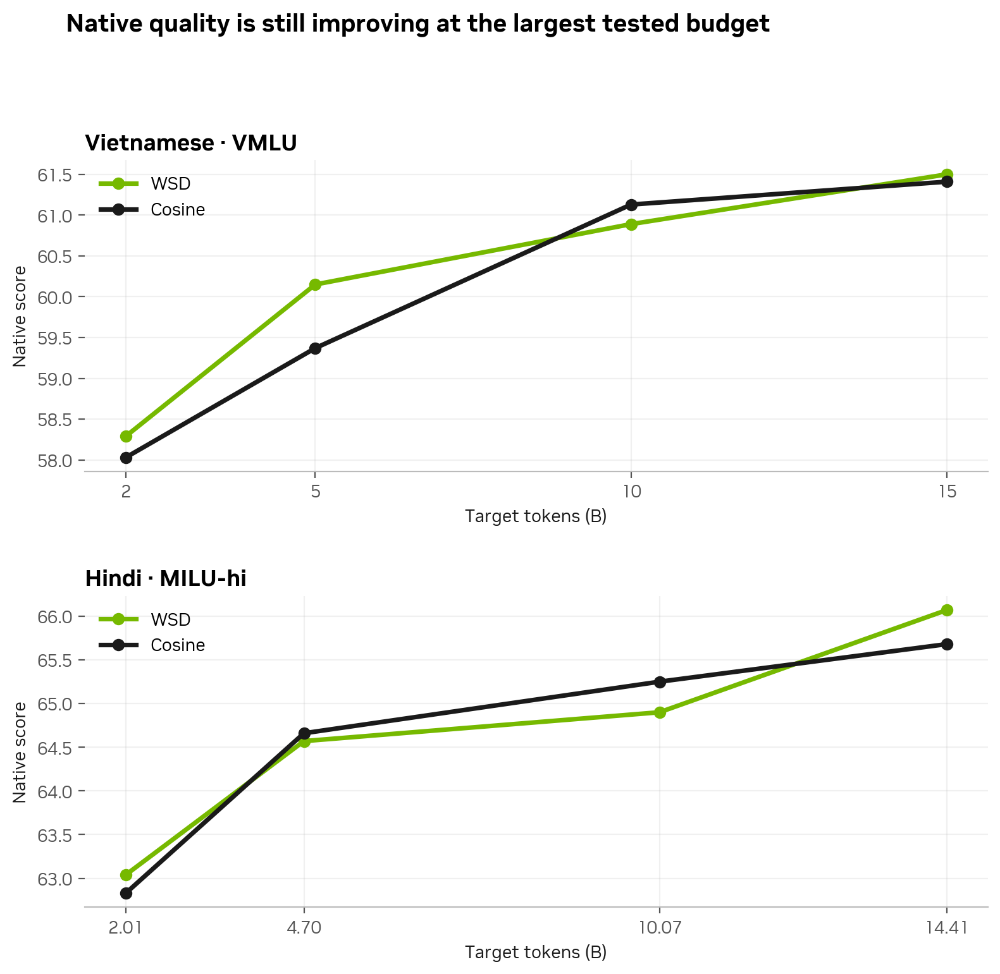
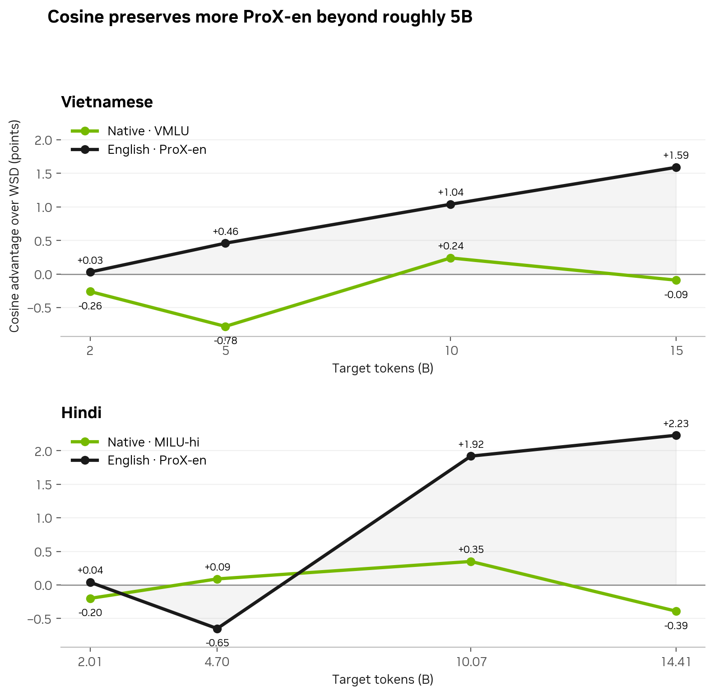

<a id="top"></a>

# Continued Pretraining Guidebook

> A practical guide to continued pretraining (CPT): how much replay to use, how many target-language tokens remain useful, when to use WSD or cosine, and how to distinguish adaptation from forgetting.

**Intended use:** a language-agnostic decision process for continued pretraining<br>
**Observed evidence:** Nemotron-3-Nano-30B-A3B experiments in Hindi, Malayalam, Vietnamese, and Punjabi<br>
**Example metrics used:** MILU/VMLU, ProX-en, ARC-Challenge, HellaSwag, and MILU-en<br>
**Reading time:** 8–10 minutes

<p align="center"></p>

**Jump to:** [Replay amount](#1-how-much-replay-is-enough) · [Retention](#2-does-more-replay-preserve-more-english) · [Target-token scale](#3-how-many-target-language-tokens-are-useful) · [Scheduler](#4-wsd-or-cosine) · [Practical recipe](#5-practical-cpt-recipe)

## How to read this guide

Each section begins with a portable decision rule. Language-specific scores then appear as **observed evidence**—examples that show why the rule is useful and where it may fail. A customer should reproduce the same measurements with their own language, corpus, model, and product evaluation.

## Start here

| Customer question | Short answer | Important qualification |
|---|---|---|
| What is the minimum replay amount? | Start with **English:target = 1:4** (20% English), then validate | The 5B observations support it as an efficient floor—not as a universal constant |
| Does more English always preserve more English capability? | **No.** Retention is not monotonic with replay ratio in this grid | Measure each retained capability directly |
| How many target-language tokens are useful? | Choose from a **marginal-gain curve** | The observed trajectories are still improving at ~15B, so 15B is not a demonstrated saturation boundary |
| Is there a practical cost knee? | Find it from the **marginal-gain curve** | A 10B cosine checkpoint is one observed example, not a universal budget |
| WSD or cosine? | Use WSD when early target lift matters; prefer cosine for a longer run when retained capability matters | The observed long-run signal is specifically ProX-en retention |
| Is the scheduler gap broad English forgetting? | Do not infer broad forgetting from one metric | In one observed language, ARC-Challenge, HellaSwag, and MILU-en remain nearly flat |
| Does the result transfer to a larger or instruction-tuned model? | Not yet established | Validate Super anchors followed by an identical lightweight SFT |

## Recommended CPT decision path

```text
establish target + English/general baselines
        ↓
start at 5B target tokens with 20% English replay
        ↓
evaluate native quality and retained capabilities at every checkpoint
        ↓
continue while marginal native gain justifies compute
        ↓
prefer cosine for the longer run when ProX-en retention matters
```

## 1. How much replay is enough?

> **Decision rule:** start with enough general-data replay to establish a retention floor, then select the smallest ratio that keeps target and retained-capability metrics inside their acceptance bands. In the current 5B observations, **1:4 English:target is the practical starting point**.

### Observed evidence

<p align="center"></p>

**Why 1:4 is the balance point:** it remains within **1.44 points** of each language's best observed native score while using **37.5% fewer total training tokens** than 1:1 at the same target-token budget.

<details>
<summary><strong>Observed native scores by language and replay ratio</strong></summary>

| English:target | English share | VMLU-vi | MILU-pa | MILU-ml | MILU-hi |
|---:|---:|---:|---:|---:|---:|
| 1:1 | 50% | 59.91 | 56.87 | **55.96** | **64.86** |
| 1:2 | 33% | 60.08 | 57.36 | 54.83 | 64.61 |
| **1:4** | **20%** | **60.15** | **57.60** | 54.52 | 64.37 |
| 1:8 | 11% | 59.52 | 56.38 | 54.41 | 64.43 |

</details>

### Why 1:4?

- It stays close to the best native score in every language.
- Versus 1:1, it changes VMLU-vi by **+0.24**, MILU-pa by **+0.73**, MILU-ml by **−1.44**, and MILU-hi by **−0.49**; all are within the reported noise.
- It uses **37.5% fewer total training tokens** than 1:1 for the same target-token budget.
- Moving from 20% to 50% English does not consistently recover English/general scores.

> **Clean takeaway:** 1:4 is an efficiency recommendation, not a claim that forgetting disappears. Avoid treating 1:8 as the universal default.

[Back to top](#top)

## 2. Does more replay preserve more English?

> **Decision rule:** measure retention directly. More replay is not guaranteed to improve every retained capability, so replay ratio should be selected jointly with schedule, total duration, data composition, and checkpoint choice.

### Observed evidence

<p align="center"></p>

**How to read this:** 1:4 does not eliminate forgetting. Across ProX-en, ARC-Challenge, HellaSwag, and MILU-en, increasing English from 20% to 33% or 50% does not produce a consistent recovery. This makes 1:4 a practical minimum—not a universal optimum.

<details>
<summary><strong>Observed English/general retention values</strong></summary>

| Ratio | ProX-en Δ: vi / pa / ml / hi | ARC-C Δ range | HellaSwag Δ range | MILU-en Δ: pa / ml |
|---:|---:|---:|---:|---:|
| 1:1 | −0.43 / −0.92 / −2.06 / −0.38 | −0.34 to 0.00 | −0.48 to +0.44 † | +0.59 / +2.30 |
| 1:2 | +0.52 / −1.04 / −1.21 / −0.83 | −0.34 to +0.09 | −0.73 to −0.50 | +0.97 / +0.37 |
| **1:4** | +0.29 / −0.70 / −2.23 / −1.09 | −0.42 to +0.09 | −0.74 to −0.36 | +0.60 / +0.72 |
| 1:8 | −0.27 / −0.83 / −0.76 / — | −0.08 to 0.00 | −1.30 to −0.49 | −0.79 / +0.21 |

† Hindi 1:1 HellaSwag is an unreplicated outlier in v3.

</details>

Some forgetting remains relative to the base, but the response is **not monotonic with English share**. Replay ratio is therefore not the only retention lever; schedule, total duration, data composition, and checkpoint selection also matter.

<details>
<summary><strong>What should be evaluated for retention?</strong></summary>

Use a portfolio rather than a single English score:

- ProX-en for the observed generative/extraction-sensitive effect.
- ARC-Challenge and HellaSwag for general reasoning/completion stability.
- MMLU-family or MILU-en evaluations where reproducible.
- English BPB or validation loss on fixed held-out text.
- Product-specific general capabilities that the base checkpoint already performs well.

Always compare with the matching base checkpoint and identical harness settings.

</details>

[Back to top](#top)

## 3. How many target-language tokens are useful?

> **Decision rule:** train and evaluate at multiple token checkpoints. Stop from the marginal target gain, retention budget, and compute economics—not from a token number copied from another language.

### Observed evidence

<p align="center"></p>

<details>
<summary><strong>Observed Vietnamese and Hindi checkpoint values</strong></summary>

### Observed Vietnamese trajectory

| Target tokens | WSD VMLU | Cosine VMLU | WSD ProX-en | Cosine ProX-en |
|---:|---:|---:|---:|---:|
| 2B | 58.29 | 58.03 | 65.24 | 65.27 |
| 5B | **60.15** | 59.37 | 64.80 | **65.26** |
| 10B | 60.89 | **61.13** | 63.73 | **64.77** |
| 15B | **61.50** | 61.41 | 63.53 | **65.12** |

### Observed Hindi trajectory

| Target tokens | WSD MILU-hi | Cosine MILU-hi | WSD ProX-en | Cosine ProX-en |
|---:|---:|---:|---:|---:|
| 2.01B | **63.04** | 62.83 | 64.38 | **64.42** |
| 4.70B | 64.57 | **64.66** | **64.47** | 63.82 |
| 10.07B | 64.90 | **65.25** | 61.36 | **63.28** |
| 14.41B | **66.07** | 65.68 | 61.09 | **63.31** |

### Marginal native gain

| Series | ~2B→5B | ~5B→10B | ~10B→15B |
|---|---:|---:|---:|
| Vietnamese WSD | +1.86 | +0.74 | +0.61 |
| Vietnamese cosine | +1.34 | +1.76 | **+0.28** |
| Hindi WSD | +1.53 | +0.33 | +1.17 |
| Hindi cosine | +1.83 | +0.59 | +0.43 |

</details>

> **Clean takeaway:** native quality remains higher at the largest tested checkpoint. One cosine trajectory shows a practical 10B cost knee because the last 5B adds only +0.28, but neither observed language demonstrates full saturation.

<details>
<summary><strong>How should a customer choose the stopping point?</strong></summary>

Stop when all of the following are true:

1. Marginal target-language gain is smaller than the product’s minimum useful improvement.
2. Retained capabilities remain inside the accepted regression budget.
3. Additional compute costs more than the expected product benefit.
4. The result is stable across at least two adjacent checkpoints or independent runs.

Do not choose a token budget solely from another language’s curve.

</details>

[Back to top](#top)

## 4. WSD or cosine?

> **Decision rule:** use checkpoint curves to separate early target-learning speed from long-run retention. WSD may be attractive early; cosine becomes preferable when a longer run reaches the region where retained capability begins to separate.

### Observed evidence

<p align="center"></p>

| Training region | Native result | ProX-en result | Current recommendation |
|---|---|---|---|
| 2B–5B | WSD leads one observed target trajectory by +0.26 at 2B and +0.78 at 5B | Small, mixed gap | Use WSD when early target-learning speed is the priority |
| 10B–15B | Native quality is similar | Cosine leads at the endpoint by **+1.59 vi** and **+2.23 hi** | Use cosine for the longer run when ProX-en retention matters |

At the largest checkpoints:

| Cosine − WSD | Native target | ProX-en | HellaSwag |
|---|---:|---:|---:|
| Vietnamese 15B | −0.09 VMLU | **+1.59** | +0.56 |
| Hindi 14.41B | −0.39 MILU-hi | **+2.23** | +0.09 |

> **Clean takeaway:** WSD can create faster early target gains; cosine provides the better long-run ProX-en trade-off in both observed language trajectories.

> [!NOTE]
> Phrase this finding precisely: **cosine limits the long-run ProX-en loss**. The current Hindi ARC-Challenge, HellaSwag, and MILU-en evidence does not show broad scheduler-driven English forgetting.

[Back to top](#top)

## 5. Practical CPT recipe

### Before training

- [ ] Fix the exact tokenizer and rebuild tokenizer-locked bin/idx data if it changes.
- [ ] Record target tokens, replay ratio, sequence length, global batch size, training steps, schedule, and checkpoint cadence.
- [ ] Establish target-language and English/general baselines with the exact evaluation harness.
- [ ] Keep held-out target and retained-capability validation data out of training.

### During training

- [ ] Start with **20% English replay** at the 5B target budget unless the product requires a more conservative prior.
- [ ] Evaluate at multiple checkpoints; do not infer final behavior from one early point.
- [ ] Track native quality, ProX-en, ARC-Challenge, HellaSwag, and fixed-text BPB/loss.
- [ ] Use marginal gain—not elapsed steps alone—to decide whether to continue.

### Before release

- [ ] Report the replay notation unambiguously as **English:target**.
- [ ] Separate statistically stable findings from directional observations.
- [ ] State whether token budgets are independent runs or checkpoints from one continuous run.
- [ ] Validate the selected policy on the intended larger model and post-SFT checkpoint.

## Evidence still needed

| Priority | Experiment | Customer question closed |
|---:|---|---|
| 1 | Extended-tokenizer CPT at 5B and 15B | Does token efficiency change the target-token scaling curve? |
| 2 | New-row-only DLR | Can new lexical rows learn quickly with less movement of legacy rows? |
| 3 | Extend one observed scale curve beyond 15B | Where does the native-quality curve actually saturate? |
| 4 | Super-model anchors followed by identical lightweight SFT | Do Nano CPT rules transfer to the shipping model journey? |

[Back to top](#top)
