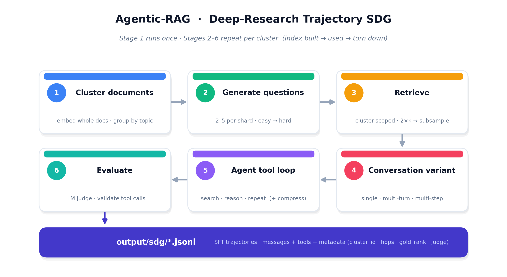

# 🔎 Agentic RAG — Deep-Research Trajectory SDG

Generate synthetic training data that teaches a model to **research like an agent**:
read a question, search a knowledge base, reason over what it finds, search again
if needed, and answer — with every claim grounded in real retrieved text.

```
cluster docs → question → (clarify?) → plan → search → reason → search → … → grounded answer
```



The engine is **domain-agnostic**. It ships with the **Constitution of India** as a
worked example; point it at any documents + tools and it generates a new domain.

---

## What you get

Each output row is one full **agent trajectory** in OpenAI `messages` + `tools`
format — the user's question, the assistant's reasoning, its tool calls, the real
retrieved passages, and the final answer — ready for SFT. Every row carries
metadata (cluster, variant, hops, whether the gold passage was retrieved, judge
verdict) for auditing and filtering.

---

## The pipeline (Stages 1–6, streaming)

The pipeline runs **one cluster at a time**, all the way through, so cluster
indexes never all exist at once — peak memory/disk is bounded to a single
cluster. Only the global cluster manifest persists across clusters.

```
STAGE 1 (once)   cluster WHOLE docs by embedding (no chunking)
                 → data/clusters/manifest.jsonl   ← global audit ledger (doc → cluster)
                 → data/clusters/<id>/docs.jsonl

then FOR EACH cluster, sequentially:
  STAGE 2   chunk the cluster's docs → build its own index → shard long docs by
            the generator window → generate 2–5 questions/shard across a
            difficulty spectrum (half-baked → crisp → complex multi-step)
  STAGE 3   a user-LLM opens with a seeded question; retrieval is scoped to THIS
            cluster's index (semantic; oversample 2×k then random-subsample to k
            so a single search is lossy and the agent must take more hops)
  STAGE 4   each row is a variant: single-turn / multi-turn / multi-step
  STAGE 5   a model-driven tool loop researches with updated queries; the
            constant tool is the retriever, others are LLM-simulated; multiple
            tool calls in a turn run concurrently
      5a    outer compression: system prompt + everything from the last user
            turn to the end are kept verbatim; the middle is compressed to a
            token budget (a knob)
  STAGE 6   LLM-as-judge rates the trajectory; tool calls are schema-validated
  → append trajectories (tagged cluster_id) to the output, tear down the index
```

Every stage is config-driven and every knob lives in the YAML — the Python code
never mentions law or the Constitution.

---

## Quick start

> Run everything from this folder: `.../steps/sdg/agentic_rag`

### 1 · Install

```bash
pip install -e .
export NVIDIA_API_KEY=nvapi-...        # from build.nvidia.com
```

### 2 · Run the whole pipeline (one command)

```bash
python pipeline.py --config config/agentic_pipeline.yaml                 # full run
python pipeline.py --config config/agentic_pipeline.yaml --limit-clusters 2   # smoke test
```

`pipeline.py` runs Stage 1 clustering, then Stages 2–6 per cluster, appending to
`output/sdg/`. It is **resumable** (a `.done` marker per cluster) and bounds disk
by deleting each cluster's index after use (`--keep-indexes` to retain them).
Useful flags: `--skip-clustering` (reuse an existing clusters root),
`--no-llm` (Stage 1–2 chunk/index only, no API).

### 3 · Evaluate (Stage 6, standalone)

```bash
python evaluate.py --input output/sdg/agentic_rag_pipeline.jsonl          # offline stats
python evaluate.py --input output/sdg/agentic_rag_pipeline.jsonl --judge  # + LLM judge
```

Reports tool-call validity, gold-retrieval rate, hop/variant distributions, and
(optionally) the judge pass-rate.

---

## Running stages individually

Each offline stage is also a standalone CLI (handy for tuning):

```bash
cd data_prep

# Stage 1 — cluster whole documents (no chunking)
python cluster_documents.py --input ../data/constitution_of_india.txt \
  --doc-unit section --profile indian_statute \
  --output-root ../data/clusters --algo kmeans --k 12

# Stage 2 — chunk + generate questions for ONE cluster
python question_gen.py --cluster-dir ../data/clusters/c000 --profile indian_statute --n-queries 4

# build one retrieval index per cluster
python retriever.py build --clusters-root ../data/clusters --backend embedding

# quick retrieval check inside a cluster's world
python retriever.py query --index ../data/clusters/c000/index --q "powers of the President"
```

---

## Files

```
agentic_rag/
├── data_prep/                ← offline corpus tooling (Stages 1–2, CLI)
│   ├── cluster_documents.py      Stage 1: whole-doc embed + cluster + manifest
│   ├── chunk_document.py         size-bounded chunking (profile-driven)
│   ├── question_gen.py           Stage 2: per-document question generation
│   └── retriever.py              CLI over the shared retrieval module (per-cluster build)
├── agentic_rag/              ← the runtime plugin (modular engine + DD adapter)
│   ├── config.py                 every runtime knob (one source of truth)
│   ├── retrieval.py              swappable retriever (embedding/lexical) + subsample
│   ├── generator.py              the phased deep-research loop (Stages 3–5)
│   ├── tools.py                  real retriever vs. LLM-simulated tools (cluster-scoped)
│   ├── context.py                Stage 5a outer compression (head/tail preserve)
│   ├── prompts.py                the agent/user/judge prompts
│   └── …                         llm, judges, messages, persona, verifiers
├── config/
│   ├── agentic_pipeline.yaml       the streaming pipeline config (Stages 1–6)
│   └── agentic_pipeline.smoke.yaml cost-bounded smoke config
├── pipeline.py               ← the streaming orchestrator (Stages 1–6)
├── step.py                   ← per-config Data Designer runner (Stages 3–6)
├── evaluate.py               ← Stage 6 standalone evaluation
└── data/                     ← source doc + (generated) clusters/index/queries
```

---

## Making it your own

Everything domain-specific lives in `config/agentic_pipeline.yaml` — the corpus,
the clustering, the tools, the personas, and every tuning knob (cluster count,
questions per shard, retrieval depth/subsample, conversation variants, context
compression budget, judge strictness). **To do a new domain:** point `clustering.input`
at your documents, swap the tool definitions, and rerun — nothing in the Python
changes. To swap the retrieval backend (BM25, FAISS, a hosted vector DB),
implement the `Retriever` interface in `agentic_rag/retrieval.py`.

---

## Status

The offline stages (cluster → chunk → index → questions) are built and validated
on the real Constitution; clustering yields balanced topical clusters, per-cluster
retrieval grounds correctly, and the lossy-subsample retrieval pushes depth. The
generator runs end-to-end against the live model endpoint and produces
trajectories. Ongoing tuning: raising the fraction that pass the quality judges.
