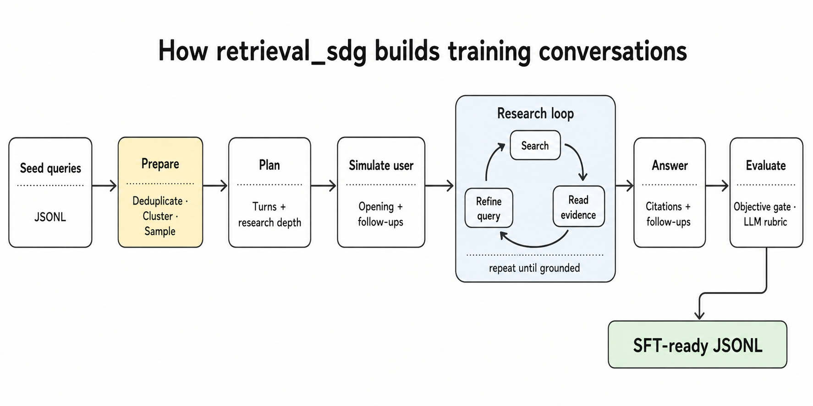

# retrieval_sdg

Generate multi-turn, retrieval-grounded tool-calling conversations for supervised
fine-tuning (SFT). Each output row contains OpenAI-style `messages`, tool schemas, and
generation metadata.



## What it does

1. Deduplicates, clusters, and samples seed queries.
2. Plans conversation length, turn type, and research depth.
3. Simulates a user and a tool-using research assistant.
4. Routes retrieval calls to an HTTP service and simulates other tools with an LLM.
5. Compresses model context while retaining the full saved trajectory.
6. Validates, scores, and filters trajectories into SFT-ready JSONL.

The implementation is domain-agnostic. Corpus access, tools, models, endpoints, and
generation behavior are configured in `config/pipeline.yaml`.

## Requirements

- Python 3.10+
- Data Designer
- A JSONL query source
- OpenAI-compatible model endpoints
- An HTTP retrieval endpoint for real generation
- API keys exposed through the environment variables named in the config

The checked-in retrieval address is deployment-specific; replace it before running
outside that network.

## Quick start

Run from this directory:

```bash
pip install -e .

# Prepare seeds: normalize, deduplicate, embed, cluster, sample
python pipeline.py --config config/pipeline.yaml --stage query_prep

# Generate a small smoke-test batch
python pipeline.py --config config/pipeline.yaml --stage generate --limit 5

# Validate and filter; --judge enables the LLM rubric
python evaluate.py \
  --input output/sdg/retrieval_sdg.raw.jsonl \
  --out output/sdg/retrieval_sdg.jsonl \
  --judge
```

`--stage all` runs query preparation and generation. `--limit N` caps sampled or
generated rows.

## Configure

Update `config/pipeline.yaml` before generation:

| Section | Key settings |
|---|---|
| Top level | `input_path`, `seeds_path`, `output_path`, `metadata_fields` |
| `query_prep` | dedup threshold, embedding model, clustering, target sample size |
| `providers` | provider name, endpoint, API-key environment variable |
| `models` | four required aliases and inference parameters |
| `retrieval` | endpoint, tool names, `top_k`, oversampling, timeout, headers, field map |
| `tools` | OpenAI-format function schemas |
| `engine` | turns, hops, steps, context compression, judging, persona behavior |

The required model aliases are:

| Alias | Responsibility |
|---|---|
| `assistant_model` | Research, tool calls, and final answers |
| `user_model` | Openings, follow-ups, and clarification replies |
| `aux_response_model` | Responses for tools without real backends |
| `judge_model` | Optional query and trajectory checks |

Tool names listed in `retrieval.tools` are routed to the HTTP client. Every other tool
is simulated by `aux_response_model`. The default config provides `search`,
`memory_read`, and `memory_write`.

### Retrieval API mapping

`retrieval.field_map` adapts service-specific request and response schemas. The client:

- requests `top_k * oversample_factor` results;
- deterministically samples back to `top_k` per seed row;
- preserves result order after sampling;
- assigns a stable content-hash id when a chunk has no id.

`top_k` is controlled by config, not by model-generated arguments.

## Runtime flow

For each seed, `ConversationSimulatorGenerator` creates one shared message list. On each
user turn it:

1. builds a bounded assistant view and attaches tool schemas;
2. requests one or more research steps, forcing tool use until `min_hops` when enabled;
3. sanitizes and schema-validates each tool call;
4. executes retrieval calls or simulates non-retrieval tools;
5. appends tool results and updates the research scratchpad;
6. stops on a tool-free answer, repeated retrieval stalls, or `max_steps`;
7. generates the next user follow-up and repeats.

The saved trajectory retains full tool results and `reasoning_content`. Later model
calls receive a compacted view: the system prompt and current turn remain visible,
older tool results may become references or snippets, and prior reasoning is not
replayed.

Tool-calling uses direct OpenAI-compatible clients because some Data Designer facades
do not preserve tool-call names correctly.

## Evaluation

Evaluation is separate from generation, so raw trajectories can be re-scored without
regenerating them.

The deterministic gate requires:

- at least one tool call;
- no schema-invalid recorded tool calls;
- at least one retrieval-shaped result;
- a final tool-free assistant answer.

With `--judge`, an LLM additionally scores faithfulness, coherence, completeness, tool
use, and user realism from 1–5. Every score must meet `--min-score`.

## Outputs

| File | Contents |
|---|---|
| `retrieval_sdg.raw.jsonl` | Generated trajectories before decoupled evaluation |
| `retrieval_sdg.jsonl` | Trajectories that passed enabled gates |
| `retrieval_sdg.scored.jsonl` | Every evaluated row with objective and rubric results |
| `retrieval_sdg.summary.json` | Keep rate and aggregate cluster, hop, and score metrics |

Raw rows contain:

```json
{
  "messages": [],
  "tools": [],
  "cluster_id": "c003",
  "hops_taken": 4,
  "conversation_status": true,
  "trajectory_judgment": "{}",
  "retrieval_log": "[]"
}
```

Some metadata values are serialized JSON strings because they pass through Data
Designer side-effect columns. Parse them before analysis.

## Code map

```text
retrieval_sdg/
├── config/pipeline.yaml       runtime configuration
├── pipeline.py                query preparation and generation driver
├── evaluate.py                deterministic and LLM evaluation
├── retrieval_sdg/
│   ├── plugin.py              Data Designer registration
│   ├── query_prep/            embedding, deduplication, clustering, sampling
│   ├── conversation/          planning, generation, tools, context, judges, prompts
│   ├── retrieval/client.py    retrieval HTTP adapter
│   └── core/                  model clients and message helpers
└── tests/                     focused unit tests
```

## Tests

```bash
pytest -q tests
```

The focused suite covers deduplication, retrieval-client behavior, and tool-call schema
verification. Full generation requires reachable model and retrieval endpoints; run a
small `--limit` batch and evaluate it before starting a large job.
