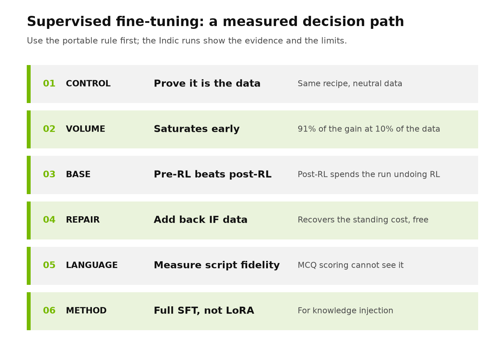
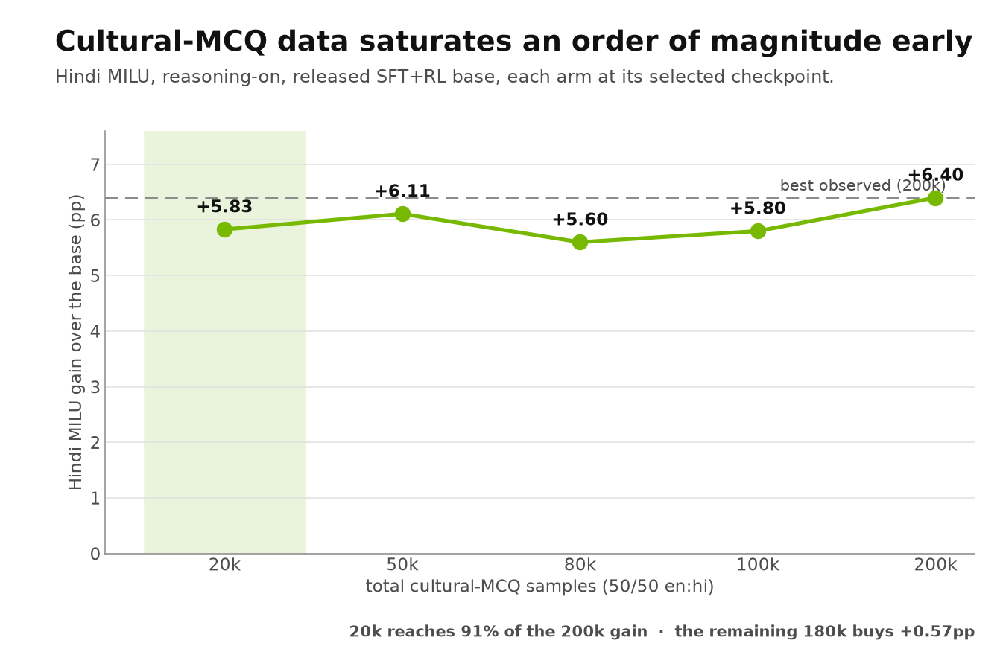
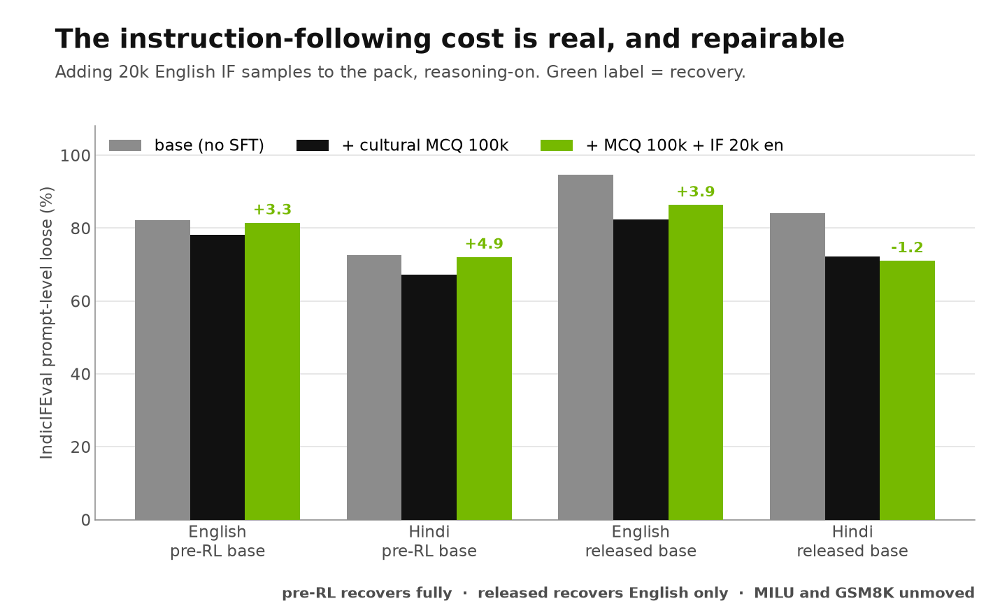
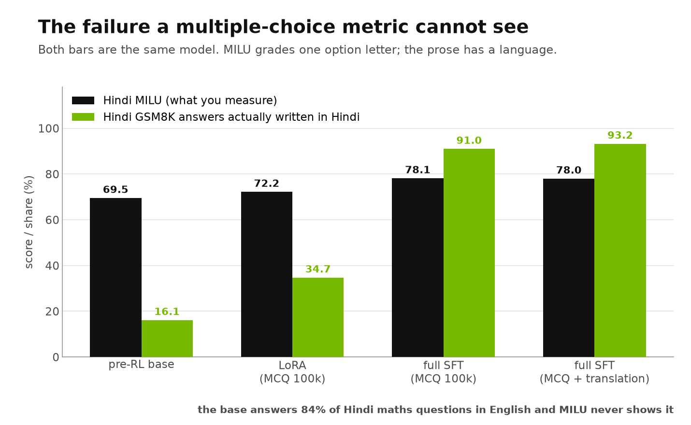
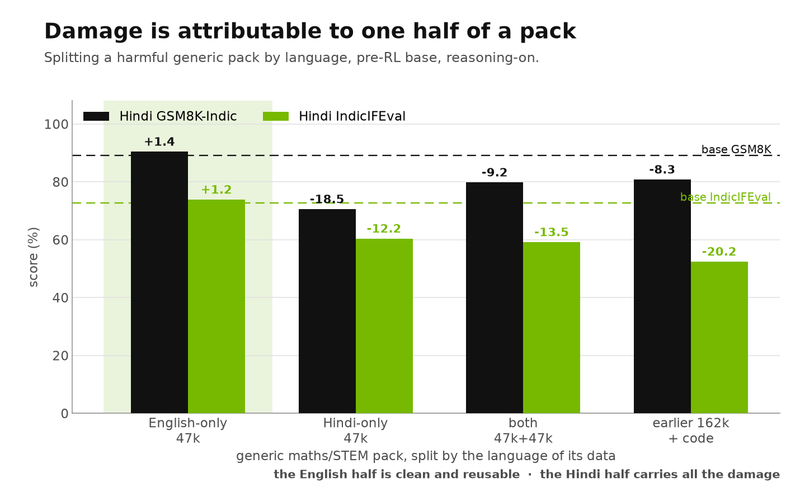
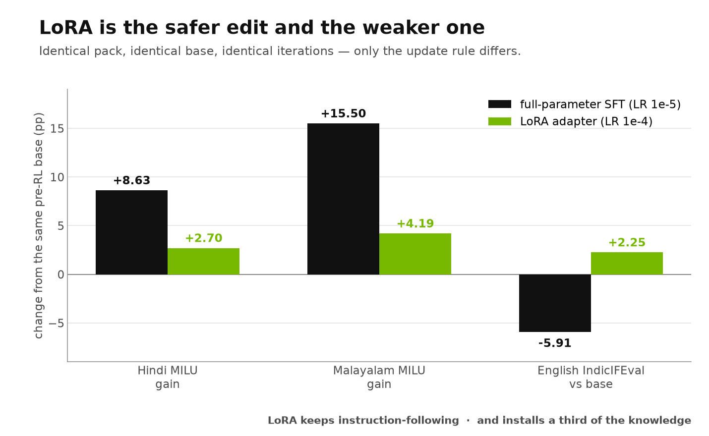

<a id="top"></a>

# Supervised Fine-Tuning Guidebook

> A practical guide to instruction SFT for language and domain adaptation: how to prove the gain came from your data, how much data is enough, which base checkpoint to start from, what SFT reliably breaks, and how to see the failure your headline metric cannot.

**Intended use:** a language-agnostic decision process for adapting a post-trained model with SFT<br>
**Observed evidence:** Nemotron-3-Nano-30B-A3B experiments in Hindi and Malayalam, 13 controlled ablations<br>
**Example metrics used:** MILU, GSM8K-Indic, IndicIFEval, IndiVibe, and per-benchmark script fidelity<br>
**Reading time:** 8–10 minutes

<p align="center"></p>

**Jump to:** [Control](#1-is-the-gain-your-data-or-would-any-fine-tuning-do-it) · [Data volume](#2-how-much-instruction-data-is-enough) · [Base checkpoint](#3-which-base-pre-rl-or-post-rl) · [Repairing the cost](#4-what-sft-breaks-and-how-to-repair-it) · [Language fidelity](#5-the-failure-your-headline-metric-cannot-see) · [Blending data](#6-should-you-blend-in-general-purpose-data) · [LoRA](#7-lora-or-full-fine-tuning) · [Recipe](#8-practical-sft-recipe)

## How to read this guide

Each section begins with a portable decision rule. Language-specific scores then appear as **observed evidence**—examples that show why the rule is useful and where it may fail. A customer should reproduce the same measurements with their own language, corpus, model, and product evaluation.

All scores are reasoning-on unless stated, taken at each arm's selected checkpoint. Standard errors: MILU 0.4pp (English/Hindi) and 0.76pp (Malayalam), GSM8K-Indic 1.3pp, IndicIFEval 2.4pp, IndiVibe 4.8pp. Treat any single move under about 2 SE as noise.

## Start here

| Customer question | Short answer | Important qualification |
|---|---|---|
| How do I know the gain is my data? | Run the **same recipe on neutral data**. If it does not move the target metric, the content is doing the work | Without this control you cannot attribute anything |
| How much instruction data do I need? | Far less than expected. **20k samples reached 91% of the gain from 200k** | Saturation point is data- and task-specific; find your own curve |
| Which base checkpoint? | The **pre-RL SFT-only** checkpoint gained more than the released RL'd model | Only if you have access to it; otherwise expect a smaller gain |
| What will SFT break? | **Instruction following**, on all 11 runs that measured it | It is repairable at near-zero cost — see section 4 |
| Will my MCQ metric show language problems? | **No.** A model scored its best MILU while writing 84% of its answers in the wrong language | Measure script fidelity per benchmark, not just accuracy |
| Should I blend in general-purpose data? | **No.** It was harmful alone and harmful as a 20k top-up | Audit any pack before training; see the checklist in section 6 |
| Is LoRA a cheaper substitute? | **Not for knowledge injection.** It installed roughly a third of the gain | It does preserve instruction following better — a real but narrow advantage |
| Can I read a result from the final checkpoint? | **No.** One experiment's sign flipped at the last iteration only | Average across matched iterations; see [how to measure](#how-to-measure-honestly) |

## Recommended SFT decision path

```text
establish target + retained-capability baselines on the exact harness
        ↓
run a neutral-data control at the same volume and recipe
        ↓
sweep data volume; find the knee from marginal gain
        ↓
evaluate accuracy AND script fidelity at every checkpoint
        ↓
add back instruction-following data to repair the standing cost
        ↓
select a checkpoint on a plateau, not an argmax
```

## 1. Is the gain your data, or would any fine-tuning do it?

> **Decision rule:** before attributing any improvement to your dataset's content, run the **same recipe, same volume, same base, same evaluation** on data that does not contain the target capability. If the neutral pack moves the metric too, you are measuring the recipe, not the data.

### Observed evidence

A 162k generic multilingual maths/STEM/code pack, trained identically to the cultural-MCQ packs:

| Metric (Hindi, reasoning-on) | Released base | After generic 162k | Change |
|---|---:|---:|---:|
| MILU | 72.02 | 69.12 | **−2.90** |
| GSM8K-Indic | 90.14 | 81.12 | **−9.02** |
| IndicIFEval | 84.08 | 57.55 | **−26.53** |
| IndiVibe (win-rate vs base) | 50.00 | 31.36 | **−18.64** |

The control did not merely fail to add knowledge — it removed capability across the board. That is what licenses attributing the cultural-MCQ gains reported elsewhere to the India-grounded content of that data rather than to instruction tuning in general.

> **Clean takeaway:** a control that comes back negative is more informative than one that comes back flat. It tells you the recipe is capable of doing damage, so a positive result from your real pack is a property of the data.

[Back to top](#top)

## 2. How much instruction data is enough?

> **Decision rule:** sweep volume across at least an order of magnitude and choose from the **marginal-gain curve**. Do not copy a sample count from another project; generating instruction data is usually the most expensive part of the pipeline and the saturation point is where the budget is decided.

### Observed evidence

<p align="center"></p>

| Total samples (50/50 en:target) | Hindi MILU | Gain over base |
|---:|---:|---:|
| 20k | 77.85 | +5.83 |
| 50k | 78.13 | **+6.11** |
| 80k | 77.62 | +5.60 |
| 100k | 77.82 | +5.80 |
| 200k | 78.42 | +6.40 |

**20k samples reached 91% of the gain that 200k produced.** The remaining 180k samples bought +0.57pp, which is inside 2 SE of the 20k result.

<details>
<summary><strong>What the extra data does buy</strong></summary>

Volume is not worthless — it buys **tolerance to training length**. The small packs peak early and then decay with continued training, while the large packs hold their score. If your pipeline cannot afford careful checkpoint selection, more data is a way of buying robustness to that. But if you are selecting checkpoints properly, it is a poor use of generation budget.

Note also that accuracy saturating is not the same as the pack being free: instruction-following and script fidelity continue to move at volumes where MILU has flattened. A two-benchmark scoreboard would report saturation and miss the ongoing cost.

</details>

[Back to top](#top)

## 3. Which base: pre-RL or post-RL?

> **Decision rule:** if you have access to the checkpoint **before** the RL stages, evaluate it as an SFT starting point. A model that has been RLHF'd or RLVR'd spends part of every fine-tuning run undoing behaviour the earlier checkpoint never had.

### Observed evidence

The same 100k cultural-MCQ pack, trained on both checkpoints:

| Base | Hindi MILU before | after | Gain |
|---|---:|---:|---:|
| Released SFT+RL | 72.02 | 77.82 | +5.80 |
| **Pre-RL SFT-only** | 69.48 | 78.11 | **+8.63** |

The pre-RL model starts lower and finishes higher. The same pattern appears in the repair experiment in section 4: instruction following recovers fully on the pre-RL base and only partially on the released one, because RL had made instruction following stronger there and so there was more of it to lose.

> [!NOTE]
> This is an argument for evaluating the pre-RL checkpoint, not for shipping it. Whether the pre-RL arm is the better *product* depends on everything RL bought you that these benchmarks do not measure.

[Back to top](#top)

## 4. What SFT breaks, and how to repair it

> **Decision rule:** assume instruction following will regress and measure it explicitly. It is the most consistent cost of instruction SFT in this series — present on all 11 of the 13 runs that measured it, the other two having evaluated only MILU and IndiVibe — and it has a direct fix that costs nothing on the other axes.

### Observed evidence

<p align="center"></p>

Adding **20k English instruction-following samples** into the 100k cultural-MCQ pack:

| IndicIFEval | Base | + MCQ 100k | + MCQ + IF 20k | Recovery |
|---|---:|---:|---:|---:|
| English, pre-RL base | 82.24 | 78.16 | 81.43 | **+3.27** |
| Hindi, pre-RL base | 72.65 | 67.14 | 72.04 | **+4.90** |
| English, released base | 94.69 | 82.45 | 86.33 | +3.88 |
| Hindi, released base | 84.08 | 72.24 | 71.02 | −1.22 |

On the pre-RL base the loss is **fully recovered in both languages**, and MILU and GSM8K-Indic are unchanged (within 0.3pp). On the released base only English recovers.

Two things worth noting. The IF data is English-only, yet it repairs Hindi instruction following on the pre-RL base — the capability being restored is not language-specific. And it costs script fidelity: Hindi fidelity falls about 7pp when the IF data is added, which is the trade to watch.

[Back to top](#top)

## 5. The failure your headline metric cannot see

> **Decision rule:** for every benchmark whose answer is free-form prose, report the **share of answers actually written in the expected language** alongside the accuracy. Multiple-choice metrics grade a single option letter and are structurally blind to the model answering in the wrong language.

### Observed evidence

<p align="center"></p>

| Model (pre-RL base) | Hindi MILU | Hindi GSM8K answers written in Hindi |
|---|---:|---:|
| Base, no SFT | 69.48 | **16.1%** |
| LoRA (MCQ 100k) | 72.18 | 34.7% |
| Full SFT (MCQ 100k) | 78.11 | **91.0%** |
| Full SFT (MCQ + translation) | 77.97 | 93.2% |

The base model writes **84% of its Hindi maths answers in something other than Hindi** and scores 69.48 on Hindi MILU while doing it; on the released base only 2.5% are in Hindi. Mostly that "something" is English — but not entirely. Roughly 8% of the released base's Hindi answers are dominated by CJK characters, which a Devanagari-vs-Latin classifier would silently record as English. If you report where the off-target answers went, make sure the classifier knows about scripts you did not expect.

<details>
<summary><strong>Two consequences that changed conclusions in this series</strong></summary>

**Accuracy drops can be language switches — but check before you claim it.** When a model stops solving target-language problems in English, GSM8K accuracy falls for reasons unrelated to mathematics. That story is tempting and was *wrong* for the largest loss we measured: the reasoning-off arm performed a more complete language switch for a third of the cost, and the base was no more accurate on the answers it wrote in English than on those it wrote in Hindi. Report the accuracy bar and the fidelity bar side by side and let a reader separate them; do not assert the mechanism without a control.

**Translation data buys fidelity at no accuracy cost.** Adding bidirectional en↔target translation pairs moved Hindi IndicIFEval fidelity from 80.8% to 84.3% and GSM8K fidelity from 91.0% to 93.2%, with MILU flat (78.11 → 77.97, inside 1 SE). On an accuracy-only scoreboard this intervention looks like it did nothing at all.

</details>

> **Clean takeaway:** a model can post its best-ever target-language MCQ score while writing most of its free-form answers in the wrong script. If language behaviour matters to your product, it must be a measured axis, not an assumption.

[Back to top](#top)

## 6. Should you blend in general-purpose data?

> **Decision rule:** no, not without measuring it. In this series general data was harmful on its own and harmful as a small top-up. More usefully: when a pack does damage, **split it and re-run** — damage is often attributable to one identifiable part, and the rest is reusable.

### Observed evidence

<p align="center"></p>

Splitting the harmful generic maths/STEM pack by the language of its data (pre-RL base):

| Pack | Hindi GSM8K-Indic | Hindi IndicIFEval |
|---|---:|---:|
| Base | 89.08 | 72.65 |
| **English-only 47k** | **90.45** (+1.37) | **73.88** (+1.23) |
| Hindi-only 47k | 70.58 (−18.50) | 60.41 (−12.24) |
| Both halves 94k | 79.83 (−9.25) | 59.18 (−13.47) |

The English half is clean and mildly positive. The Hindi half carries all of the damage. "Discard the generic data" would have thrown away usable English maths; splitting the pack turned an unusable result into an actionable one.

<details>
<summary><strong>Audit the pack before you train on it</strong></summary>

Inspecting the staged JSONL explained the result. Compared with the clean cultural-MCQ pack, the generic pack carried:

| Check | Cultural-MCQ pack | Generic pack |
|---|---:|---:|
| Exact duplicate targets | **0.00%** | **14.06%** |
| Target in a different language from the prompt | 0 | **9.01%** |
| Language balance | exactly 50/50 | 48% / 40% / 12% with no language |
| Answer-format marker present | 50% / 50% by language | 52% / 33% by language |

It also contained degenerate targets — one Hindi multiple-choice item whose entire assistant response was the string `Answer: A` — and content that was Codeforces C++ and olympiad algebra rather than anything resembling the evaluation. Some answers had been rewritten by majority vote, with the original preserved in a sibling field.

Run these five checks on any pack before spending GPU time on it:

1. Exact and near-duplicate rate on targets.
2. Prompt language against target language, per row.
3. Degenerate targets — length below a threshold, or no reasoning at all.
4. Answer-format markers, checked **per language** rather than in aggregate.
5. Whether labels were machine-modified, and whether the original is recoverable.

</details>

<details>
<summary><strong>What about a small general-purpose top-up?</strong></summary>

Tested directly: 20k generic samples added to a 200k cultural-MCQ pack, compared at matched training exposure. The result was worse on 6 of 14 accuracy cells and better on 3, with every gain under 1.3pp. The losses landed on Hindi MILU (−4.3pp) and Hindi GSM8K (−3.0pp), both reasoning-off. There was no metric it clearly bought.

Conversational data was tested the same way — 15k conversational samples added at two different MCQ volumes, so the effect is measured twice independently. Averaged across matched iterations it moved Hindi IndiVibe by **−5.1pp and −5.9pp** and Hindi IndicIFEval by **−2.9pp and −3.0pp**, with knowledge and reasoning unchanged. Both pairs agreed in sign and magnitude. It was added to improve open-ended behaviour and it did the opposite.

</details>

[Back to top](#top)

## 7. LoRA or full fine-tuning?

> **Decision rule:** for **installing new knowledge**, full-parameter SFT. A low-rank adapter moved the model less on every knowledge axis measured, and the shortfall grew with how unfamiliar the target language was. LoRA's real advantage is that it damages existing behaviour less.

### Observed evidence

<p align="center"></p>

Identical pack, identical base, identical iterations — only the update rule differs:

| Change from the same pre-RL base | Full SFT (1e-5) | LoRA (1e-4) |
|---|---:|---:|
| Hindi MILU | **+8.63** | +2.70 |
| Malayalam MILU | **+15.50** | +4.19 |
| English IndicIFEval | −5.91 | **+2.25** |

Averaged across all matched iterations LoRA trails full SFT by **6.6pp** on Hindi MILU and **13.5pp** on Malayalam MILU. The harder, less-represented language is roughly twice as bad, which reads as a capacity limit rather than a tuning accident.

The two methods also have different **shapes**: full SFT climbed monotonically and was still climbing at the last checkpoint, while LoRA peaked at iteration 100 and then declined to below its starting point on Hindi MILU. Any comparison drawn at a single iteration is a snapshot of a widening gap.

> [!NOTE]
> The learning rates are deliberately unmatched — an adapter barely moves at 1e-5. This measures LoRA as it would actually be run, not low-rank capacity in the abstract. LoRA would earn its place in a setting needing many cheap, composable, revertible adapters; that case is not tested here.

[Back to top](#top)

## 8. Practical SFT recipe

### Before training

- [ ] Fix tokenizer, chat template and sequence length before packing; re-pack if any of them change.
- [ ] Establish target and retained-capability baselines on the exact harness you will use after training.
- [ ] Run the pack audit in section 6 — duplicates, prompt/target language, degenerate targets, per-language format markers.
- [ ] Plan the neutral-data control at the same volume and recipe. Budget for it; it is what makes the result attributable.
- [ ] Record samples, language split, iterations-per-epoch, LR schedule and checkpoint cadence for every arm.

### During training

- [ ] Evaluate at several checkpoints. Never infer final behaviour from one point.
- [ ] Track accuracy **and** script fidelity for every generative benchmark, in every language.
- [ ] Carry untrained languages through the evaluation as controls — cross-language damage was one of the most important findings here — but do not let them decide a checkpoint.
- [ ] Watch instruction following specifically; it is the axis that breaks first.

### How to measure honestly

These four rules changed conclusions in this series, each after producing a wrong one first.

- [ ] **Average across matched iterations.** One experiment's headline sign was positive at the final iteration and negative at all four earlier ones. Quote the mean, not the endpoint.
- [ ] **Anchor each arm to its own base.** Arms trained from different initialisations must never share an anchor or an axis.
- [ ] **Match exposure, not steps.** Packs of different sizes see different numbers of epochs at the same iteration. Correct for it, or compare only packs of equal size.
- [ ] **Select on a plateau, not an argmax**, and only on the languages actually in the training data. A raw maximum chases a late fractional gain into a checkpoint whose other benchmarks have already turned over.

### Before release

- [ ] Separate statistically stable findings from directional observations, and state the standard errors.
- [ ] Report whether an effect replicated across independent pairs, and say so when it did not.
- [ ] State which iteration each claim refers to.
- [ ] Re-validate the chosen recipe on the model you actually intend to ship.

## Evidence still needed

| Priority | Experiment | Customer question closed |
|---:|---|---|
| 1 | Rebuild the target-language half of the generic pack and re-run | Is generic data harmful, or was this pack simply bad? |
| 2 | Instruction-following data authored in the target language | Does the section 4 repair improve if the IF data is not English-only? |
| 3 | A volume sweep below 20k | Where does the saturation curve actually begin? |
| 4 | LoRA at matched exposure with a rank/LR sweep | Is the section 7 shortfall low-rank capacity, or this configuration? |
| 5 | The same recipe on the larger shipping model | Do the Nano rules transfer to the model that ships? |

[Back to top](#top)
