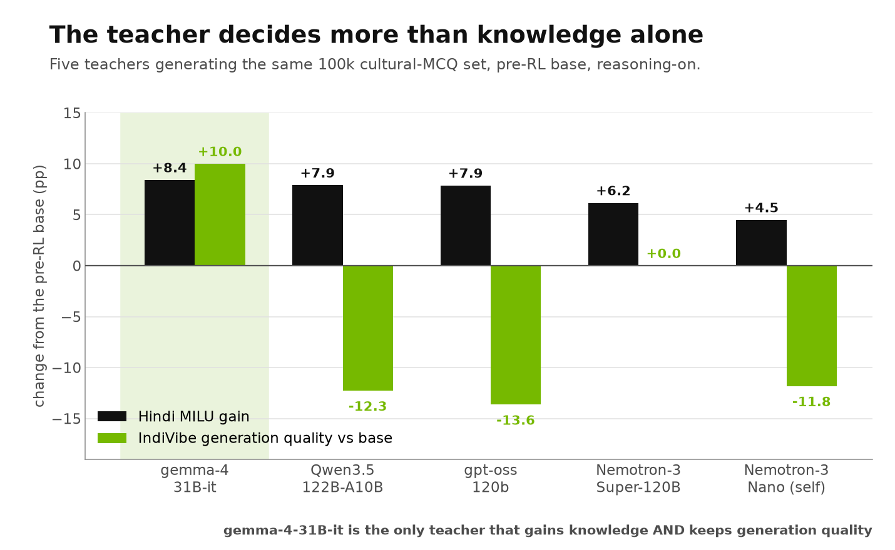

<a id="top"></a>

# Supervised Fine-Tuning Guidebook

> You want to adapt a post-trained model to a new domain or language. This guidebook is the output of an ablation study run specifically to answer that: which base checkpoint, which teacher, what reasoning blend, what learning rate, how much data, and what to put back in so nothing regresses.

**Intended use:** a language- and domain-agnostic recipe for adapting an instruct model with SFT<br>
**Observed evidence:** Nemotron-3-Nano-30B-A3B, Hindi and Malayalam, 13 controlled ablations<br>
**Example metrics used:** MILU, GSM8K-Indic, IndicIFEval, IndiVibe (LLM-as-judge), script fidelity<br>
**Reading time:** 10–12 minutes

<p align="center"></p>

**Jump to:** [The recipe](#the-recipe) · [What to expect](#what-to-expect) · [Base](#1-start-from-the-pre-rl-checkpoint) · [Curating the data](#2-curating-the-adaptation-data) · [Teacher](#3-choose-the-teacher-deliberately) · [Reasoning blend](#4-never-train-on-100-reasoning-on-data) · [Learning rate](#5-learning-rate-and-schedule) · [Data volume](#6-how-much-data-you-actually-need) · [Replay](#7-replay-english-alongside-the-target-data) · [Language fidelity](#8-measure-language-fidelity-not-just-accuracy) · [Full SFT vs LoRA](#9-use-full-parameter-sft) · [Apply to your run](#10-apply-this-guide-to-your-sft-run) · [Reproducibility](#reproducibility) · [Future work](#future-work)

## Why this study exists

Adapting an already post-trained instruct model is not the same problem as pretraining it. The model already follows instructions, already reasons on demand, and already has an alignment you are about to disturb. The questions a developer actually faces are narrow and practical — *what learning rate, what data mix, how much of it, and what will I break?* — and they are not answered by general SFT guidance.

This study ran 13 controlled ablations to answer them on one concrete use case: adding **Indic language and cultural knowledge** to Nemotron-3-Nano using multiple-choice data grounded in [Nemotron Personas India](#2-curating-the-adaptation-data). The recipe below is what those runs support. The use case is an example; the decisions generalise.

## How to read this guide

Each section states a recommendation, then shows the measurement behind it. The scores are Hindi and Malayalam on one model — treat them as evidence that the *rule* is worth applying, and reproduce the same measurements on your own domain, corpus and product evaluation before committing.

All scores are reasoning-on unless stated, taken at each arm's selected checkpoint and anchored to the base that arm actually started from. Standard errors: MILU 0.4pp (English/Hindi) and 0.76pp (Malayalam), GSM8K-Indic 1.3pp, IndicIFEval 2.4pp, IndiVibe 4.8pp. Treat a single move under about 2 SE as noise.

## The recipe

| Decision | Recommendation | Section |
|---|---|---|
| **Base checkpoint** | The **pre-RL SFT-only** checkpoint, if you have it | [1](#1-start-from-the-pre-rl-checkpoint) |
| **Data** | Persona-grounded synthetic data via [`sdg/persona_mcq`](../../sdg/persona_mcq/README.md), 50/50 English:target | [2](#2-curating-the-adaptation-data) |
| **Teacher for SDG** | **gemma-4-31B-it** | [3](#3-choose-the-teacher-deliberately) |
| **Reasoning blend** | **90:10 reasoning-on : reasoning-off.** Never 100% on | [4](#4-never-train-on-100-reasoning-on-data) |
| **Learning rate** | **Constant 1e-5** | [5](#5-learning-rate-and-schedule) |
| **Volume** | **50k–100k total samples.** More does not buy accuracy | [6](#6-how-much-data-you-actually-need) |
| **Replay** | **English IF data alongside the target data** — 20k was enough | [7](#7-replay-english-alongside-the-target-data) |
| **Optional** | +bidirectional en↔target translation pairs, for language routing | [8](#8-measure-language-fidelity-not-just-accuracy) |
| **Method** | **Full-parameter SFT**, not LoRA | [9](#9-use-full-parameter-sft) |

## What to expect

<p align="center"></p>

The full recipe — persona MCQ data **plus English IF replay** — on the pre-RL base, reasoning-on, change from the base:

| Benchmark | English | Hindi | Malayalam |
|---|---:|---:|---:|
| **MILU** (knowledge) | +3.09 | **+8.67** | **+17.26** |
| **GSM8K-Indic** (maths) | −0.15 | **+2.96** | **+14.48** |
| **IndicIFEval** (instruction following) | −0.81 | −0.61 | −4.90 |
| **IndiVibe** (LLM-as-judge generation) | — | **56.4 / 100** win-rate vs base | — |

**English is preserved on all three tracked English benchmarks.** MILU improves, GSM8K-Indic and IndicIFEval are flat inside one standard error. That is the point of the replay in [section 7](#7-replay-english-alongside-the-target-data): *without* it, the same run costs 4.08pp of English IndicIFEval.

**Target-language gains are large, on knowledge and maths together.** Malayalam gains 17 points of MILU and 14 points of GSM8K-Indic from the same pack.

**IndicIFEval in the target language is the axis to watch.** With the replay it is recovered on the pre-RL base (−0.61 Hindi). On an already-RL-trained checkpoint it is **not** recoverable by SFT replay alone — see [section 7](#7-replay-english-alongside-the-target-data).

**Generation quality improves too.** IndiVibe, judged by an LLM against the model's own base, reaches 56.4 on the pre-RL base and 75.9 on the released base (50 = no change), so the gains are not confined to multiple-choice formats.

> **Read this next to the totals:** the pre-RL base answered only 16% of its Hindi maths questions in Hindi. After SFT it answers 91% of them in Hindi. That is a large behavioural improvement that no multiple-choice metric reports — see [section 8](#8-measure-language-fidelity-not-just-accuracy).

[Back to top](#top)

## 1. Start from the pre-RL checkpoint

> **Recommendation:** if the checkpoint **before** the RL stages is available to you, use it. A model that has already been RLHF'd or RLVR'd spends part of every fine-tuning run moving away from behaviour the earlier checkpoint never had — and, critically, some of that behaviour cannot be restored by SFT.

### Observed evidence

The same 100k persona-MCQ pack on both checkpoints:

| Base | Hindi MILU before | after | Gain |
|---|---:|---:|---:|
| Released SFT+RL | 72.02 | 77.82 | +5.80 |
| **Pre-RL SFT-only** | 69.48 | 78.11 | **+8.63** |

The pre-RL model starts nearly 3 points lower and finishes higher. The same ordering holds for Malayalam (+17.26 pre-RL against +13.70 released). The decisive difference is instruction following: on the pre-RL base the regression is fully repairable with replay data, and on the RL-trained base it is not ([section 7](#7-replay-english-alongside-the-target-data)).

> [!NOTE]
> This is a recommendation about where to *start* SFT, not about what to ship. If you must start from an RL-trained checkpoint, plan an RL stage after SFT rather than expecting replay data to cover it.

[Back to top](#top)

## 2. Curating the adaptation data

> **Recommendation:** generate persona-grounded synthetic data with a **multi-teacher agreement gate** and both lexical and semantic deduplication. The pipeline used here ships in this repo as [`sdg/persona_mcq`](../../sdg/persona_mcq/README.md); the shape of the data should follow your target domain, but the gates should not change.

### What we generated, and how

This study needed India-grounded knowledge, so the example data is **multiple-choice questions grounded in [Nemotron Personas India](../../sdg/persona_mcq/README.md)** — locales `en_IN` and `hi_Deva_IN`. MCQ is one shape among many; a coding-assistant or support-agent adaptation would generate a different artefact through the same pipeline.

The stages, in order:

| Stage | What it does | Why it matters |
|---|---|---|
| `questions` | Three models generate persona-grounded questions per locale | Diversity of question style, not just content |
| `lexical_dedup` | MinHash/LSH, similarity threshold 0.80 | Removes near-verbatim repeats cheaply |
| `semantic_dedup` | `multilingual-e5-large` embeddings, cosine 0.965, greedy | Catches paraphrases that survive lexical dedup |
| `answers` | **Three teachers each answer every question** | Produces the signal the agreement gate needs |
| `build_sft` | Keeps only records where the teachers **unanimously** agree | Consistency gate on the label |
| `sample` | Aligns English/target pairs and applies the reasoning blend | Produces the final training pack |

Two gates in that config are worth copying regardless of domain:

- **Unanimous multi-teacher agreement** (`sft.agreement: unanimous`). Treat it as a *consistency* gate, not factual verification — it removes items the teachers disagree about, which are disproportionately the ambiguous or wrong ones.
- **A script-fidelity gate at curation time.** The config constrains the Devanagari fraction of each assistant response — 0.00–0.15 for English records, 0.70–1.00 for Hindi records. Enforcing language at data-build time is much cheaper than discovering the problem after training ([section 8](#8-measure-language-fidelity-not-just-accuracy)).

```bash
uv run nemotron steps run sdg/persona_mcq -c default pipeline.experiment_name=my-run
```

> [!NOTE]
> Use `sdg/persona_mcq` for MCQ-shaped **training** data. Use `byob/mcq` when the output is a held-out benchmark — never build both from the same generator run.

[Back to top](#top)

## 3. Choose the teacher deliberately

> **Recommendation:** **gemma-4-31B-it**. The teacher that generates your synthetic data is a first-order decision, and the knowledge score alone will not reveal the right choice — check open-ended generation quality at the same time.

### Observed evidence

<p align="center"></p>

Five teachers generating the same 100k persona-MCQ set, pre-RL base:

| Teacher | Hindi MILU gain | IndiVibe generation quality |
|---|---:|---:|
| **gemma-4-31B-it** | **+8.41** | **+10.00** |
| Qwen3.5-122B-A10B | +7.89 | −12.27 |
| gpt-oss-120b | +7.87 | −13.64 |
| Nemotron-3-Super-120B | +6.16 | 0.00 |
| Nemotron-3-Nano-30B (self-distill) | +4.49 | −11.82 |

Three teachers land within 0.6pp of each other on MILU, which is inside noise — on knowledge alone the choice would look arbitrary. On open-ended generation they separate sharply, and **gemma-4-31B-it is the only teacher that gains knowledge and improves generation quality at the same time**.

Self-distillation from the model being trained is the weakest option here, which is worth knowing before committing generation budget to it.

[Back to top](#top)

## 4. Never train on 100% reasoning-on data

> **Recommendation:** mix reasoning-on and reasoning-off responses in the same pack. **90:10 on:off** worked well here and is the shipped default (`sampling.reasoning_off_fraction: 0.10`). Training only on reasoning-on data disturbs the model's alignment and teaches it to reason even when the caller has explicitly asked it not to.

### Observed evidence

<p align="center"></p>

A model with intact mode integrity produces **no** reasoning when called in reasoning-off mode. The base does exactly that: **0.0%** leakage in every language. The metric below is the share of reasoning-off answers that still emit reasoning content.

Every pack in this study used the same 90:10 blend, so the size of the reasoning-off subset scales with the pack — which turns pack size into a dose-response on how much reasoning-off supervision the mode actually needs:

| Pack | Reasoning-off samples | Peak leakage, English | Peak leakage, Malayalam |
|---|---:|---:|---:|
| 20k | 2,000 | 11.9% | **20.1%** |
| 50k | 5,000 | 4.9% | 10.0% |
| 80k | 8,000 | 4.1% | 5.3% |
| **100k** | **10,000** | **3.0%** | **4.0%** |
| **200k** | **20,000** | **1.6%** | **2.8%** |

Leakage falls monotonically as the reasoning-off subset grows. Extrapolating to a 0% subset is exactly the failure this recommendation is about: with too little reasoning-off supervision the model starts thinking when it was told not to, and the less-represented language degrades first and worst.

> [!NOTE]
> A 100%-reasoning-on arm was not run as a formal ablation in this study — the recommendation rests on practitioner experience plus the dose-response above. If your product exposes both modes, measure reasoning-off mode integrity directly rather than assuming it.

[Back to top](#top)

## 5. Learning rate and schedule

> **Recommendation:** **constant 1e-5**, full-parameter. Prefer a constant schedule over cosine when you intend to evaluate intermediate checkpoints.

### Observed evidence

Three constant learning rates on the same blend, evaluated early where an over-hot rate shows first:

| Learning rate | Hindi MILU gain | English MILU |
|---|---:|---:|
| **1e-5** | **+2.41** | +0.49 |
| 5e-6 | +2.18 | −0.03 |
| 3e-6 | +1.65 | +0.26 |

The three rates are close this early, which is the useful result: none of them is destructive in the first few dozen steps, so the choice can be made on later behaviour rather than on early damage. 1e-5 is the best of the three and is the value every other experiment in this series uses.

> **Why constant rather than cosine:** under a cosine schedule the learning rate at step *k* depends on the *total* `train_iters`, so an intermediate checkpoint is a partially-decayed run rather than the model you would get by training for that many steps. With a constant rate every checkpoint is directly comparable, which is what makes the volume and stopping decisions in section 6 measurable at all.

[Back to top](#top)

## 6. How much data you actually need

> **Recommendation:** **50k–100k total samples**, split 50/50 English:target. Knowledge accuracy saturates far earlier than that, but the reasoning-off subset needs to stay large enough to hold mode integrity — which is what sets the floor.

### Observed evidence

<p align="center"></p>

| Total samples | Hindi MILU | Gain over base |
|---:|---:|---:|
| 20k | 77.85 | +5.83 |
| **50k** | 78.13 | **+6.11** |
| 80k | 77.62 | +5.60 |
| 100k | 77.82 | +5.80 |
| 200k | 78.42 | +6.40 |

**20k samples reached 91% of the gain that 200k produced.** The remaining 180k bought +0.57pp, inside 2 SE of the 20k result. On knowledge alone, 20k would be the recommendation.

**But knowledge is not the only axis.** At 20k the 10% reasoning-off subset is only 2,000 samples, and reasoning-off mode integrity degrades badly ([section 4](#4-never-train-on-100-reasoning-on-data): 20.1% leakage in Malayalam against 4.0% at 100k). That is what moves the recommendation up to 50k–100k: you are not buying more accuracy, you are buying enough reasoning-off supervision to keep the mode intact.

<details>
<summary><strong>What the larger packs also buy</strong></summary>

Volume buys **tolerance to training length**. The small packs peak and then decay if training continues; the large packs hold their score for longer. If your pipeline cannot afford per-checkpoint evaluation and careful selection, extra data is one way to buy robustness to that. Beyond 100k, neither accuracy nor mode integrity improved enough here to justify the generation cost.

</details>

[Back to top](#top)

## 7. Replay English alongside the target data

> **Recommendation:** when fine-tuning an instruct model, **do not train on target-domain data alone**. Include English replay — in this study 20k English instruction-following samples in the same pack was enough to hold every English benchmark flat and recover the target-language regression.

### Observed evidence

<p align="center"></p>

Instruction following regressed on every run in this series that measured it. Adding 20k English IF samples to the 100k persona-MCQ pack, pre-RL base:

| IndicIFEval | Base | Target data only | + English IF replay |
|---|---:|---:|---:|
| English | 82.24 | 78.16 (−4.08) | **81.43 (−0.81)** |
| Hindi | 72.65 | 67.14 (−5.51) | **72.04 (−0.61)** |

And the gains you trained for are untouched:

| Change from base | Target data only | + English IF replay |
|---|---:|---:|
| Hindi MILU | +8.63 | **+8.67** |
| Hindi GSM8K-Indic | +3.04 | **+2.96** |

The replay data is **English-only**, yet it repairs Hindi instruction following as well — the capability being restored is not language-specific, so you do not need to author IF data in every target language to recover most of it.

### The RL checkpoint is different

This is the one place where the choice of base in [section 1](#1-start-from-the-pre-rl-checkpoint) becomes decisive rather than merely preferable:

| IndicIFEval, reasoning-on | Target data only | + English IF replay |
|---|---:|---:|
| **Pre-RL base**, English | −4.08 | **−0.81** |
| **Pre-RL base**, Hindi | −5.51 | **−0.61** |
| Released RL base, English | −12.24 | −8.36 |
| Released RL base, Hindi | −11.84 | **−13.06** |

On the RL-trained checkpoint the replay recovers part of English and **nothing of Hindi**. The reason is that most of that model's instruction-following capability was installed by RL, not by SFT — so SFT replay cannot put it back.

> **If you must start from an RL-trained checkpoint, budget an RL stage after SFT.** Replay data alone will not restore instruction following there.

[Back to top](#top)

## 8. Measure language fidelity, not just accuracy

> **Recommendation:** for every benchmark whose answer is free-form prose, report the **share of answers actually written in the expected language** next to the accuracy. A multiple-choice metric grades one option letter and cannot see this at all.

### Observed evidence

<p align="center"></p>

| Model (pre-RL base) | Hindi MILU | Hindi GSM8K answers written in Hindi |
|---|---:|---:|
| Base, no SFT | 69.48 | **16.1%** |
| Full SFT (persona MCQ 100k) | 78.11 | **91.0%** |
| Full SFT (MCQ + translation) | 77.97 | **93.2%** |

The base scores 69.48 on Hindi MILU while writing only 16% of its Hindi maths answers in Hindi. The recommended recipe fixes that — a large, product-visible improvement that the headline knowledge metric never reports.

**Optional addition — bidirectional translation data.** Adding en↔target translation pairs to the pack improved language routing further, at no accuracy cost:

| Metric (Hindi, pre-RL base) | MCQ 100k | + translation |
|---|---:|---:|
| MILU | 78.11 | 77.97 |
| GSM8K answers in Hindi | 91.0% | **93.2%** |
| IndicIFEval answers in Hindi | 80.8% | **84.3%** |
| IndicIFEval score | 67.14 | **71.84** |
| IndiVibe generation quality | 56.4 | **58.6** |

Knowledge is flat inside 1 SE, script fidelity improves, and instruction following recovers part of what the MCQ data cost. On an accuracy-only scoreboard this intervention would look like it did nothing — which is exactly why fidelity belongs on the scoreboard, and why the curation pipeline in [section 2](#2-curating-the-adaptation-data) gates on script fraction before training rather than after.

[Back to top](#top)

## 9. Use full-parameter SFT

> **Recommendation:** **full-parameter SFT** for installing new domain or language knowledge. A LoRA adapter moved the model considerably less on every knowledge axis measured, and the shortfall grew with how unfamiliar the target language was.

### Observed evidence

<p align="center"></p>

Identical pack, identical base, identical iterations — only the update rule differs:

| Change from the same pre-RL base | Full SFT (1e-5) | LoRA (1e-4) |
|---|---:|---:|
| Hindi MILU | **+8.63** | +2.70 |
| Malayalam MILU | **+15.50** | +4.19 |
| English IndicIFEval | −5.91 | **+2.25** |

Full SFT delivers roughly three times the knowledge gain in Hindi and nearly four times in Malayalam. (The Malayalam full-SFT figure here is +15.50 rather than the +17.26 quoted in [What to expect](#what-to-expect) because each page selects its own checkpoint independently — 400 here against 800 there. Both arms on this table are read at the same iterations as each other, which is what makes the comparison valid.) The harder, less-represented language shows the larger gap, which is what you would expect if the limit is adapter capacity rather than tuning.

LoRA does have one real advantage — it preserves English instruction following, where full SFT regresses. But [section 7](#7-replay-english-alongside-the-target-data) buys that back directly for the cost of 20k replay samples without giving up the knowledge, so it is not a reason to choose the adapter for this task.

> [!NOTE]
> The learning rates are deliberately unmatched (1e-5 full, 1e-4 LoRA) because an adapter barely moves at 1e-5. This measures LoRA as it would actually be run. A setting that needs many cheap, composable, revertible adapters rather than maximum knowledge from one run is a different question and is not tested here.

[Back to top](#top)

## 10. Apply this guide to your SFT run

Sections 1–9 report what we observed. This turns it into six decisions for
**your** domain, language, model and product bar.

### 1. Set acceptance thresholds before you train

Write down four numbers against your own baselines. Without them you cannot tell
a finished run from an unfinished one.

| Threshold | Question | Example from this study |
|---|---|---|
| Adaptation floor | What gain justifies the run? | target MILU ≥ base +8 |
| Retention budget | What English regression is acceptable? | English within −1.0 of base |
| Behaviour floor | What must not break? | reasoning-off leakage < 5% |
| Minimum useful gain | When is more data not worth it? | < +0.5 per 50k samples |

### 2. Build the pack, not just the data

Generate through a pipeline with a **multi-teacher agreement gate**, lexical
*and* semantic dedup, and a language gate ([§2](#2-curating-the-adaptation-data)).
Then check three properties of the pack itself before training: duplicate rate,
prompt language against target language per row, and answer-format markers
**per language** rather than in aggregate.

### 3. Compose the mix

Three things go in the same pack:

```
target-domain data   50/50 English:target      -> the capability you want
reasoning blend      90:10 reasoning-on:off    -> mode integrity  (§4)
English replay       ~20k IF samples           -> instruction following  (§7)
```

Start at **50k–100k total samples** ([§6](#6-how-much-data-you-actually-need)) —
sized by the reasoning-off subset, not by accuracy, which saturates earlier.

### 4. Train

Constant **1e-5**, full-parameter, warmup 5% of `train_iters`
([§5](#5-learning-rate-and-schedule), [§9](#9-use-full-parameter-sft)). Save
often enough to select from a curve, and use the **same cadence** across every
arm you intend to compare.

### 5. Evaluate several checkpoints, on more than accuracy

At each checkpoint track target accuracy, English retention, **script fidelity**
per generative benchmark ([§8](#8-measure-language-fidelity-not-just-accuracy)),
**reasoning-off mode integrity** ([§4](#4-never-train-on-100-reasoning-on-data)),
and open-ended generation quality with an LLM judge. Read a few raw generations
before trusting any aggregate — the language failures are invisible in the
numbers a multiple-choice metric produces.

### 6. Select the smallest configuration that clears every bar

Choose on a **plateau, not an argmax**, and only on the languages present in your
training data. Stop when the marginal gain falls below your threshold, retention
holds, and the result is stable across two adjacent checkpoints.

If instruction following fails, add replay — unless you started from an
RL-trained checkpoint, in which case plan an RL stage instead
([§7](#7-replay-english-alongside-the-target-data)). If adaptation fails, change
the teacher or the data before adding volume; [§6](#6-how-much-data-you-actually-need)
shows more of the same data does not reliably help.

### Measurement rules

Four rules each changed a conclusion during this study.

- **Average across matched iterations.** In one experiment the headline sign was
  positive at the final iteration and negative at all four earlier ones. Quote
  the mean, not the endpoint.
- **Anchor each arm to its own base.** Arms trained from different
  initialisations must never share an anchor or an axis.
- **Match exposure, not steps.** Packs of different sizes see different numbers
  of epochs at the same iteration.
- **Name the harness for every number** and never compare across harnesses.

### Before release

State the reasoning-on:off blend and the English:target split unambiguously;
separate statistically stable findings from directional observations and give
the standard errors; say which iteration each claim refers to; and re-validate
on the model you intend to ship.

[Back to top](#top)

## Reproducibility

Datasets, pipeline steps, hardware, and the full hyperparameter tables live in
[REPRODUCIBILITY.md](./REPRODUCIBILITY.md).

## Future work

| Priority | Experiment | Question it would close |
|---:|---|---|
| 1 | A 100%-reasoning-on arm against the 90:10 blend | Quantifies the [section 4](#4-never-train-on-100-reasoning-on-data) recommendation directly |
| 2 | Instruction-following data authored in the target language | Does the [section 7](#7-replay-english-alongside-the-target-data) repair improve when replay is not English-only? |
| 3 | An RL stage after SFT on the released checkpoint | Confirms instruction following is restorable that way |
| 4 | The same pipeline for a non-Indic domain | Does the recipe hold when the adaptation is domain rather than language? |
| 5 | The same recipe on the larger shipping model | Do these Nano results transfer to the model that ships? |

[Back to top](#top)
