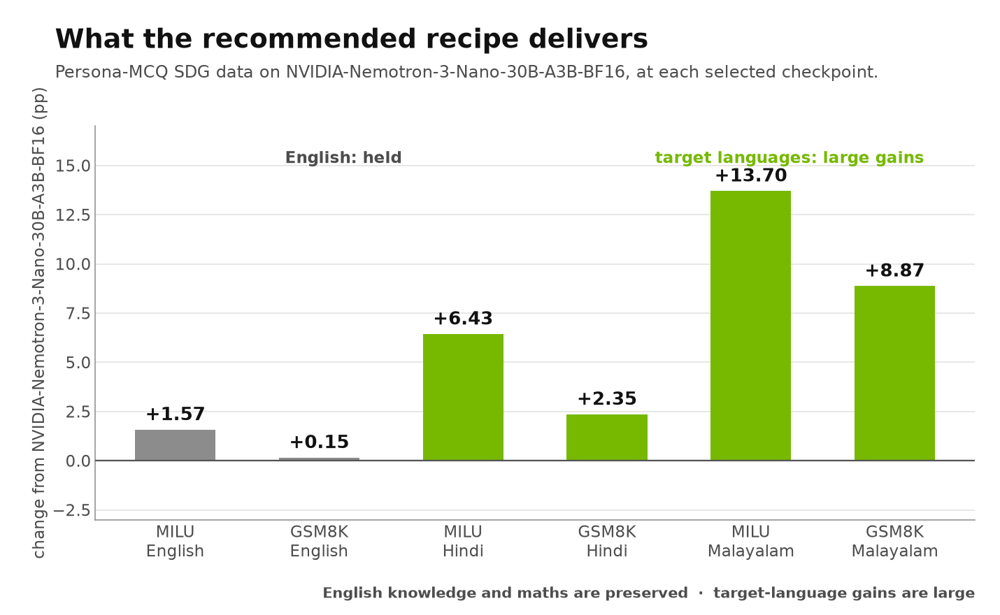
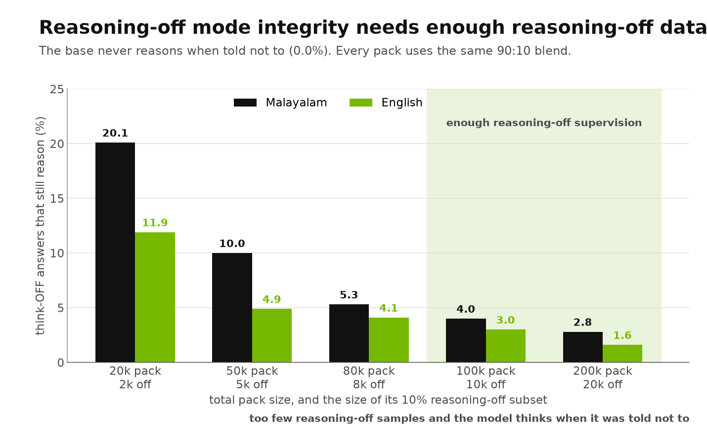

<a id="top"></a>

# Supervised Fine-Tuning Guidebook

> You want to adapt a post-trained model to a new domain or language. This guidebook is the output of an ablation study run specifically to answer that: how to curate the data, what reasoning blend, what learning rate, how much data, and what to put back in so nothing regresses.

**Intended use:** a language- and domain-agnostic recipe for adapting an instruct model with SFT<br>
**Model:** `nvidia/NVIDIA-Nemotron-3-Nano-30B-A3B-BF16`, adapted to Hindi and Malayalam<br>
**Example metrics used:** MILU, GSM8K-Indic, IndicIFEval, IndiVibe (LLM-as-judge), script fidelity<br>
**Reading time:** 10–12 minutes

<p align="center"></p>

**Jump to:** [The recipe](#the-recipe) · [What to expect](#what-to-expect) · [Curating the data](#1-curating-the-adaptation-data) · [Reasoning blend](#2-never-train-on-100-reasoning-on-data) · [Learning rate](#3-learning-rate-and-schedule) · [Data volume](#4-how-much-data-you-actually-need) · [Replay](#5-replay-english-alongside-the-target-data) · [Language fidelity](#6-measure-language-fidelity-not-just-accuracy) · [Full SFT vs LoRA](#7-use-full-parameter-sft) · [Apply to your run](#8-apply-this-guide-to-your-sft-run) · [Internal SFT checkpoint](#9-if-you-have-the-internal-sft-checkpoint-you-get-more) · [Reproducibility](#reproducibility) · [Future work](#future-work)

## Why this study exists

Adapting an already post-trained instruct model is not the same problem as pretraining it. The model already follows instructions, already reasons on demand, and already has an alignment you are about to disturb. The questions a developer actually faces are narrow and practical — *what learning rate, what data mix, how much of it, and what will I break?* — and they are not answered by general SFT guidance.

This study ran a series of controlled ablations to answer them on one concrete use case: adding **Indic language and cultural knowledge** to Nemotron-3-Nano using multiple-choice data grounded in [Nemotron Personas India](#1-curating-the-adaptation-data). The recipe below is what those runs support. The use case is an example; the decisions generalise.

## How to read this guide

Each section states a recommendation, then shows the measurement behind it. The scores are Hindi and Malayalam on one model — treat them as evidence that the *rule* is worth applying, and reproduce the same measurements on your own domain, corpus and product evaluation before committing.

Three conventions hold throughout, so that every table on this page can be compared with every other:

- **Base model.** Every number is measured on models fine-tuned from the public
  **`nvidia/NVIDIA-Nemotron-3-Nano-30B-A3B-BF16`** checkpoint, so you can reproduce it. Two
  experiments were only run from the **internal SFT version of
  `NVIDIA-Nemotron-3-Nano-30B-A3B-BF16`** — the checkpoint taken before the RL stages — and those
  tables say so in place. [Section 9](#9-if-you-have-the-internal-sft-checkpoint-you-get-more)
  collects what changes if you have such a checkpoint of your own.
- **Reasoning mode.** Every score is **reasoning-on**. The single exception is the reasoning-off
  mode-integrity metric in [section 2](#2-never-train-on-100-reasoning-on-data), which only exists
  in reasoning-off mode and is labelled as such.
- **Checkpoint.** Every arm is read at **its own selected checkpoint** — the plateau its own
  benchmark curve settles on, chosen using only the languages present in that arm's training data.
  The iteration is given wherever two arms are compared. No number on this page is averaged across
  iterations.

Standard errors: MILU 0.4pp (English/Hindi) and 0.76pp (Malayalam), GSM8K-Indic 1.3pp, IndicIFEval 2.4pp, IndiVibe 4.8pp. Treat a single move under about 2 SE as noise.

## The recipe

| Decision | Recommendation | Section |
|---|---|---|
| **Data** | Persona-grounded synthetic data via [`sdg/persona_mcq`](../../sdg/persona_mcq/README.md), 50/50 English:target | [1](#1-curating-the-adaptation-data) |
| **Reasoning blend** | **90:10 reasoning-on : reasoning-off.** Never 100% on | [2](#2-never-train-on-100-reasoning-on-data) |
| **Learning rate** | **Constant 1e-5** | [3](#3-learning-rate-and-schedule) |
| **Volume** | **50k–100k total samples.** More does not buy accuracy | [4](#4-how-much-data-you-actually-need) |
| **Replay** | **English IF data alongside the target data** — 20k was enough | [5](#5-replay-english-alongside-the-target-data) |
| **Optional** | +bidirectional en↔target translation pairs, for language routing | [6](#6-measure-language-fidelity-not-just-accuracy) |
| **Method** | **Full-parameter SFT**, not LoRA | [7](#7-use-full-parameter-sft) |
| **Base checkpoint** | `NVIDIA-Nemotron-3-Nano-30B-A3B-BF16`. An internal SFT checkpoint does better | [9](#9-if-you-have-the-internal-sft-checkpoint-you-get-more) |

## What to expect

<p align="center"></p>

Both tables are fine-tuned from **`NVIDIA-Nemotron-3-Nano-30B-A3B-BF16`**, reasoning-on, each arm at its selected checkpoint.

**English + Hindi** — 100k persona-MCQ (50k en / 50k hi) **plus 20k English IF replay**, iteration 500:

| Benchmark | Base | After SFT | Change |
|---|---:|---:|---:|
| MILU, English | 80.40 | 81.97 | **+1.57** |
| MILU, Hindi | 72.02 | 78.45 | **+6.43** |
| GSM8K-Indic, English | 96.06 | 96.21 | +0.15 |
| GSM8K-Indic, Hindi | 90.14 | 92.49 | **+2.35** |
| IndicIFEval, English | 94.69 | 86.33 | −8.36 |
| IndicIFEval, Hindi | 84.08 | 71.02 | −13.06 |
| *Script fidelity* — GSM8K-Indic Hindi answers in Hindi | 2.5% | 91.3% | **+88.8pp** |
| *Script fidelity* — IndiVibe Hindi answers in Hindi | 73.3% | 89.2% | **+15.9pp** |
| *Script fidelity* — IndicIFEval Hindi answers in Hindi | 70.9% | 72.8% | +1.9pp |

**English + Malayalam** — 100k persona-MCQ (50k en / 50k ml), iteration 800. No replay arm was run for this pair, and IndiVibe is a Hindi-only benchmark so it does not appear here:

| Benchmark | Base | After SFT | Change |
|---|---:|---:|---:|
| MILU, English | 80.40 | 81.88 | **+1.48** |
| MILU, Malayalam | 58.20 | 71.90 | **+13.70** |
| GSM8K-Indic, English | 96.06 | 95.15 | −0.91 |
| GSM8K-Indic, Malayalam | 74.83 | 83.70 | **+8.87** |
| IndicIFEval, English | 94.69 | 77.76 | −16.93 |
| IndicIFEval, Malayalam | 62.24 | 53.88 | −8.36 |
| *Script fidelity* — GSM8K-Indic Malayalam answers in Malayalam | 0.1% | 74.4% | **+74.3pp** |
| *Script fidelity* — IndicIFEval Malayalam answers in Malayalam | 58.2% | 78.0% | **+19.8pp** |

Four things to read out of those tables.

**English knowledge and maths are preserved.** MILU-English *improves* on both packs and GSM8K-English is flat inside one standard error. Adapting to a new language did not cost the model its English capability.

**Target-language gains are large, on knowledge and maths together.** Malayalam gains 13.7 points of MILU and 8.9 points of GSM8K-Indic from the same pack.

**Language fidelity improves on every generative benchmark.** This is the change a knowledge metric cannot report at all: the base model answers 2.5% of its Hindi maths questions in Hindi and 0.1% of its Malayalam maths questions in Malayalam. After SFT those are 91.3% and 74.4%. Open-ended Hindi generation goes from 73.3% to 89.2% in-script, and Malayalam instruction-following from 58.2% to 78.0%. See [section 6](#6-measure-language-fidelity-not-just-accuracy).

**Instruction following is the one axis that regresses, and it is the axis to plan for.** English IF replay buys back about 4pp of English IndicIFEval on this checkpoint (−12.24 → −8.36) but nothing in Hindi. That is not a data problem — it is where the capability came from. See [section 5](#5-replay-english-alongside-the-target-data), and [section 9](#9-if-you-have-the-internal-sft-checkpoint-you-get-more) for the checkpoint that does repair fully.

**Generation quality improves too.** IndiVibe, judged by an LLM against the model's own base, reaches **75.9 / 100** for the MCQ pack at iteration 300 (50 = no change), so the gains are not confined to multiple-choice formats.

[Back to top](#top)

## 1. Curating the adaptation data

> **Recommendation:** generate persona-grounded synthetic data with a **multi-teacher agreement gate** and both lexical and semantic deduplication. The pipeline used here ships in this repo as [`sdg/persona_mcq`](../../sdg/persona_mcq/README.md); the shape of the data should follow your target domain, but the gates should not change.

### What we generated, and how

This study needed India-grounded knowledge, so the example data is **multiple-choice questions grounded in [Nemotron Personas India](../../sdg/persona_mcq/README.md)** — locales `en_IN` and `hi_Deva_IN`. MCQ is one shape among many; a coding-assistant or support-agent adaptation would generate a different artefact through the same pipeline.

The stages, in order:

| Stage | What it does | Why it matters |
|---|---|---|
| `questions` | Three models generate persona-grounded questions per locale | Diversity of question style, not just content |
| `lexical_dedup` | MinHash/LSH, similarity threshold 0.80 | Removes near-verbatim repeats cheaply |
| `semantic_dedup` | `multilingual-e5-large` embeddings, cosine 0.965, greedy | Catches paraphrases that survive lexical dedup |
| `answers` | **Three teachers each answer every question** | Produces the signal the agreement gate needs |
| `build_sft` | Keeps only records where the teachers **unanimously** agree | Consistency gate on the label |
| `sample` | Aligns English/target pairs and applies the reasoning blend | Produces the final training pack |

**The teacher matters.** We compared several candidate teachers internally before this study and picked **gemma-4-31B-it**, which is the teacher behind every result in this guidebook. Treat the teacher as a real decision rather than a default, and compare candidates on **open-ended generation quality** as well as on your knowledge benchmark — in our comparison the strongest models on multiple-choice accuracy were not the strongest on generation.

Two gates in that config are worth copying regardless of domain:

- **Unanimous multi-teacher agreement** (`sft.agreement: unanimous`). Treat it as a *consistency* gate, not factual verification — it removes items the teachers disagree about, which are disproportionately the ambiguous or wrong ones.
- **A script-fidelity gate at curation time.** The config constrains the Devanagari fraction of each assistant response — 0.00–0.15 for English records, 0.70–1.00 for Hindi records. Enforcing language at data-build time is much cheaper than discovering the problem after training ([section 6](#6-measure-language-fidelity-not-just-accuracy)).

```bash
nemotron steps run sdg/persona_mcq -c default
```

> [!NOTE]
> Use `sdg/persona_mcq` for MCQ-shaped **training** data. Use `byob/mcq` when the output is a held-out benchmark — never build both from the same generator run.

[Back to top](#top)

## 2. Never train on 100% reasoning-on data

> **Recommendation:** mix reasoning-on and reasoning-off responses in the same pack. **90:10 on:off** worked well here and is the shipped default (`sampling.reasoning_off_fraction: 0.10`). Training only on reasoning-on data disturbs the model's alignment and teaches it to reason even when the caller has explicitly asked it not to.

### Observed evidence

<p align="center"></p>

This is the one metric in the guidebook that is measured in **reasoning-off** mode, because that is the only mode in which it exists. A model with intact mode integrity produces **no** reasoning when called in reasoning-off mode; `NVIDIA-Nemotron-3-Nano-30B-A3B-BF16` does exactly that, at **0.0%** in every language. The number below is the share of reasoning-off answers that still emit reasoning content — lower is better, and 0.0% is the target.

Every pack in this study used the same 90:10 blend, so the size of the reasoning-off subset scales with the pack — which turns pack size into a dose-response on how much reasoning-off supervision the mode actually needs:

| Pack | Reasoning-off samples | English | Hindi | Malayalam |
|---|---:|---:|---:|---:|
| 20k | 2,000 | 11.9% | 5.9% | **20.1%** |
| 50k | 5,000 | 4.9% | 1.7% | 10.0% |
| 80k | 8,000 | 4.1% | 1.3% | 5.3% |
| **100k** | **10,000** | **3.0%** | **0.6%** | **4.0%** |
| **200k** | **20,000** | **1.6%** | **0.2%** | **2.8%** |

Worst value over iterations ≥ 100. (The 20k arm also shows a 25.0% English spike at iteration 40 that has settled by iteration 100; the table excludes that early transient so every arm is read over the same window.)

Leakage falls monotonically as the reasoning-off subset grows, and the **least-represented language degrades first and worst** — Malayalam is 3–4× English at every pack size. Extrapolating to a 0% subset is exactly the failure this recommendation is about.

> [!NOTE]
> A 100%-reasoning-on arm was not run as a formal ablation in this study — the recommendation rests on practitioner experience plus the dose-response above. If your product exposes both modes, measure reasoning-off mode integrity directly rather than assuming it.

[Back to top](#top)

## 3. Learning rate and schedule

> **Recommendation:** **constant 1e-5**, full-parameter. Prefer a constant schedule over cosine when you intend to evaluate intermediate checkpoints.

### Observed evidence

Three constant learning rates on the same 170k blend from `NVIDIA-Nemotron-3-Nano-30B-A3B-BF16`, reasoning-on, each read at its own selected checkpoint — deliberately early, where an over-hot rate shows first:

| Learning rate | Selected iteration | Hindi MILU gain | English MILU | IndiVibe |
|---|---:|---:|---:|---:|
| **1e-5** | 20 | **+2.41** | +0.49 | 57.3 |
| 5e-6 | 40 | +2.18 | −0.03 | 55.0 |
| 3e-6 | 40 | +1.65 | +0.26 | 58.2 |

The three rates are close this early, which is the useful result: none of them is destructive in the first few dozen steps, so the choice can be made on later behaviour rather than on early damage. 1e-5 is the best of the three on the target language and is the value every other experiment in this series uses.

> **Why constant rather than cosine:** under a cosine schedule the learning rate at step *k* depends on the *total* `train_iters`, so an intermediate checkpoint is a partially-decayed run rather than the model you would get by training for that many steps. With a constant rate every checkpoint is directly comparable, which is what makes the checkpoint selection this guidebook depends on possible at all.

[Back to top](#top)

## 4. How much data you actually need

> **Recommendation:** **50k–100k total samples**, split 50/50 English:target. Knowledge accuracy saturates far earlier than that, but the reasoning-off subset needs to stay large enough to hold mode integrity — which is what sets the floor.

### Observed evidence

<p align="center"></p>

Fine-tuned from `NVIDIA-Nemotron-3-Nano-30B-A3B-BF16`, Hindi, reasoning-on, each pack at its own selected checkpoint. The base scores 72.02 MILU / 90.14 GSM8K-Indic, with 2.5% of its Hindi maths answers and 73.3% of its IndiVibe answers written in Hindi:

| Total samples | MILU | Gain | GSM8K-Indic | GSM8K fidelity | IndiVibe fidelity |
|---:|---:|---:|---:|---:|---:|
| 20k | 77.85 | +5.83 | 91.96 | 84.4% | 86.8% |
| **50k** | 78.13 | **+6.11** | 91.96 | 86.0% | **91.4%** |
| 80k | 77.62 | +5.60 | 91.81 | 90.4% | **92.5%** |
| 100k | 77.82 | +5.80 | 91.13 | **90.6%** | 90.9% |
| 200k | 78.42 | +6.40 | 91.21 | 83.5% | 85.2% |

**20k samples reached 91% of the gain that 200k produced.** The remaining 180k bought +0.57pp of MILU, inside 2 SE of the 20k result. Hindi GSM8K-Indic is flat across the whole sweep. On knowledge alone, 20k would be the recommendation.

**But knowledge is not the only axis.** At 20k the 10% reasoning-off subset is only 2,000 samples, and reasoning-off mode integrity degrades badly ([section 2](#2-never-train-on-100-reasoning-on-data): 20.1% leakage in Malayalam against 4.0% at 100k). Script fidelity on both generative benchmarks is also still climbing between 20k and 100k. That is what moves the recommendation up to 50k–100k: you are not buying more accuracy, you are buying enough reasoning-off supervision to keep the mode intact and enough target-language supervision to keep the model writing in it.

<details>
<summary><strong>What the larger packs also buy</strong></summary>

Volume buys **tolerance to training length**. The small packs peak and then decay if training continues; the large packs hold their score for longer. If your pipeline cannot afford per-checkpoint evaluation and careful selection, extra data is one way to buy robustness to that. Beyond 100k, neither accuracy, mode integrity nor fidelity improved enough here to justify the generation cost.

</details>

[Back to top](#top)

## 5. Replay English alongside the target data

> **Recommendation:** when fine-tuning an instruct model, **do not train on target-domain data alone**. Include English replay — in this study, 20k English instruction-following samples in the same pack. On `NVIDIA-Nemotron-3-Nano-30B-A3B-BF16` that holds English knowledge and maths and buys back part of English instruction following; on an internal SFT checkpoint it repairs the regression outright ([section 9](#9-if-you-have-the-internal-sft-checkpoint-you-get-more)).

### Observed evidence

<p align="center"></p>

Instruction following regressed on every run in this series that measured it. Adding 20k English IF samples to the 100k persona-MCQ pack, reasoning-on, each arm at its selected checkpoint:

| IndicIFEval | Base | Target data only | + English IF replay |
|---|---:|---:|---:|
| **`NVIDIA-Nemotron-3-Nano-30B-A3B-BF16`**, English | 94.69 | 82.45 (−12.24) | **86.33 (−8.36)** |
| **`NVIDIA-Nemotron-3-Nano-30B-A3B-BF16`**, Hindi | 84.08 | 72.24 (−11.84) | 71.02 (−13.06) |
| internal SFT version, English | 82.24 | 78.16 (−4.08) | **81.43 (−0.81)** |
| internal SFT version, Hindi | 72.65 | 67.14 (−5.51) | **72.04 (−0.61)** |

On `NVIDIA-Nemotron-3-Nano-30B-A3B-BF16` the replay recovers about 4pp of English and **nothing of Hindi**. The reason is that most of that model's instruction-following capability was installed by RL, not by SFT — so SFT replay cannot put it back. On the internal SFT checkpoint, which has not been through RL, the same 20k samples recover both languages to within one standard error of the base; the replay data is **English-only**, so the capability being restored is evidently not language-specific.

And the gains you trained for survive the replay, so it costs you nothing on the axis you care about:

| Change from `NVIDIA-Nemotron-3-Nano-30B-A3B-BF16` | Target data only (iter 300) | + English IF replay (iter 500) |
|---|---:|---:|
| MILU, English | +1.33 | **+1.57** |
| MILU, Hindi | +5.80 | **+6.43** |
| GSM8K-Indic, English | −0.91 | **+0.15** |
| GSM8K-Indic, Hindi | +0.99 | **+2.35** |
| GSM8K-Indic Hindi answers in Hindi | 90.6% | **91.3%** |
| IndiVibe Hindi answers in Hindi | 90.9% | 89.2% |

> [!IMPORTANT]
> **If you are starting from an RL-trained checkpoint, budget an RL stage after SFT.** Replay data alone will not restore instruction following there. This is the single most important planning consequence in this guidebook.

> [!NOTE]
> **One measured cost of the replay.** Adding the English IF pack lowers Hindi open-ended generation quality. At their selected checkpoints the target-data-only arm reaches **75.9** on IndiVibe (iteration 300) while the arm with replay reaches **49.1** (iteration 500, i.e. no better than the base). Script fidelity and every accuracy axis above are unaffected, and reasoning-off mode shows no such gap. If open-ended generation is your product surface, evaluate both arms rather than adopting the replay unconditionally.

[Back to top](#top)

## 6. Measure language fidelity, not just accuracy

> **Recommendation:** for every benchmark whose answer is free-form prose, report the **share of answers actually written in the expected language** next to the accuracy. A multiple-choice metric grades one option letter and cannot see this at all.

### Observed evidence

<p align="center"></p>

Fine-tuned from `NVIDIA-Nemotron-3-Nano-30B-A3B-BF16`, Hindi, reasoning-on, each arm at its selected checkpoint:

| Model | Hindi MILU | GSM8K-Indic answers in Hindi | IndiVibe answers in Hindi | IndicIFEval answers in Hindi |
|---|---:|---:|---:|---:|
| Base, no SFT | 72.02 | **2.5%** | 73.3% | 70.9% |
| Full SFT (persona MCQ 100k) | 77.82 | **90.6%** | **90.9%** | **80.4%** |
| Full SFT (MCQ + translation) | 78.64 | **90.8%** | 86.9% | **82.0%** |

The base model scores 72.02 on Hindi MILU while writing only **2.5%** of its Hindi maths answers in Hindi — it is silently answering Hindi questions in another script, and the knowledge metric reports nothing. The recommended recipe fixes that on every generative benchmark at once, and Malayalam is the same story from an even lower floor: maths fidelity 0.1% → 74.4%, instruction-following fidelity 58.2% → 78.0%.

This matters for how you read a *drop*, too. When target-language GSM8K-Indic moves after adding target-language maths data, accuracy alone cannot tell you whether the model got the maths wrong or simply stopped answering in English. Only the accuracy and the fidelity read side by side separate those two findings.

**Optional addition — bidirectional translation data.** Adding en↔target translation pairs to the pack improved language routing further, at no accuracy cost:

| Reasoning-on, at each arm's selected checkpoint | MCQ 100k (iter 300) | + translation (iter 500) |
|---|---:|---:|
| **Hindi** MILU | 77.82 | **78.64** |
| Hindi GSM8K-Indic | 91.13 | **92.57** |
| Hindi GSM8K-Indic answers in Hindi | 90.6% | **90.8%** |
| Hindi IndicIFEval answers in Hindi | 80.4% | **82.0%** |
| Hindi IndicIFEval score | 72.24 | **73.88** |
| Hindi IndiVibe answers in Hindi | 90.9% | 86.9% |
| **Malayalam** MILU | 69.75 | 69.82 |
| Malayalam GSM8K-Indic | 81.65 | **86.28** |
| Malayalam GSM8K-Indic answers in Malayalam | 74.0% | **81.6%** |
| Malayalam IndicIFEval answers in Malayalam | 80.2% | **84.7%** |

No accuracy regresses, and Malayalam maths gains 4.6 points with 7.6pp more of its answers in the right script. On an accuracy-only scoreboard the fidelity half of this intervention would be invisible — which is exactly why fidelity belongs on the scoreboard, and why the curation pipeline in [section 1](#1-curating-the-adaptation-data) gates on script fraction before training rather than after.

[Back to top](#top)

## 7. Use full-parameter SFT

> **Recommendation:** **full-parameter SFT** for installing new domain or language knowledge. A LoRA adapter moved the model considerably less on every knowledge and fidelity axis measured, and the shortfall grew with how unfamiliar the target language was.

### Observed evidence

<p align="center"></p>

> [!NOTE]
> This is the one comparison in the guidebook that was **only run from the internal SFT version of `NVIDIA-Nemotron-3-Nano-30B-A3B-BF16`**. Both arms share that base, so the comparison between them is valid; the absolute numbers are not directly comparable to the tables elsewhere on this page.

Identical pack, identical base, reasoning-on, each arm at its own selected checkpoint — only the update rule differs:

| Change from the same internal SFT base | Pack | Full SFT (1e-5) | LoRA (1e-4) |
|---|---|---:|---:|
| Hindi MILU | en+hi | **+8.63** | +2.70 |
| Malayalam MILU | en+ml | **+15.50** | +4.19 |
| GSM8K-Indic Hindi answers in Hindi | en+hi | **+74.9pp** | +18.6pp |
| GSM8K-Indic Malayalam answers in Malayalam | en+ml | **+80.7pp** | +4.8pp |
| IndiVibe Hindi answers in Hindi | en+hi | **+14.0pp** | +7.1pp |
| English IndicIFEval | en+hi | −4.08 | **−0.61** |
| English IndicIFEval | en+ml | −5.91 | **+2.25** |

Full SFT delivers roughly three times the knowledge gain in Hindi and nearly four times in Malayalam. The harder, less-represented language shows the larger gap, which is what you would expect if the limit is adapter capacity rather than tuning — and the fidelity rows make the point sharply: the LoRA arm barely learns to answer in Malayalam at all.

LoRA does have one real advantage — it gives up much less English instruction following, on both packs. But [section 5](#5-replay-english-alongside-the-target-data) buys most of that back for the cost of 20k replay samples without giving up the knowledge, so it is not a reason to choose the adapter for this task.

> [!NOTE]
> The learning rates are deliberately unmatched (1e-5 full, 1e-4 LoRA) because an adapter barely moves at 1e-5. This measures LoRA as it would actually be run. A setting that needs many cheap, composable, revertible adapters rather than maximum knowledge from one run is a different question and is not tested here.

[Back to top](#top)

## 8. Apply this guide to your SFT run

Sections 1–7 report what we observed. This turns it into six decisions for
**your** domain, language, model and product bar.

### 1. Set acceptance thresholds before you train

Write down four numbers against your own baselines. Without them you cannot tell
a finished run from an unfinished one.

| Threshold | Question | Example from this study |
|---|---|---|
| Adaptation floor | What gain justifies the run? | target MILU ≥ base +6 |
| Retention budget | What English regression is acceptable? | English MILU and GSM8K within −1.0 of base |
| Behaviour floor | What must not break? | reasoning-off leakage < 5% |
| Minimum useful gain | When is more data not worth it? | < +0.5 per 50k samples |

### 2. Build the pack, not just the data

Generate through a pipeline with a **multi-teacher agreement gate**, lexical
*and* semantic dedup, and a language gate ([§1](#1-curating-the-adaptation-data)).
Then check three properties of the pack itself before training: duplicate rate,
prompt language against target language per row, and answer-format markers
**per language** rather than in aggregate.

### 3. Compose the mix

Three things go in the same pack:

```
target-domain data   50/50 English:target      -> the capability you want
reasoning blend      90:10 reasoning-on:off    -> mode integrity  (§2)
English replay       ~20k IF samples           -> instruction following  (§5)
```

Start at **50k–100k total samples** ([§4](#4-how-much-data-you-actually-need)) —
sized by the reasoning-off subset, not by accuracy, which saturates earlier.

### 4. Train

Constant **1e-5**, full-parameter, warmup 5% of `train_iters`
([§3](#3-learning-rate-and-schedule), [§7](#7-use-full-parameter-sft)). Save
often enough to select from a curve, and use the **same cadence** across every
arm you intend to compare.

### 5. Evaluate several checkpoints, on more than accuracy

At each checkpoint track target accuracy, English retention, **script fidelity**
per generative benchmark ([§6](#6-measure-language-fidelity-not-just-accuracy)),
**reasoning-off mode integrity** ([§2](#2-never-train-on-100-reasoning-on-data)),
and open-ended generation quality with an LLM judge. Read a few raw generations
before trusting any aggregate — the language failures are invisible in the
numbers a multiple-choice metric produces.

### 6. Select the smallest configuration that clears every bar

Choose on a **plateau, not an argmax**, and only on the languages present in your
training data. Stop when the marginal gain falls below your threshold, retention
holds, and the result is stable across two adjacent checkpoints.

If instruction following fails, add replay — and if you are starting from an
RL-trained checkpoint, plan an RL stage as well
([§5](#5-replay-english-alongside-the-target-data)). If adaptation fails, change
the teacher or the data before adding volume;
[§4](#4-how-much-data-you-actually-need) shows more of the same data does not
reliably help.

### Measurement rules

Four rules each changed a conclusion during this study.

- **Read every arm at its own selected checkpoint, and look at the whole curve
  before believing a difference.** In one experiment the gap between two arms was
  positive at the final iteration and negative at all four earlier ones. Say which
  iteration each claim refers to.
- **Anchor each arm to its own base.** Arms trained from different
  initialisations must never share an anchor or an axis.
- **Match exposure, not steps.** Packs of different sizes see different numbers
  of epochs at the same iteration.
- **Name the harness for every number** and never compare across harnesses.

### Before release

State the reasoning-on:off blend and the English:target split unambiguously;
separate statistically stable findings from directional observations and give
the standard errors; say which iteration each claim refers to; and re-validate
on the model you intend to ship.

[Back to top](#top)

## 9. If you have the internal SFT checkpoint, you get more

> **Recommendation:** everything above reproduces on `NVIDIA-Nemotron-3-Nano-30B-A3B-BF16`, and that is the default we recommend. But if the **internal SFT version of `NVIDIA-Nemotron-3-Nano-30B-A3B-BF16`** — the checkpoint taken before the RL stages — is available to you, use that instead. A model that has already been RLHF'd or RLVR'd spends part of every fine-tuning run moving away from behaviour the earlier checkpoint never had, and some of that behaviour cannot be restored by SFT.

### Observed evidence

The same 100k persona-MCQ pack on both checkpoints, reasoning-on, each at its selected checkpoint:

| Base | Hindi MILU before | after | Gain |
|---|---:|---:|---:|
| `NVIDIA-Nemotron-3-Nano-30B-A3B-BF16` | 72.02 | 77.82 | +5.80 |
| **internal SFT version** | 69.48 | 78.11 | **+8.63** |

The internal SFT model starts nearly 3 points lower and finishes higher. The same ordering holds for Malayalam (**+17.26** against +13.70) and for maths (Hindi GSM8K-Indic +3.04 against +0.99).

The decisive difference, though, is instruction following. With the 20k English IF replay from [section 5](#5-replay-english-alongside-the-target-data):

| IndicIFEval | `NVIDIA-Nemotron-3-Nano-30B-A3B-BF16` | internal SFT version |
|---|---:|---:|
| English | −8.36 | **−0.81** |
| Hindi | −13.06 | **−0.61** |

On the internal SFT checkpoint the regression is fully repairable with replay data alone, and the knowledge and maths gains are unchanged by the repair (Hindi MILU +8.63 → +8.67, GSM8K-Indic +3.04 → +2.96). On the released, RL-trained checkpoint it is not, because most of that model's instruction-following capability came from RL rather than SFT.

**The full recipe on the internal SFT checkpoint**, for comparison with the [What to expect](#what-to-expect) tables:

| Benchmark | English | Hindi | Malayalam |
|---|---:|---:|---:|
| MILU | +3.09 | **+8.67** | **+17.26** |
| GSM8K-Indic | −0.15 | **+2.96** | **+14.48** |
| IndicIFEval | −0.81 | −0.61 | −4.90 |
| *Fidelity* — GSM8K-Indic answers in target script | — | 16.1% → **91.6%** | 6.9% → **89.9%** |
| *Fidelity* — IndiVibe answers in Hindi | — | 69.5% → **87.4%** | — |

*English and Hindi are the 100k MCQ + 20k IF replay arm; Malayalam is the en+ml MCQ pack, for which no replay arm was run.*

> [!NOTE]
> This is a recommendation about where to *start* SFT, not about what to ship. If you must start from an RL-trained checkpoint — which is the normal case, and the case every other section of this guidebook is measured on — plan an RL stage after SFT rather than expecting replay data to cover it.

[Back to top](#top)

## Reproducibility

Datasets, pipeline steps, hardware, and the full hyperparameter tables live in
[REPRODUCIBILITY.md](./REPRODUCIBILITY.md).

## Future work

| Priority | Experiment | Question it would close |
|---:|---|---|
| 1 | An RL stage after SFT on `NVIDIA-Nemotron-3-Nano-30B-A3B-BF16` | Confirms instruction following is restorable that way — the largest open gap for anyone using the public model |
| 2 | A 100%-reasoning-on arm against the 90:10 blend | Quantifies the [section 2](#2-never-train-on-100-reasoning-on-data) recommendation directly |
| 3 | Instruction-following data authored in the target language | Does the [section 5](#5-replay-english-alongside-the-target-data) repair improve when replay is not English-only? |
| 4 | English IF replay on the English+Malayalam pack | Closes the one cell missing from [What to expect](#what-to-expect) |
| 5 | LoRA against full SFT on `NVIDIA-Nemotron-3-Nano-30B-A3B-BF16` | Reproduces [section 7](#7-use-full-parameter-sft) on the public base |
| 6 | The same pipeline for a non-Indic domain | Does the recipe hold when the adaptation is domain rather than language? |
| 7 | The same recipe on the larger shipping model | Do these Nano results transfer to the model that ships? |

[Back to top](#top)
