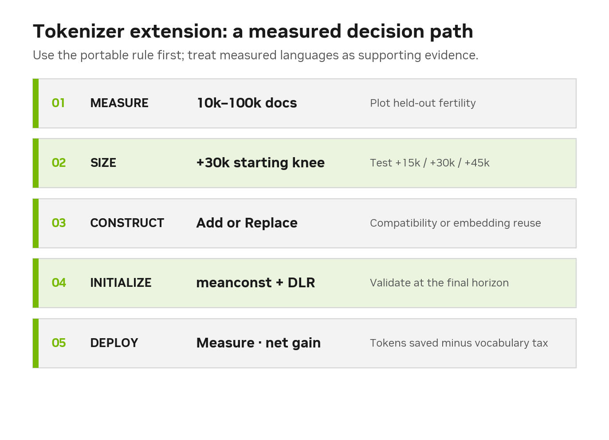
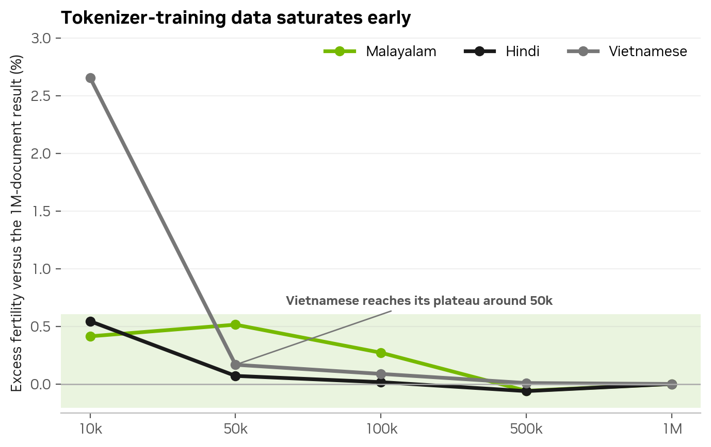
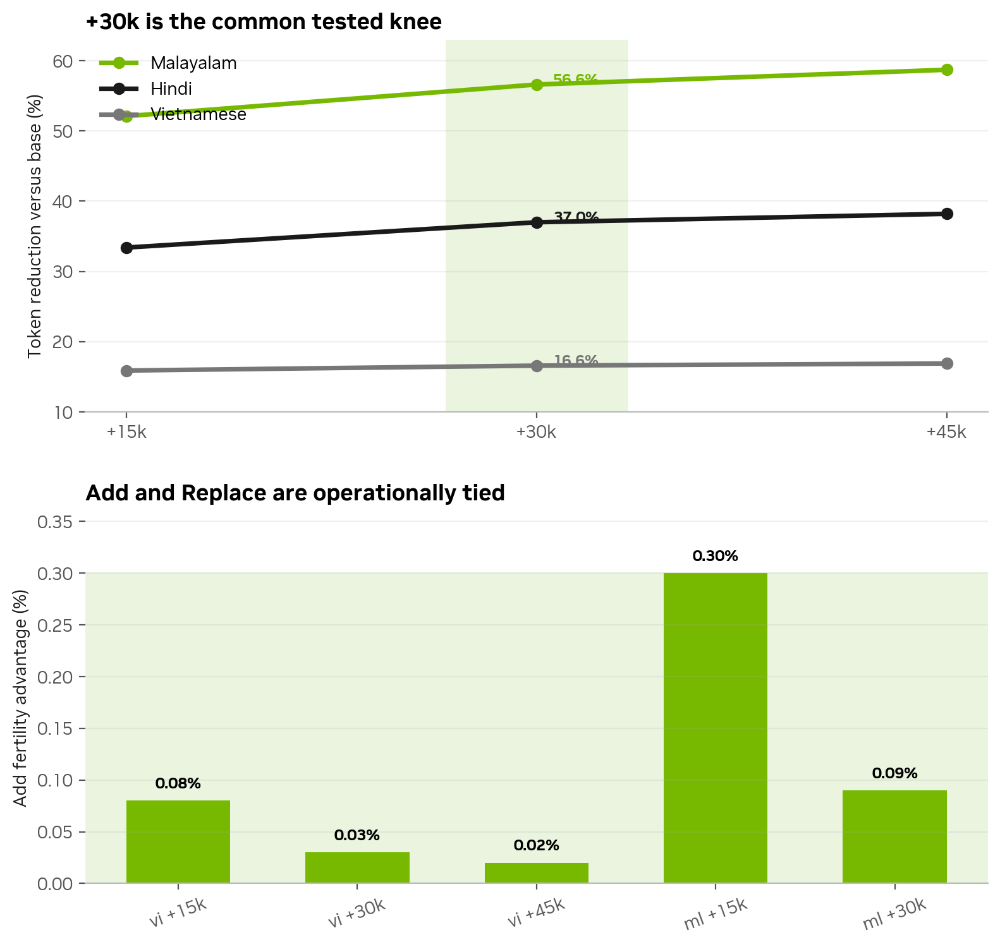
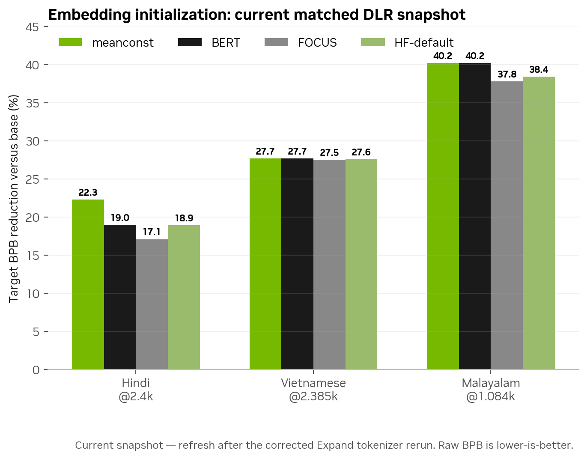
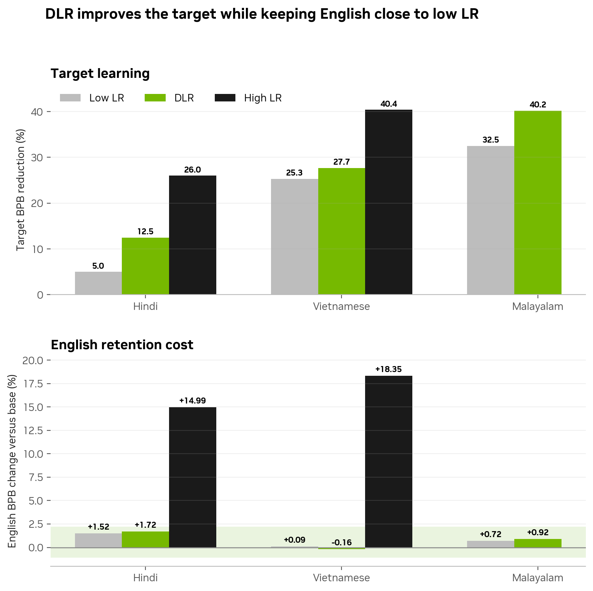
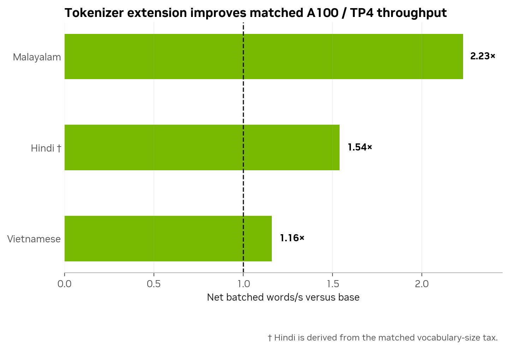

<a id="top"></a>

# Tokenizer Extension Guidebook

> A practical decision guide for extending a base-model tokenizer to a new language—how much tokenizer data to use, how many vocabulary rows to add, how to initialize them, and when the serving benefit is worth the vocabulary cost.

**Intended use:** a language-agnostic decision process for adapting any supported language<br>
**Observed evidence:** Nemotron-3-Nano-30B-A3B experiments in Hindi, Malayalam, and Vietnamese<br>
**Reading time:** 8–10 minutes

<p align="center"></p>

**Jump to:** [Data requirement](#1-how-much-tokenizer-data-is-enough) · [Vocabulary and method](#2-how-many-vocabulary-rowsand-which-extension-type) · [Embedding initialization](#3-how-should-new-embeddings-be-initialized) · [Learning rate](#4-which-learning-rate-policy-is-safe) · [Serving](#5-does-the-tokenizer-pay-at-serving-time) · [Apply to your tokenizer](#6-apply-this-guide-to-your-tokenizer) · [Reproducibility](#reproducibility)

## How to read this guide

Each section follows the same order:

1. **Decision rule** — the portable recommendation for a new language.
2. **Validation** — what the customer should measure on their own data and deployment.
3. **Observed evidence** — results from Hindi, Malayalam, and Vietnamese that support or limit the rule.

The tested languages are examples, not prerequisites and not universal constants.

## Start here

| Customer question | Short answer | Evidence strength |
|---|---|---|
| How much tokenizer-training data? | Start with **10k–100k documents** and stop when held-out fertility flattens | Established across three languages |
| How many vocabulary rows? | **+30k** is the common tested knee | Established within this model |
| Add, Replace, or naive Expand? | Use **Add** for compatibility; **Replace** when rows matter; consider Expand where the base vocab barely covers the script | Add and Replace are near-identical; Expand wins in Malayalam and loses in Hindi and Vietnamese |
| Which embedding initialization? | Begin with **meanconst**, then compare at the final training horizon | Directional — differences are small and horizon-dependent |
| Which learning-rate policy? | Use **DLR** when the vocabulary change is substantial | Replicated target/English BPB pattern across three languages — measured outside this repository, see §4 |
| How should different tokenizers be compared? | Use **bits per byte (BPB)**, not raw per-token perplexity | Required for a fair cross-tokenizer comparison |
| Will extension improve model quality? | Treat it primarily as an **efficiency intervention** | Independent downstream-quality contribution not yet established |
| Will it improve serving? | Usually—if fertility savings exceed the vocabulary-row tax on the intended deployment shape | Matched A100/TP4 evidence across three languages |

> Short names like `meanconst` and `hfdefault` are figure labels, not config
> values. [REPRODUCIBILITY.md](./REPRODUCIBILITY.md#settings) maps each one to
> the exact `init_embeddings` YAML.

### Recommended starting recipe

```text
10k–100k diverse documents
        ↓
measure held-out fertility at +15k / +30k / +45k
        ↓
choose the smallest useful vocabulary knee (often +30k)
        ↓
initialize with meanconst (method: subword, uniform)
        ↓
validate BPB, target quality, English retention, and serving throughput
```

## 1. How much tokenizer data is enough?

> **Decision rule:** begin with a diverse 10k–100k-document sample. Increase it only while held-out fertility, token utilization, or script/domain coverage is still improving.

### Observed evidence

<p align="center"></p>

<details>
<summary><strong>Observed values by language</strong></summary>

| Language | Earliest practical plateau | 10k→1M spread | Interpretation |
|---|---:|---:|---|
| Malayalam | **10k documents** | 0.6% | The 10k sample captures essentially the full fertility benefit |
| Hindi | **10k documents** | 0.5% | Small non-monotonicity is consistent with independent resampling noise |
| Vietnamese | **50k documents** | 2.7% from 10k; 50k is within 0.17% of 1M | One extra step is useful, but 1M is unnecessary |

</details>

> **Clean takeaway:** tokenizer construction needs coverage and diversity—not CPT-scale data. Begin small, measure on a held-out slice, and scale only while fertility is still moving.

<details>
<summary><strong>What should be represented in the tokenizer corpus?</strong></summary>

- Native-script and romanized text.
- Formal and conversational text.
- Domain text, tables, OCR, numbers, and named entities.
- Code-switched text if it is part of the product workload.
- Enough examples of each script and normalization pattern to avoid dead tokens.

Document count is only a convenient control variable. For reproducibility, also record bytes, characters, domains, sampling policy, and unique-script coverage.

</details>

[Back to top](#top)

## 2. How many vocabulary rows—and which extension type?

> **Decision rule:** measure at several vocabulary budgets and select the smallest knee that meets the product’s context and serving goals. Choose the construction method from compatibility and row-budget constraints—not from a tiny fertility difference.

### Observed evidence

<p align="center"></p>

### Vocabulary budget

<details>
<summary><strong>Observed token reduction by language and vocabulary budget</strong></summary>

| Added rows | Hindi reduction | Malayalam reduction | Vietnamese reduction | Reading |
|---:|---:|---:|---:|---|
| +15k | 33.4% | 52.1% | 15.9% | Captures most of the available compression |
| **+30k** | **37.0%** | **56.6%** | **16.6%** | Common tested knee |
| +45k | 38.2% | 58.7% | 16.9% | Smaller marginal return; language-dependent value |

</details>

Every second +15k increment buys only **0.40–0.48×** the gain of the first. Use +30k as a starting hypothesis—not as an unconditional constant.

### Construction choice

| Method | What it does | Use it when | Current evidence |
|---|---|---|---|
| **Continued-BPE Add** | Preserves the base vocabulary and learns compatible new merges/rows | Compatibility and simplicity matter | Wins 11/11 matched Add-vs-Replace fertility pairs, but only by 0.016–0.30% |
| **Prune-and-Replace** | Removes weak target-script rows before inserting new ones | Serving rows or vocabulary size are constrained | Nearly identical fertility with fewer final rows |
| **Naive Expand** | Registers atomic token surfaces without continued merge learning | You need a baseline, a deliberately simple tokenizer, or the target script is barely covered by the base vocab | Loses in Hindi (−6.8%) and Vietnamese (−1.6%); **wins in Malayalam (+2.5%)** |

> **Clean takeaway:** the extension budget matters far more than Add versus Replace. Choose Add for operational compatibility and Replace when every row matters.

> **Naive Expand is not uniformly worse.** At a 30,000-token budget:
>
> | Language | continued-BPE `add` | naive `add_tokens` | winner | margin |
> |---|--:|--:|:--|--:|
> | Hindi | **1.2871** | 1.3817 | continued-BPE | −6.8% |
> | Vietnamese | **1.2623** | 1.2830 | continued-BPE | −1.6% |
> | Malayalam | 2.1791 | **2.1251** | **naive** | +2.5% |
>
> The reversal tracks base-vocab coverage. `replace` finds only **406** prunable
> base tokens in Malayalam versus 761 in Vietnamese — the stock vocab barely
> covers `U+0D00–U+0D7F`, so almost any well-chosen unit helps and there is
> little for merge training to add. Where the base already carries partial
> coverage (Hindi, Vietnamese), the learned merges are what compose it. Expect
> continued-BPE to win by more the better the base already covers your script.

<details>
<summary><strong>Why fertility alone is insufficient</strong></summary>

Before selecting a production tokenizer, also compare:

- Token-ID compatibility with existing data, adapters, and checkpoints.
- Embedding/output parameter growth and memory.
- Tokenizer construction reproducibility and dead-token rate.
- Words/s or characters/s on the intended hardware, tensor-parallel shape, batch size, and request mix.
- Target quality and retained general capability after CPT.

</details>

[Back to top](#top)

## 3. How should new embeddings be initialized?

> **Decision rule:** start with an initialization derived from the base model’s existing token geometry, then compare alternatives at the final training horizon. Do not select an initializer from an early-only checkpoint.

### Observed evidence

<p align="center"></p>

**Raw BPB is lower-is-better.** The chart presents reduction versus the matching base so larger bars are better.

| Initialization | Operational interpretation | Current recommendation |
|---|---|---|
| **meanconst** | Builds each new row from the model’s existing subtoken decomposition | **Starting default**: dependency-free and strongest in one current final-horizon observation |
| BERT-family transfer | Uses an aligned auxiliary encoder | Alternative when the dependency is already available and final-horizon validation supports it |
| FOCUS | Cross-tokenizer alignment | Validate per language; ranking is not stable enough for a universal default |
| HF-default/random | Starts new rows without lexical structure | Baseline only for substantial extensions; can be fragile when new rows learn slowly |

### Observed example: why the final checkpoint matters

<details>
<summary><strong>Exact Add+DLR checkpoint values</strong></summary>

| Hindi Add+DLR | BPB @1k | BPB @2.4k | Reduction vs base @2.4k |
|---|---:|---:|---:|
| **meanconst** | **0.30149** | **0.26745** | **22.3%** |
| BERT | 0.30178 | 0.27895 | 19.0% |
| HF-default | 0.30494 | 0.27921 | 18.9% |
| FOCUS | 0.31228 | 0.28538 | 17.1% |

| Malayalam Add+DLR @1.084k | BPB | Reduction vs base |
|---|---:|---:|
| **meanconst** | **0.34204** | **40.2%** |
| BERT | 0.34216 | 40.2% |
| HF-default | 0.35195 | 38.4% |
| FOCUS | 0.35581 | 37.8% |

</details>

The meanconst–BERT difference grows from **0.00029 BPB at 1k** to **0.01150 at 2.4k**. An early-only screen would incorrectly conclude that initialization does not matter.

> [!NOTE]
> Initializer differences are small and depend on the training horizon; treat
> them as directional rather than a ranking. The Add+DLR initializer grid is
> complete across languages and methods.

[Back to top](#top)

## 4. Which learning-rate policy is safe?

> **Decision rule:** keep the backbone learning rate conservative and accelerate the parameters changed by tokenizer extension. Increase the whole-model learning rate only when a matched retention evaluation justifies it.

### Observed evidence

<p align="center"></p>

| Regime | Definition | Target result | English result | Recommendation |
|---|---|---|---|---|
| Low LR | Whole model at `1e-5` | Safe but slower target learning | Small English change | Use for a small tokenizer change |
| **DLR** | Backbone at `1e-5`; embeddings and output head at `1e-4` | Adds **+7.5 hi · +2.4 vi · +7.7 ml pp** over Low LR | English BPB stays between **−0.16% and +1.72%** | **Default for a substantial extension** |
| High LR | Whole model at `1e-4` | Learns the target fastest | **+14.99–18.35% English BPB damage** | Do not use as the safe default |

> **Clean takeaway:** train changed lexical capacity faster, not the whole model. DLR is the best tested target/retention exchange rate.

> **Availability.** The DLR results above come from an experimental training
> stack outside this repository. The `pretrain/megatron_bridge` step ships no
> differential-learning-rate option, so this section is **evidence, not a
> runnable recipe** — treat it as a reason to seek a decoupled embedding
> learning rate in whichever trainer you use, not as a config you can set here.
> The supported path in this repository is the conservative whole-model
> learning rate ("Low LR" above).

### BPB versus perplexity

Per-token perplexity changes when token boundaries change, so it cannot fairly compare the base and extended tokenizers. BPB scores the same held-out bytes and is therefore the primary tokenizer-independent language-modeling metric.

<details>
<summary><strong>Recommended evaluation bundle</strong></summary>

1. Fertility or characters/token on held-out target text.
2. Target-language BPB and English BPB on identical fixed-byte corpora.
3. Target downstream evaluation such as MILU/VMLU.
4. English/general retention such as ProX-en, ARC-Challenge, HellaSwag, and MMLU-family tasks.
5. Matched serving throughput and memory on the intended deployment shape.

</details>

[Back to top](#top)

## 5. Does the tokenizer pay at serving time?

> **Decision rule:** treat serving value as a deployment measurement. Compare the token-count reduction with the added vocabulary-row cost on the exact hardware, tensor-parallel shape, batch profile, and request mix.

### Observed evidence

<p align="center"></p>

| Language | Fertility gain | Vocabulary tax | Net batched throughput | Net single-request throughput |
|---|---:|---:|---:|---:|
| Malayalam | 2.303× | −3.0% | **2.23×** | **2.29×** |
| Hindi † | 1.588× | ≈−3.0% | **1.54×** | **1.58×** |
| Vietnamese | 1.199× | −3.1% | **1.16×** | **1.19×** |

† Hindi is derived from the matched vocabulary-size tax; Malayalam and Vietnamese were directly benchmarked.

> **Clean takeaway:** vocabulary rows impose a serving tax, but compression wins at matched A100/TP4 for all three languages. Re-measure on the production tensor-parallel shape—this result is not hardware-independent.

## 6. Apply this guide to your tokenizer

Sections 1–5 report what we observed. This turns it into five decisions for
**your** language, model and serving profile.

### 1. Set acceptance thresholds before you build

| Threshold | Question | Example |
|---|---|---|
| Fertility target | How much compression justifies the change? | ≥1.5× on held-out target text |
| Retention budget | What English/general regression is acceptable? | BPB within +0.5% of base |
| Serving floor | What net throughput must survive the vocabulary tax? | ≥1.2× end-to-end |

Compression alone is not the goal — a smaller token count that costs quality or
throughput is not a win.

### 2. Size the tokenizer corpus

Start at **10k–100k diverse documents** and confirm with a saturation curve
(§1). More data stops helping well before you expect; measure rather than assume.
Keep tokenizer-training and evaluation text **disjoint**, or fertility flatters
itself.

### 3. Choose budget and construction

Measure held-out fertility at **+15k / +30k / +45k** and take the smallest knee
(often +30k). Then pick the method (§2):

- **Add** — preserves base IDs; the default for compatibility.
- **Replace** — same fertility with fewer total rows, when rows are constrained.
- **Expand** — worth testing when the base vocab barely covers your script.

Verify `tokens_spliced` equals the requested budget before comparing anything —
a short arm invalidates the comparison silently.

### 4. Initialise and train

Initialise new rows with an auxiliary encoder that actually covers your language,
then apply the learning-rate policy from §4. Validate with BPB on identical
held-out bytes across tokenizers — not just fertility, which cannot see whether
the new rows carry meaning.

### 5. Confirm the win end to end

Measure target quality, English retention and throughput on the **intended
hardware, tensor-parallel shape, batch profile and request mix** (§5). The
vocabulary tax is real; the net result is what matters, and it is not
hardware-independent.

### Before release

- [ ] Held-out fertility reported by language, script and domain.
- [ ] Corpus size justified by a saturation curve; vocabulary size by marginal gain and serving cost.
- [ ] `tokens_spliced` equals the requested budget.
- [ ] BPB uses identical held-out bytes across tokenizers.
- [ ] Target quality and English retention evaluated after CPT.
- [ ] Throughput measured on the production serving profile.

[Back to top](#top)

## Reproducibility

Datasets, pipeline steps, and the full hyperparameter tables live in
[REPRODUCIBILITY.md](./REPRODUCIBILITY.md).
