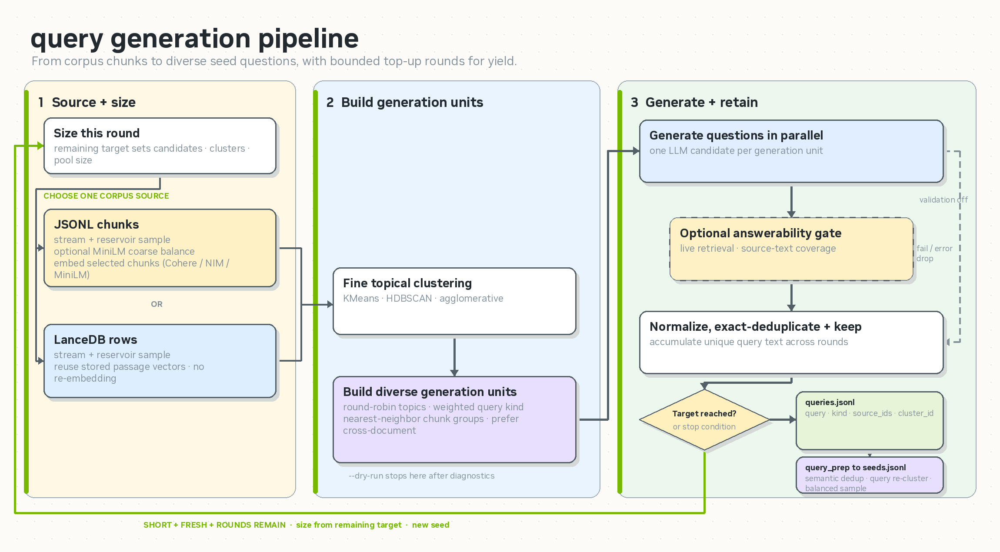

# Generate Long-Context Tool-Call Chats with Synthetic Data

This example uses NeMo Data Designer to create multi-turn, retrieval-grounded chat
trajectories for supervised fine-tuning. It starts with a chunked corpus or prepared
queries, simulates a user and a research assistant over several turns, records search
tool calls and evidence, and filters the result into OpenAI-style SFT JSONL.

The retriever is deliberately external to this example. Production runs connect to any
HTTP search service through a configurable schema adapter. An explicit simulation mode
is available for demos and produces separately labeled SFT rows.

## What you will build

```text
corpus chunks
  -> diverse query synthesis
  -> deduplicate, cluster, and sample seeds
  -> multi-turn assistant + user simulation
  -> HTTP or explicitly simulated search calls
  -> objective and optional LLM quality gates
  -> retrieval-grounded tool-call SFT JSONL
```

The query-synthesis stage supports JSONL chunks and optional LanceDB rows:



## Requirements

- `uv` and Python 3.12.
- OpenAI-compatible endpoints for the assistant and user-simulator models.
- An embedding endpoint, unless query preparation uses a local embedding model.
- For production generation, an HTTP retrieval endpoint over your corpus.
- A chunked JSONL corpus or an existing `queries.jsonl` file.
- For the default managed-persona configuration, the NGC CLI and `NGC_API_KEY`
  are needed once to download the `en_IN` persona asset. Alternatively, configure
  `persona.hf_dataset`, `persona.local_path`, or disable personas.

No retriever server, index builder, or deployment manifests are included. Operate the
retriever separately and configure only its HTTP contract here.

## Setup

From the repository root:

```bash
cd use-case-examples/long-context-chat-sdg
uv sync --extra dev
```

For a LanceDB query source, include the optional dependency:

```bash
uv sync --extra dev --extra lancedb
```

Configure model credentials through the environment rather than writing secrets into
`config/pipeline.yaml`:

```bash
export ASSISTANT_ENDPOINT=http://model-host:8000/v1
export USER_MODEL_ENDPOINT=http://model-host:8000/v1
export RETRIEVAL_ENDPOINT=http://retriever-host:8080/search
```

`ASSISTANT_API_KEY`, `USER_MODEL_API_KEY`, and `EMBEDDING_API_KEY` are the default
credential variable names. Open endpoints may leave their values unset.

The default configuration uses Data Designer's managed `en_IN` personas. Stage that
asset before the first generation run:

```bash
export NGC_API_KEY=<your-ngc-api-key>
uv run data-designer download personas --locale en_IN
```

After the asset is cached, generation does not need `NGC_API_KEY`. To use an external
persona source instead, set `persona.hf_dataset` or `persona.local_path` in a copy of
`config/pipeline.yaml`; to run without personas, set `persona.enabled: false`.

## 1. Prepare the input

For corpus-backed query synthesis, write chunks to `data/chunks.jsonl`. Each line must
contain text; stable chunk and document identifiers are recommended:

```json
{"text":"Passage text...","chunk_id":"chunk-001","source_id":"document-01"}
```

The field names are configurable through `query_gen.field_map`. To bring your own
queries instead, remove `query_gen.chunks_path` from the config and write records such
as `{"query": "..."}` to `experiments/<exp_name>/output/queries.jsonl`.

Generate and prepare balanced queries:

```bash
uv run python pipeline.py --config config/pipeline.yaml --stage query_gen
uv run python pipeline.py --config config/pipeline.yaml --stage query_prep
```

Use `--dry-run` with `--stage query_gen` to inspect corpus clustering and sizing without
calling a generation model or writing query output. Dry-run is intentionally rejected
for `query_prep` and `generate`; those stages do not have a no-spend simulation. Limits
must be positive (`--limit 1` or greater); omit the flag to process every row.

## 2. Generate with an external retriever

Production mode is the default and fails before generation when no retrieval endpoint
is configured:

```bash
uv run python pipeline.py \
  --config config/pipeline.yaml \
  --stage generate \
  --limit 5
```

The default adapter sends:

```json
{"query":"model-generated search query","num_chunks":8}
```

and expects:

```json
{"chunks":[{"id":"chunk-001","text":"Passage text...","score":0.92,"doc_id":"document-01"}]}
```

`retrieval.field_map` changes the request query/count fields, results path, result
fields, and static request body without code changes. The client requests
`top_k * oversample_factor` results and deterministically samples back to `top_k` so
successive searches can explore different evidence.

Persistent HTTP, timeout, response-decoding, and service errors stop generation rather
than becoming empty evidence. A valid empty search result can still be recorded, but it
does not satisfy the objective retrieval gate and is counted in the evaluation summary.

## 3. Run an explicit simulated demo

To exercise the pipeline without a retriever, opt in on the command line:

```bash
uv run python pipeline.py \
  --config config/pipeline.yaml \
  --stage generate \
  --limit 5 \
  --simulate-retrieval
```

The auxiliary model produces retrieval-shaped evidence with stable chunk IDs. These
rows can be evaluated and exported, but every row carries
`"retrieval_mode": "simulated"`; HTTP-backed rows carry `"retrieval_mode": "http"`.
Keep that provenance when blending or training on the generated dataset.

## 4. Evaluate and export SFT data

Run deterministic tool-schema, retrieval, final-answer, and citation-integrity checks:

```bash
uv run python evaluate.py --config config/pipeline.yaml
```

Add the configured judge model for a defect gate and 1–5 quality score:

```bash
uv run python evaluate.py --config config/pipeline.yaml --judge
```

Objective-only and judged evaluations use separate checkpoints keyed by the exact
`raw.jsonl` content. Judged checkpoints also include the judge model and endpoint
identity. Changing only `--min-quality` or `--min-overlap` reuses the existing scored
checkpoint, while changing the input or judge cannot reuse stale verdicts.

Assistant `reasoning_content` is retained by default. Pass `--strip-reasoning` when the
training recipe should learn only tool calls and final answers.

## Outputs

Each experiment writes under `experiments/<exp_name>/`:

| File | Contents |
| --- | --- |
| `output/queries.jsonl` | Synthesized or user-provided seed queries. |
| `output/seeds.jsonl` | Deduplicated, clustered, sampled queries with tools and personas. |
| `output/raw.jsonl` | Full generated trajectories before evaluation. |
| `output/sft.jsonl` | Rows that passed the enabled evaluation gates. |
| `output/summary.json` | Keep rate, context length, grounding, hop, score, and retrieval-mode metrics. |
| `output/eval_details.jsonl` | Per-row objective, evidence, citation, judge, and keep/drop details. |
| `output/generation_rejections.jsonl` | Durable diagnostics when DD returns fewer or invalid trajectories. |
| `artifacts/` | Data Designer checkpoints used for resume and re-evaluation. |

SFT rows contain `messages`, `tools`, `retrieval_mode`, and generation metadata. Tool
responses use `{"results": [...]}` and final assistant answers cite the retrieved chunk
IDs inline.

Output replacement is atomic. A generation stage publishes `raw.jsonl` only when every
requested record produced a valid trajectory; otherwise it exits non-zero and preserves
the prior dataset. Successful regeneration removes the old `sft.jsonl`, `summary.json`,
and `eval_details.jsonl` because they describe the previous raw input. Change
`exp_name` whenever generation configuration changes so runs remain auditable.

## Tests

The CPU-focused suite uses fake model and retriever calls; it does not require live
services:

```bash
uv run pytest
```

Before a large run, generate and evaluate a small `--limit 5` batch against the actual
model and retrieval endpoints and inspect every retained trajectory.

## Project layout

```text
config/pipeline.yaml          Models, corpus, retrieval, generation, and evaluation knobs
pipeline.py                   Query synthesis, query preparation, and trajectory generation
evaluate.py                   Re-runnable objective and LLM evaluation pass
long_context_chat_sdg/        Data Designer plugin and reusable pipeline implementation
tests/                        Offline unit and contract tests
data/                         Local corpus input (ignored)
experiments/                  Generated datasets and checkpoints (ignored)
```

## References

- [NeMo Data Designer](https://github.com/NVIDIA-NeMo/DataDesigner)
- [Nemotron use-case examples](../README.md)
